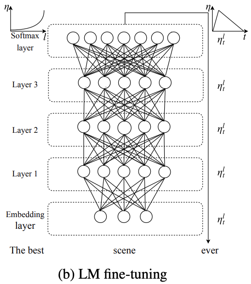

# [Discriminative Fine-Tuning](https://paperswithcode.com/method/discriminative-fine-tuning)

**Discriminative Fine-Tuning** is a fine-tuning strategy that is used for ULMFiT type models. Instead of using the same learning rate for all layers of the model, discriminative fine-tuning allows us to tune each layer with different learning rates. For context, the regular stochastic gradient descent (SGD) update of a model’s parameters $\theta$ at time step $t$ looks like the following (Ruder, 2016):

$$ \theta_{t} = \theta_{t-1} − \eta\cdot\nabla_{\theta}J\left(\theta\right)$$

where $\eta$ is the learning rate and $\nabla_{\theta}J\left(\theta\right)$ is the gradient with regard to the model’s objective function. For discriminative fine-tuning, we split the parameters $\theta$ into {$\theta_{1}, \ldots, \theta_{L}$} where $\theta_{l}$ contains the parameters of the model at the $l$-th layer and $L$ is the number of layers of the model. Similarly, we obtain {$\eta_{1}, \ldots, \eta_{L}$} where $\theta_{l}$ where $\eta_{l}$ is the learning rate of the $l$-th layer. The SGD update with discriminative finetuning is then:

$$ \theta_{t}^{l} = \theta_{t-1}^{l} - \eta^{l}\cdot\nabla_{\theta^{l}}J\left(\theta\right) $$

The authors find that empirically it worked well to first choose the learning rate $\eta^{L}$ of the last layer by fine-tuning only the last layer and using $\eta^{l-1}=\eta^{l}/2.6$ as the learning rate for lower layers.

source: [source](http://arxiv.org/abs/1801.06146v5)
