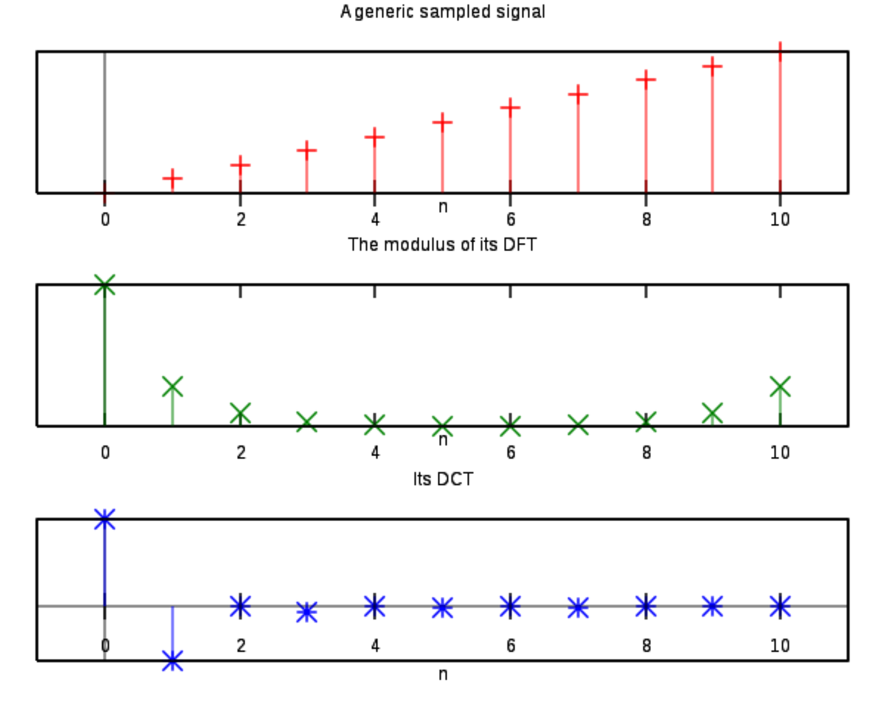

# [Discrete Cosine Transform](https://paperswithcode.com/method/discrete-cosine-transform)

**Discrete Cosine Transform (DCT)** is an orthogonal transformation method that decomposes an
image to its spatial frequency spectrum. It expresses a finite sequence of data points in terms of a sum of cosine functions oscillating at different frequencies. It is used a lot in compression tasks, e..g image compression where for example high-frequency components can be discarded. It is a type of Fourier-related Transform, similar to discrete fourier transforms (DFTs), but only using real numbers.

Image Credit: [Wikipedia](https://en.wikipedia.org/wiki/Discrete_cosine_transform#/media/File:Example_dft_dct.svg)

