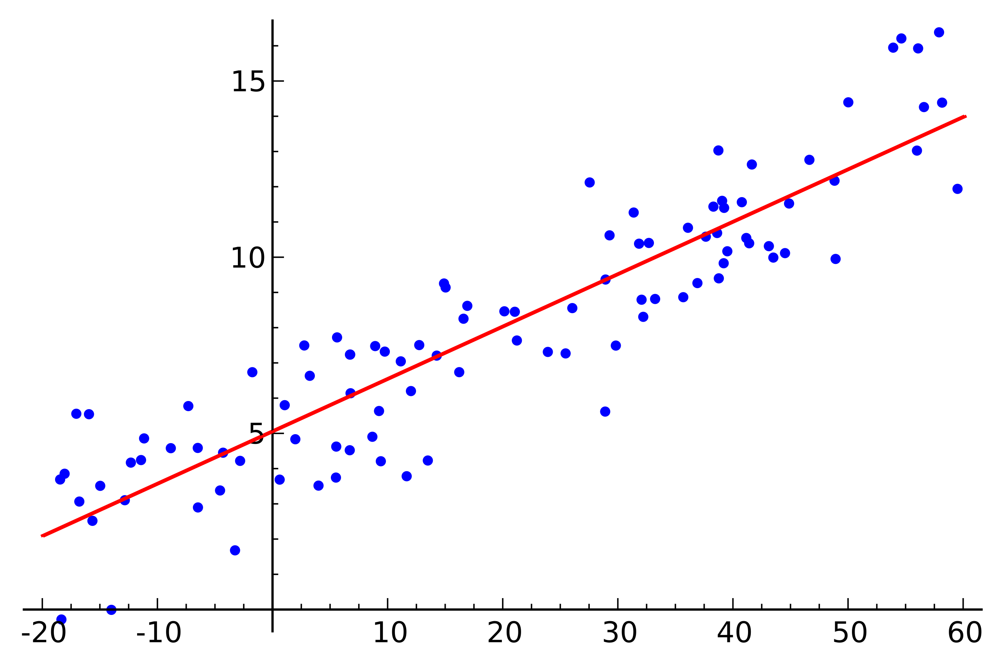

# [Logistic Regression](https://paperswithcode.com/method/logistic-regression)

**Logistic Regression**, despite its name, is a linear model for classification rather than regression. Logistic regression is also known in the literature as logit regression, maximum-entropy classification (MaxEnt) or the log-linear classifier. In this model, the probabilities describing the possible outcomes of a single trial are modeled using a logistic function.

Source: [scikit-learn](https://scikit-learn.org/stable/modules/linear_model.html#logistic-regression)

Image: [Michaelg2015](https://commons.wikimedia.org/wiki/User:Michaelg2015)

# [Linear Regression](https://paperswithcode.com/method/linear-regression)

**Linear Regression** is a method for modelling a relationship between a dependent variable and independent variables. These models can be fit with numerous approaches. The most common is **least squares**, where we minimize the mean square error between the predicted values $\hat{y} = \textbf{X}\hat{\beta}$ and actual values $y$: $\left(y-\textbf{X}\beta\right)^{2}$.

We can also define the problem in probabilistic terms as a generalized linear model (GLM) where the pdf is a Gaussian distribution, and then perform maximum likelihood estimation to estimate $\hat{\beta}$.

Image Source: [Wikipedia](https://en.wikipedia.org/wiki/Linear_regression)

