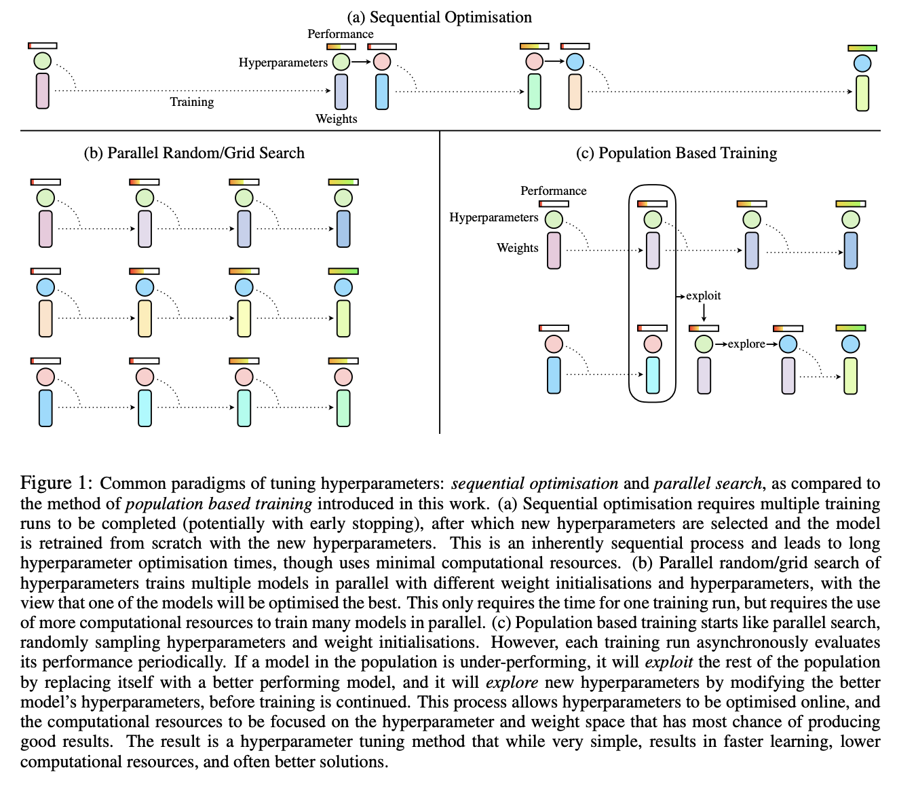

# [Population Based Training](https://paperswithcode.com/method/population-based-training)

**Population Based Training**, or **PBT**, is an optimization method for finding parameters and hyperparameters, and extends upon parallel search methods and sequential optimisation methods.
It leverages information sharing across a population of concurrently running optimisation processes, and allows for online propagation/transfer of parameters and hyperparameters between members of the population based on their performance. Furthermore, unlike most other adaptation schemes, the method is capable of performing online adaptation of hyperparameters -- which can be particularly important in problems with highly non-stationary learning dynamics, such as reinforcement learning settings. PBT is decentralised and asynchronous, although it could also be executed semi-serially or with partial synchrony if there is a binding budget constraint.

source: [source](http://arxiv.org/abs/1711.09846v2)
