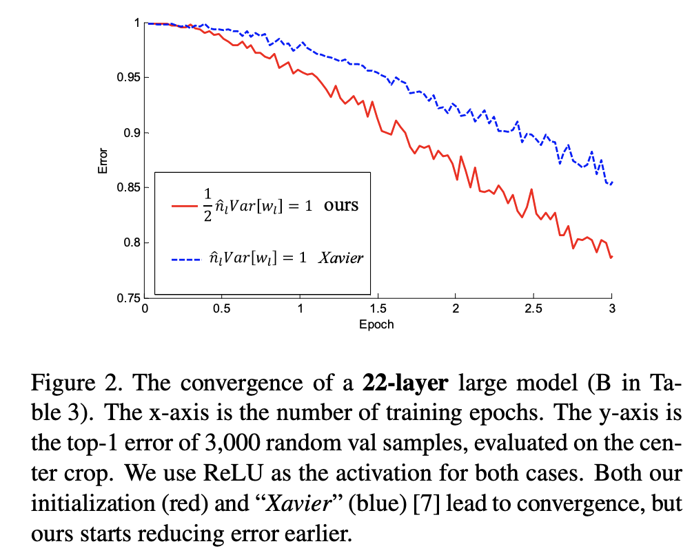
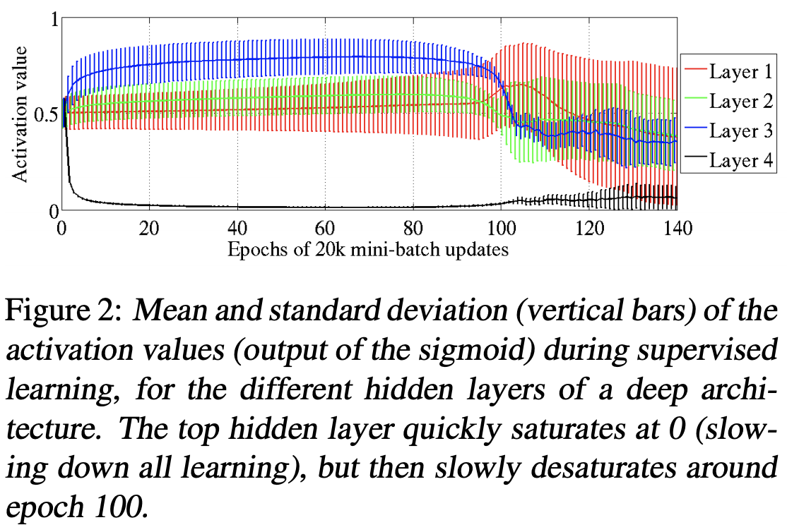

# [Kaiming Initialization](https://paperswithcode.com/method/he-initialization)

**Kaiming Initialization**, or **He Initialization**, is an initialization method for neural networks that takes into account the non-linearity of activation functions, such as ReLU activations.

A proper initialization method should avoid reducing or magnifying the magnitudes of input signals exponentially. Using a derivation they work out that the condition to stop this happening is:

$$\frac{1}{2}n_{l}\text{Var}\left[w_{l}\right] = 1 $$

This implies an initialization scheme of:

$$ w_{l} \sim \mathcal{N}\left(0,  2/n_{l}\right)$$

That is, a zero-centered Gaussian with standard deviation of $\sqrt{2/{n}_{l}}$ (variance shown in equation above). Biases are initialized at $0$.

source: [source]http://arxiv.org/abs/1502.01852v1
# [Xavier Initialization](https://paperswithcode.com/method/xavier-initialization)

**Xavier Initialization**, or **Glorot Initialization**, is an initialization scheme for neural networks. Biases are initialized be 0 and the weights $W_{ij}$ at each layer are initialized as:

$$ W_{ij} \sim U\left[-\frac{1}{\sqrt{n}}, \frac{1}{\sqrt{n}}\right] $$

Where $U$ is a uniform distribution and $n$ is the size of the previous layer (number of columns in $W$).

