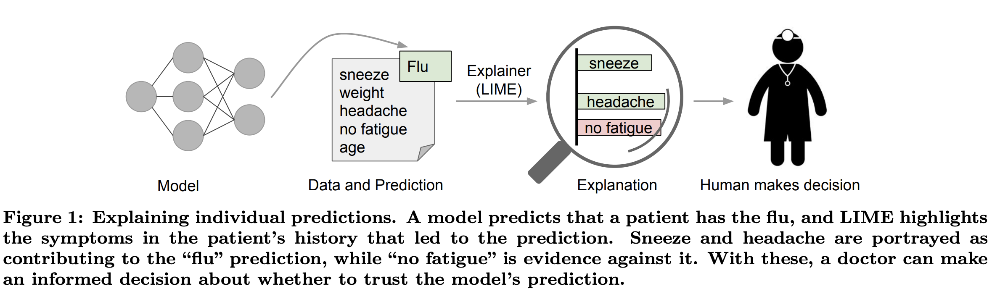
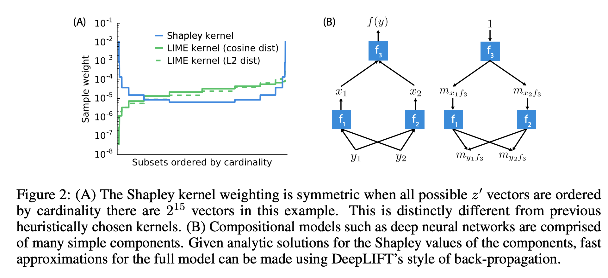
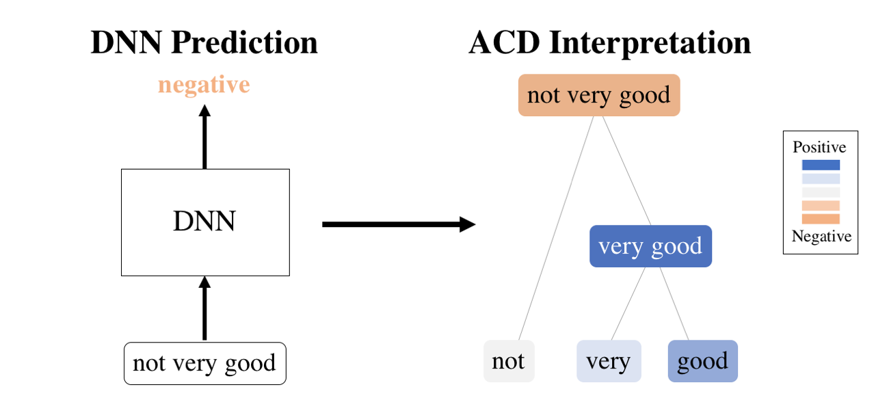
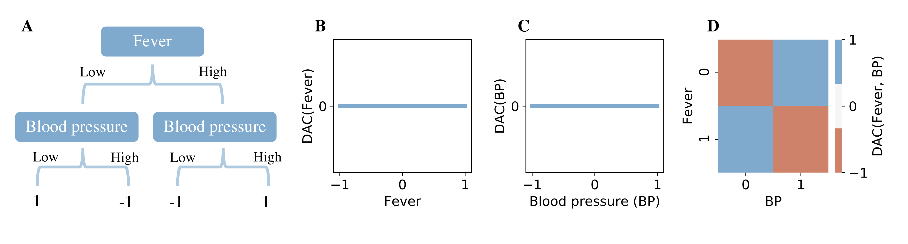
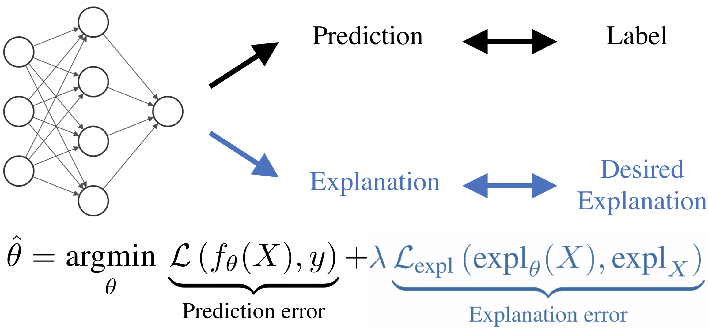

# LIME

**LIME**, or **Local Interpretable Model-Agnostic Explanations**, is an algorithm that can explain the predictions of any classifier or regressor in a faithful way, by approximating it locally with an interpretable model.

# SHAP

**SHAP**, or **SHapley Additive exPlanations**, is a game theoretic approach to explain the output of any machine learning model. It connects optimal credit allocation with local explanations using the classic Shapley values from game theory and their related extensions.

# Agglomerative Contextual Decomposition

**Agglomerative Contextual Decomposition (ACD)** produces hierarchical interpretations for a single prediction made by a neural network, by scoring interactions and building them into a tree.

# Disentangled Attribution Curves

**Disentangled Attribution Curves (DAC)** provide interpretations of tree ensemble methods in the form of (multivariate) feature importance curves. For a given variable, or group of variables, DAC plots the importance of a variable(s) as their value changes.

# CDEP

**Contextual Decomposition Explanation Penalization (CDEP)** is a method which leverages existing explanation techniques for neural networks in order to prevent a model from learning
unwanted relationships and ultimately improve predictive accuracy. Given particular importance
scores, CDEP works by allowing the user to directly penalize importances of certain features, or
interactions. This forces the neural network to not only produce the correct prediction, but also the
correct explanation for that prediction

# NAM

