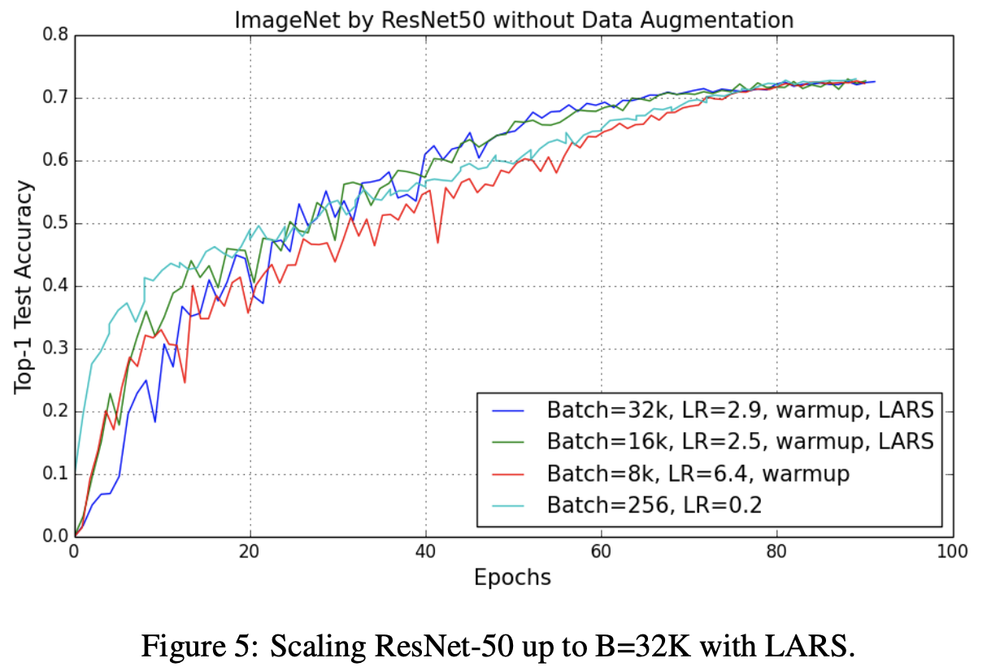

# [LAMB](https://paperswithcode.com/method/lamb)

**LAMB** is a a layerwise adaptive large batch optimization technique. It provides a strategy for adapting the learning rate in large batch settings. LAMB uses ADAM as the base algorithm and then forms an update as:

$$r_{t} = \frac{m_{t}}{\sqrt{v_{t}} + \epsilon}$$
$$x_{t+1}^{\left(i\right)} = x_{t}^{\left(i\right)}  - \eta_{t}\frac{\phi\left(|| x_{t}^{\left(i\right)} ||\right)}{|| m_{t}^{\left(i\right)} || }\left(r_{t}^{\left(i\right)}+\lambda{x_{t}^{\left(i\right)}}\right) $$

Unlike LARS, the adaptivity of LAMB is two-fold: (i) per dimension normalization with respect to the square root of the second moment used in ADAM and (ii) layerwise normalization obtained due to layerwise adaptivity.

source: [source]https://arxiv.org/abs/1904.00962v5
# [LARS](https://paperswithcode.com/method/lars)

**Layer-wise Adaptive Rate Scaling**, or **LARS**, is a large batch optimization technique.  There are two notable differences between LARS and other adaptive algorithms such as ADAM or RMSProp : first, LARS uses a separate learning rate for each layer and not for each weight. And second, the magnitude of the update is controlled with respect to the weight norm for better control of training speed.

$$m_{t} = \beta_{1}m_{t-1} + \left(1-\beta_{1}\right)\left(g_{t} + \lambda{x_{t}}\right)$$
$$x_{t+1}^{\left(i\right)} = x_{t}^{\left(i\right)}  - \eta_{t}\frac{\phi\left(|| x_{t}^{\left(i\right)} ||\right)}{|| m_{t}^{\left(i\right)} || }m_{t}^{\left(i\right)} $$

source: [source]http://arxiv.org/abs/1708.03888v3
