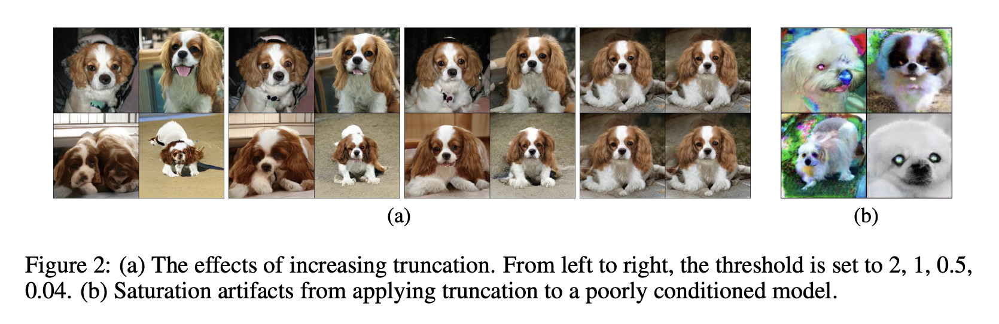

# [Truncation Trick](https://paperswithcode.com/method/truncation-trick)

The **Truncation Trick** is a latent sampling procedure for generative adversarial networks, where we sample $z$ from a truncated normal (where values which fall outside a range are resampled to fall inside that range). The authors find this provides a boost to the Inception Score and FID of [BigGAN](http://paperswithcode.com/method/biggan).

source: [source]http://arxiv.org/abs/1809.11096v2
# [Latent Optimisation](https://paperswithcode.com/method/latent-optimisation)

**Latent Optimisation** is a technique used for generative adversarial networks to refine the sample quality of $z$. Specifically, it exploits knowledge from the discriminator $D$ to refine the latent source $z$. Intuitively, the gradient $\nabla_{z}f\left(z\right) = \delta{f}\left(z\right)\delta{z}$ points in the direction that better satisfies the discriminator $D$, which implies better samples. Therefore, instead of using the randomly sampled $z \sim p\left(z\right)$, we uses the optimised latent:

$$ \Delta{z} = \alpha\frac{\delta{f}\left(z\right)}{\delta{z}} $$

$$ z' = z + \Delta{z} $$

Source: [LOGAN](https://arxiv.org/pdf/1912.00953.pdf)
.

source: [source]https://arxiv.org/abs/1905.06723v2
