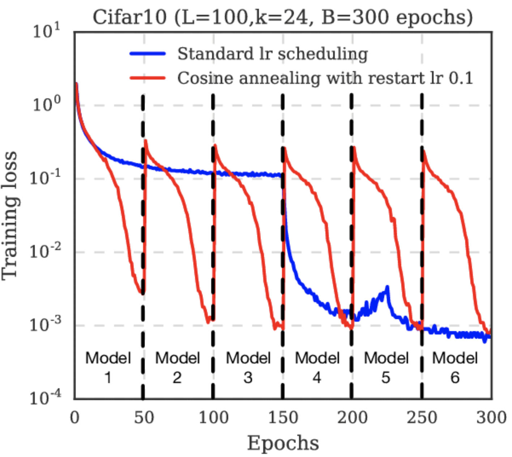

# Linear Warmup With Linear Decay

**Linear Warmup With Linear Decay** is a learning rate schedule in which we increase the learning rate linearly for $n$ updates and then linearly decay afterwards.

# Linear Warmup With Cosine Annealing

**Linear Warmup With Cosine Annealing** is a learning rate schedule where we increase the learning rate linearly for $n$ updates and then anneal according to a cosine schedule afterwards.

# Step Decay

**Step Decay** is a learning rate schedule drops the learning rate by a factor every few epochs, where the number of epochs is a hyperparameter.

Image Credit: [Suki Lau](https://towardsdatascience.com/learning-rate-schedules-and-adaptive-learning-rate-methods-for-deep-learning-2c8f433990d1)

# Exponential Decay

**Exponential Decay** is a learning rate schedule where we decay the learning rate with more iterations using an exponential function:

$$ \text{lr} = \text{lr}_{0}\exp\left(-kt\right) $$

Image Credit: [Suki Lau](https://towardsdatascience.com/learning-rate-schedules-and-adaptive-learning-rate-methods-for-deep-learning-2c8f433990d1)

# Cosine Annealing

**Cosine Annealing** is a type of learning rate schedule that has the effect of starting with a large learning rate that is relatively rapidly decreased to a minimum value before being increased rapidly again. The resetting of the learning rate acts like a simulated restart of the learning process and the re-use of good weights as the starting point of the restart is referred to as a "warm restart" in contrast to a "cold restart" where a new set of small random numbers may be used as a starting point.

$$\eta_{t} = \eta_{min}^{i} + \frac{1}{2}\left(\eta_{max}^{i}-\eta_{min}^{i}\right)\left(1+\cos\left(\frac{T_{cur}}{T_{i}}\pi\right)\right)
$$

Where where $\eta_{min}^{i}$ and $ \eta_{max}^{i}$ are ranges for the learning rate, and $T_{cur}$ account for how many epochs have been performed since the last restart.

Text Source: [Jason Brownlee](https://machinelearningmastery.com/snapshot-ensemble-deep-learning-neural-network/)

Image Source: [Gao Huang](https://www.researchgate.net/figure/Training-loss-of-100-layer-DenseNet-on-CIFAR10-using-standard-learning-rate-blue-and-M_fig2_315765130)

# Slanted Triangular Learning Rates

**Slanted Triangular Learning Rates (STLR)** is a learning rate schedule which first linearly increases the learning rate and then linearly decays it, which can be seen in Figure to the right. It is a modification of Triangular Learning Rates, with a short increase and a long decay period.

# Polynomial Rate Decay

**Polynomial Rate Decay** is a learning rate schedule where we polynomially decay the learning rate.

# Linear Warmup

**Linear Warmup** is a learning rate schedule where we linearly increase the learning rate from a low rate to a constant rate thereafter. This reduces volatility in the early stages of training.

Image Credit: [Chengwei Zhang](https://www.dlology.com/about-me/)

# Inverse Square Root Schedule

**Inverse Square Root** is a learning rate schedule 1 / $\sqrt{\max\left(n, k\right)}$ where
$n$ is the current training iteration and $k$ is the number of warm-up steps. This sets a constant learning rate for the first $k$ steps, then exponentially decays the learning rate until pre-training is over.

# Cyclical Learning Rate Policy

A **Cyclical Learning Rate Policy** combines linear learning rate decay with warm restarts.

Image: [ESPNetv2](https://paperswithcode.com/paper/espnetv2-a-light-weight-power-efficient-and)

# 1cycle

