# Cycle Consistency Loss

**Cycle Consistency Loss** is a type of loss used for generative adversarial networks that perform unpaired image-to-image translation. It was introduced with the [CycleGAN](https://paperswithcode.com/method/cyclegan) architecture. For two domains $X$ and $Y$, we want to learn a mapping $G : X \rightarrow Y$ and $F: Y \rightarrow X$. We want to enforce the intuition that these mappings should be reverses of each other and that both mappings should be bijections. Cycle Consistency Loss encourages $F\left(G\left(x\right)\right) \approx x$ and $G\left(Y\left(y\right)\right) \approx y$.  It reduces the space of possible mapping functions by enforcing forward and backwards consistency:

$$ \mathcal{L}_{cyc}\left(G, F\right) = \mathbb{E}_{x \sim p_{data}\left(x\right)}\left[||F\left(G\left(x\right)\right) - x||_{1}\right] + \mathbb{E}_{y \sim p_{data}\left(y\right)}\left[||G\left(F\left(y\right)\right) - y||_{1}\right] $$

# GAN Least Squares Loss
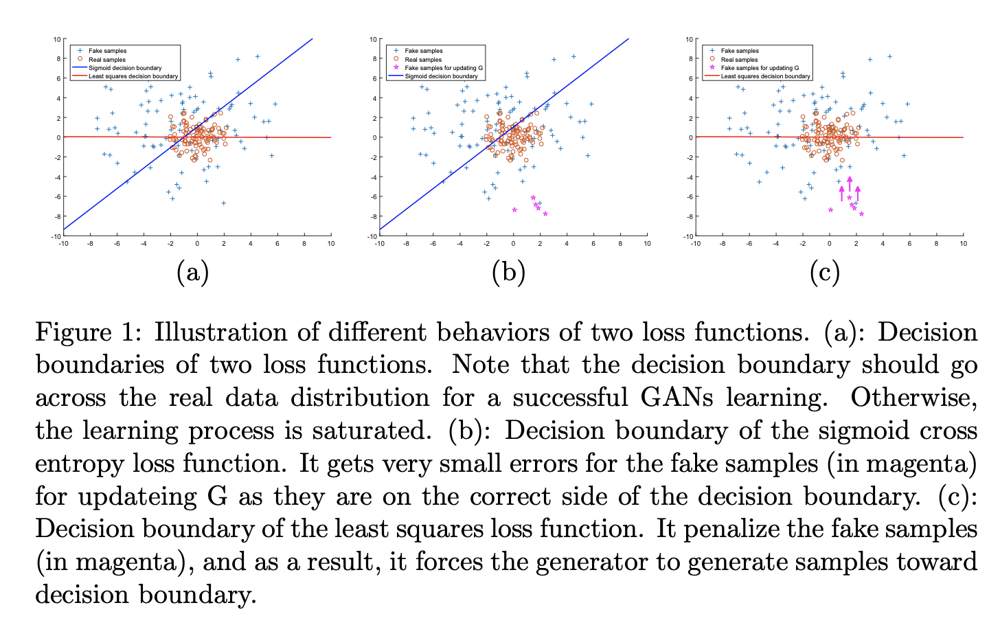

**GAN Least Squares Loss** is a least squares loss function for generative adversarial networks. Minimizing this objective function is equivalent to minimizing the Pearson $\chi^{2}$ divergence. The objective function (here for [LSGAN](https://paperswithcode.com/method/lsgan)) can be defined as:

$$ \min_{D}V_{LS}\left(D\right) = \frac{1}{2}\mathbb{E}_{\mathbf{x} \sim p_{data}\left(\mathbf{x}\right)}\left[\left(D\left(\mathbf{x}\right) - b\right)^{2}\right] + \frac{1}{2}\mathbb{E}_{\mathbf{z}\sim p_{data}\left(\mathbf{z}\right)}\left[\left(D\left(G\left(\mathbf{z}\right)\right) - a\right)^{2}\right] $$

$$ \min_{G}V_{LS}\left(G\right) = \frac{1}{2}\mathbb{E}_{\mathbf{z} \sim p_{\mathbf{z}}\left(\mathbf{z}\right)}\left[\left(D\left(G\left(\mathbf{z}\right)\right) - c\right)^{2}\right] $$

where $a$ and $b$ are the labels for fake data and real data and $c$ denotes the value that $G$ wants $D$ to believe for fake data.

# Focal Loss
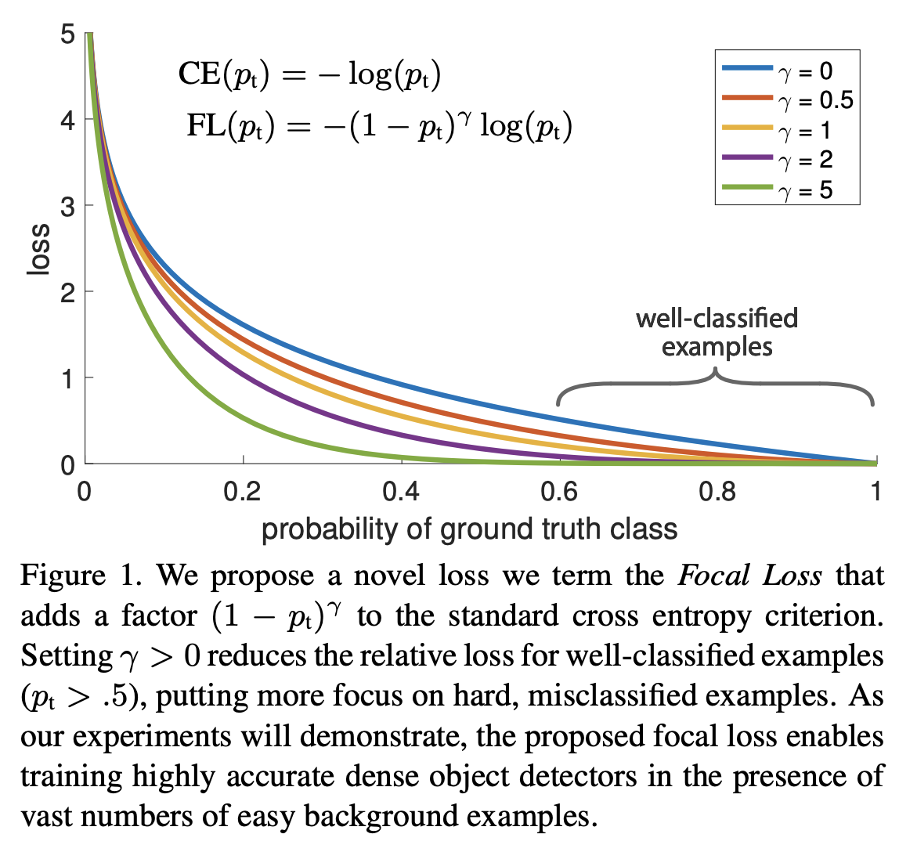

A **Focal Loss** function addresses class imbalance during training in tasks like object detection. Focal loss applies a modulating term to the cross entropy loss in order to focus learning on hard negative examples. It is a dynamically scaled cross entropy loss, where the scaling factor decays to zero as confidence in the correct class increases. Intuitively, this scaling factor can automatically down-weight the contribution of easy examples during training and rapidly focus the model on hard examples. 

Formally, the Focal Loss adds a factor $(1 - p_{t})^\gamma$ to the standard cross entropy criterion. Setting $\gamma&gt;0$ reduces the relative loss for well-classified examples ($p_{t}&gt;.5$), putting more focus on hard, misclassified examples. Here there is tunable **focusing** parameter $\gamma \ge 0$. 

$$ {\text{FL}(p_{t}) = - (1 - p_{t})^\gamma \log\left(p_{t}\right)} $$

# GAN Hinge Loss
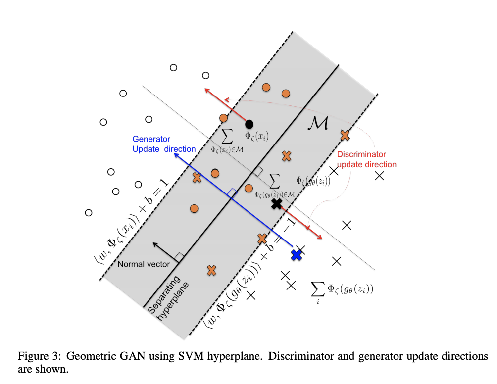

The **GAN Hinge Loss** is a hinge loss based loss function for [generative adversarial networks](https://paperswithcode.com/methods/category/generative-adversarial-networks):

$$ L_{G} = -\mathbb{E}_{\left(x, y\right)\sim{p}_{data}}\left[\min\left(0, -1 + D\left(x, y\right)\right)\right] -\mathbb{E}_{z\sim{p_{z}}, y\sim{p_{data}}}\left[\min\left(0, -1 - D\left(G\left(z\right), y\right)\right)\right] $$

$$ L_{G} = -\mathbb{E}_{z\sim{p_{z}}, y\sim{p_{data}}}D\left(G\left(z\right), y\right) $$

# InfoNCE
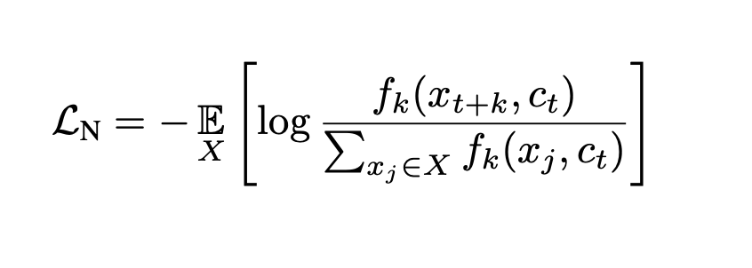

**InfoNCE**, where NCE stands for Noise-Contrastive Estimation, is a type of contrastive loss function used for [self-supervised learning](https://paperswithcode.com/methods/category/self-supervised-learning).

Given a set $X = ${$x_{1}, \dots, x_{N}$} of $N$ random samples containing one positive sample from $p\left(x_{t+k}|c_{t}\right)$ and $N − 1$ negative samples from the 'proposal' distribution $p\left(x_{t+k}\right)$, we optimize:

$$ \mathcal{L}_{N} = - \mathbb{E}_{X}\left[\log\frac{f_{k}\left(x_{t+k}, c_{t}\right)}{\sum_{x_{j}\in{X}}f_{k}\left(x_{j}, c_{t}\right)}\right] $$

Optimizing this loss will result in $f_{k}\left(x_{t+k}, c_{t}\right)$ estimating the density ratio, which is:

$$ f_{k}\left(x_{t+k}, c_{t}\right) \propto \frac{p\left(x_{t+k}|c_{t}\right)}{p\left(x_{t+k}\right)} $$

# WGAN-GP Loss
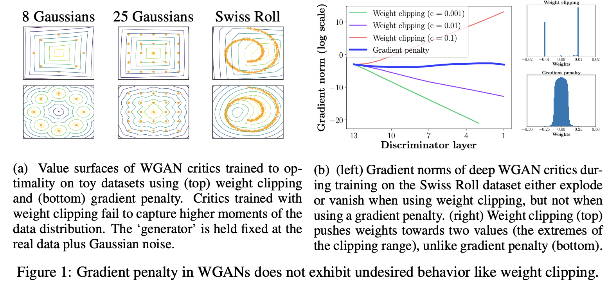

**Wasserstein Gradient Penalty Loss**, or **WGAN-GP Loss**, is a loss used for generative adversarial networks that augments the Wasserstein loss with a gradient norm penalty for random samples $\mathbf{\hat{x}} \sim \mathbb{P}_{\hat{\mathbf{x}}}$ to achieve Lipschitz continuity:

$$ L = \mathbb{E}_{\mathbf{\hat{x}} \sim \mathbb{P}_{g}}\left[D\left(\tilde{\mathbf{x}}\right)\right] - \mathbb{E}_{\mathbf{x} \sim \mathbb{P}_{r}}\left[D\left(\mathbf{x}\right)\right] + \lambda\mathbb{E}_{\mathbf{\hat{x}} \sim \mathbb{P}_{\hat{\mathbf{x}}}}\left[\left(||\nabla_{\tilde{\mathbf{x}}}D\left(\mathbf{\tilde{x}}\right)||_{2}-1\right)^{2}\right]$$

It was introduced as part of the [WGAN-GP](https://paperswithcode.com/method/wgan-gp) overall model.

# CTC Loss

Please enter a description about the method here

# NT-Xent
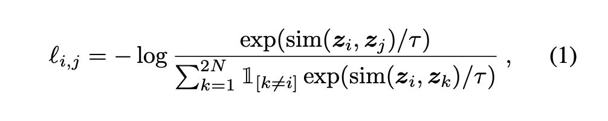

**NT-Xent**, or **Normalized Temperature-scaled Cross Entropy Loss**, is a loss function. Let $\text{sim}\left(\mathbf{u}, \mathbf{v}\right) = \mathbf{u}^{T}\mathbf{v}/||\mathbf{u}|| ||\mathbf{v}||$ denote the cosine similarity between two vectors $\mathbf{u}$ and $\mathbf{v}$. Then the loss function for a positive pair of examples $\left(i, j\right)$ is :

$$ \mathbb{l}_{i,j} = -\log\frac{\exp\left(\text{sim}\left(\mathbf{z}_{i}, \mathbf{z}_{j}\right)/\tau\right)}{\sum^{2N}_{k=1}\mathcal{1}_{[k\neq{i}]}\exp\left(\text{sim}\left(\mathbf{z}_{i}, \mathbf{z}_{j}\right)/\tau\right)}$$

where $\mathcal{1}_{[k\neq{i}]} \in ${$0, 1$} is an indicator function evaluating to $1$ iff $k\neq{i}$ and $\tau$ denotes a temperature parameter. The final loss is computed across all positive pairs, both $\left(i, j\right)$ and $\left(j, i\right)$, in a mini-batch.

Source: [SimCLR](https://beta.paperswithcode.com/method/simclr#)

# Lovasz-Softmax
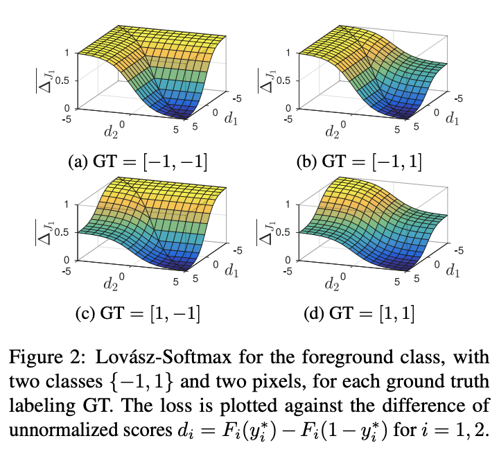

The **Lovasz-Softmax loss** is a loss function for multiclass semantic segmentation that incorporates the softmax operation in the Lovasz extension. The Lovasz extension is a means by which we can achieve direct optimization of the mean intersection-over-union loss in neural networks.

# Balanced L1 Loss
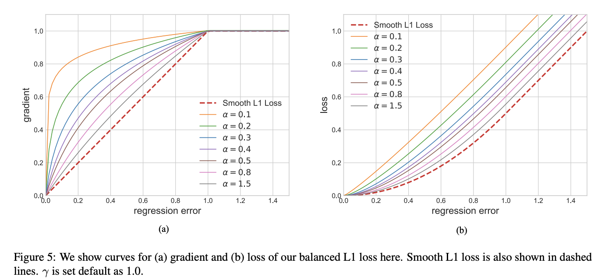

**Balanced L1 Loss** is a loss function used for the object detection task. Classification and localization problems are solved simultaneously under the guidance of a multi-task loss since
[Fast R-CNN](https://paperswithcode.com/method/fast-r-cnn), defined as:

$$ L_{p,u,t_{u},v} = L_{cls}\left(p, u\right) + \lambda\left[u \geq 1\right]L_{loc}\left(t^{u}, v\right) $$

$L_{cls}$ and $L_{loc}$ are objective functions corresponding to recognition and localization respectively. Predictions and targets in $L_{cls}$ are denoted as $p$ and $u$. $t_{u}$ is the corresponding regression results with class $u$. $v$ is the regression target. $\lambda$ is used for tuning the loss weight under multi-task learning. We call samples with a loss greater than or equal to 1.0 outliers. The other samples are called inliers.

A natural solution for balancing the involved tasks is to tune the loss weights of them. However, owing to the unbounded regression targets, directly raising the weight of localization loss will make the model more sensitive to outliers. These outliers, which can be regarded as hard samples, will produce excessively large gradients that are harmful to the training process. The inliers, which can be regarded as the easy samples, contribute little gradient to the overall gradients compared with the outliers. To be more specific, inliers only contribute 30% gradients average per sample compared with outliers. Considering these issues, the authors introduced the balanced L1 loss, which is denoted as $L_{b}$.

Balanced L1 loss is derived from the conventional smooth L1 loss, in which an inflection point is set to separate inliers from outliners, and clip the large gradients produced by outliers with a maximum value of 1.0, as shown by the dashed lines in the Figure to the right. The key idea of balanced L1 loss is promoting the crucial regression gradients, i.e. gradients from inliers (accurate samples), to rebalance
the involved samples and tasks, thus achieving a more balanced training within classification, overall localization and accurate localization. Localization loss $L_{loc}$ uses balanced L1 loss is defined as:

$$ L_{loc} = \sum_{i\in{x,y,w,h}}L_{b}\left(t^{u}_{i}-v_{i}\right) $$

The Figure to the right shows that the balanced L1 loss increases the gradients of inliers under the control of a factor denoted as $\alpha$. A small $\alpha$ increases more gradient for inliers, but the gradients of outliers are not influenced. Besides, an overall promotion magnification controlled by γ is also brought in for tuning the upper bound of regression errors, which can help the objective function better balancing involved tasks. The two factors that control different aspects are mutually enhanced to reach a more balanced training.$b$ is used to ensure $L_{b}\left(x = 1\right)$ has the same value for both formulations in the equation below.

By integrating the gradient formulation above, we can get the balanced L1 loss as:

$$ L_{b}\left(x\right) = \frac{\alpha}{b}\left(b|x| + 1\right)ln\left(b|x| + 1\right) - \alpha|x| \text{ if } |x| &lt; 1$$

$$ L_{b}\left(x\right) = \gamma|x| + C \text{ otherwise } $$

in which the parameters $\gamma$, $\alpha$, and $b$ are constrained by $\alpha\text{ln}\left(b + 1\right) = \gamma$. The default parameters are set as $\alpha = 0.5$ and $\gamma = 1.5$

# Supervised Contrastive Loss
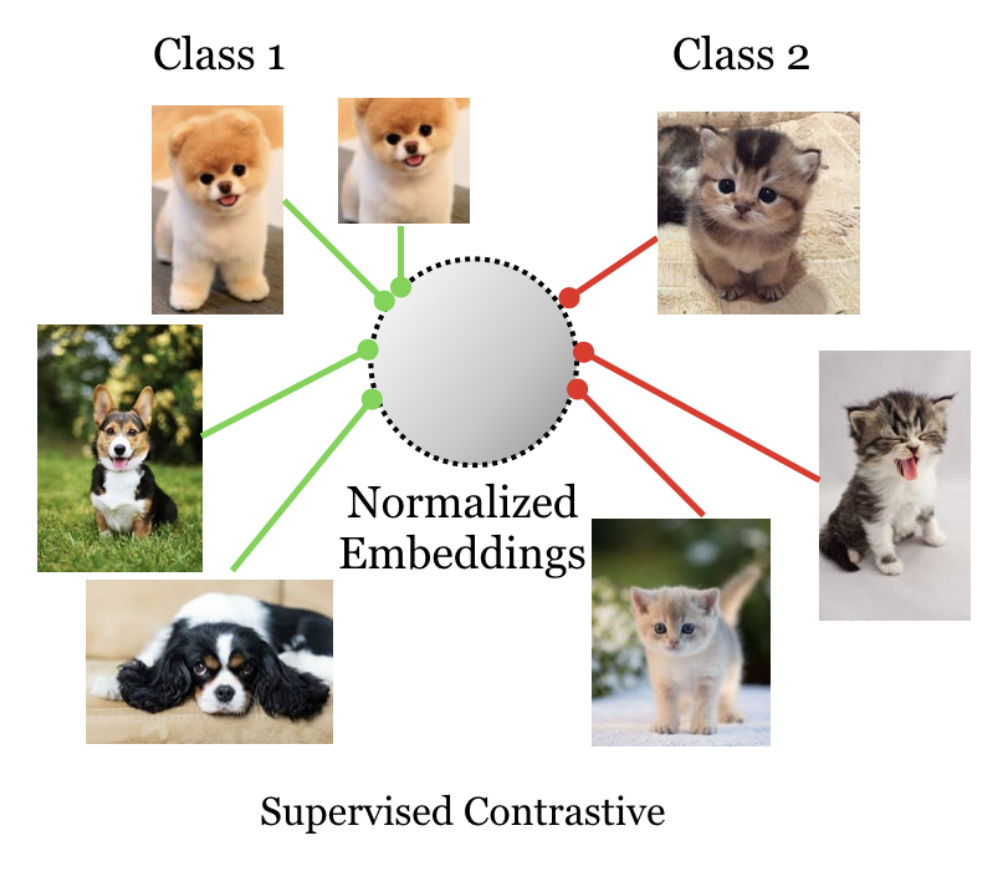

**Supervised Contrastive Loss** is an alternative loss function to cross entropy that the authors argue can leverage label information more effectively. Clusters of points belonging to the same class are pulled together in embedding space, while simultaneously pushing apart clusters of samples from different classes.

$$
  \mathcal{L}^{sup}=\sum_{i=1}^{2N}\mathcal{L}_i^{sup}
  \label{eqn:total_supervised_loss}
$$

$$
  \mathcal{L}_i^{sup}=\frac{-1}{2N_{\boldsymbol{\tilde{y}}_i}-1}\sum_{j=1}^{2N}\mathbf{1}_{i\neq j}\cdot\mathbf{1}_{\boldsymbol{\tilde{y}}_i=\boldsymbol{\tilde{y}}_j}\cdot\log{\frac{\exp{\left(\boldsymbol{z}_i\cdot\boldsymbol{z}_j/\tau\right)}}{\sum_{k=1}^{2N}\mathbf{1}_{i\neq k}\cdot\exp{\left(\boldsymbol{z}_i\cdot\boldsymbol{z}_k/\tau\right)}}}
$$

where $N_{\boldsymbol{\tilde{y}}_i}$ is the total number of images in the minibatch that have the same label, $\boldsymbol{\tilde{y}}_i$, as the anchor, $i$. This loss has important properties well suited for supervised learning: (a) generalization to an arbitrary number of positives, (b) contrastive power increases with more negatives.

# Dynamic SmoothL1 Loss
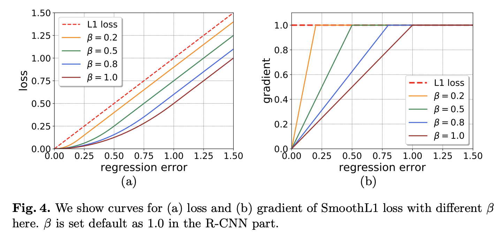

**Dynamic SmoothL1 Loss (DSL)** is a loss function in object detection where we change the shape of loss function to gradually focus on high quality samples:

$$\text{DSL}\left(x, \beta_{now}\right) = 0.5|{x}|^{2}/\beta_{now}, \text{ if } |x| &lt; \beta_{now}\text{,} $$ 
$$\text{DSL}\left(x, \beta_{now}\right) = |{x}| - 0.5\beta_{now}\text{, otherwise} $$ 

DSL will change the value of $\beta_{now}$ according to the statistics of regression errors which can reflect the localization accuracy. It was introduced as part of the [Dynamic R-CNN](https://paperswithcode.com/method/dynamic-r-cnn) model.

# Self-Adjusting Smooth L1 Loss
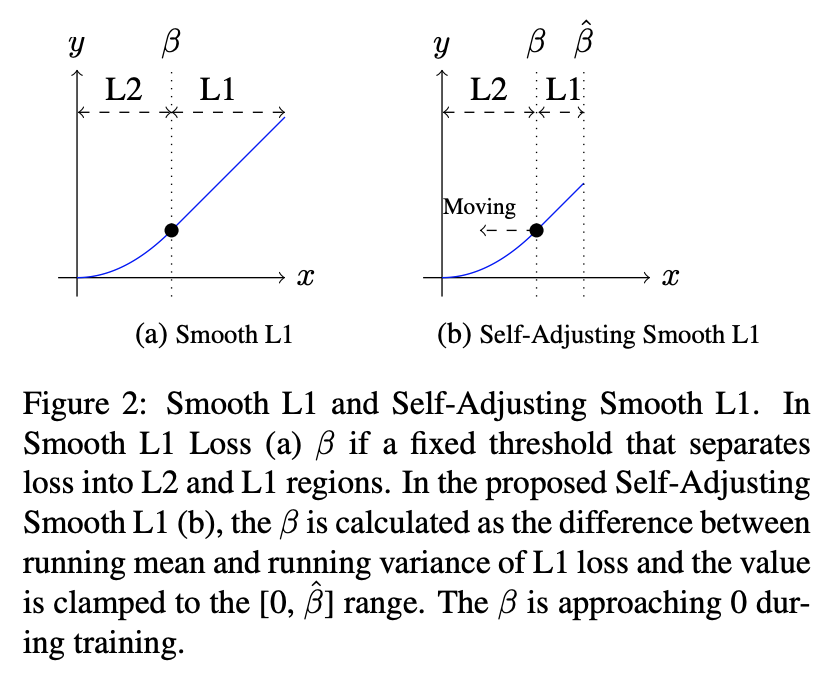

**Self-Adjusting Smooth L1 Loss** is a loss function used in object detection that was introduced with [RetinaMask](https://paperswithcode.com/method/retinamask). This is an improved version of Smooth L1.  For Smooth L1 loss we have:

$$ f(x) = 0.5  \frac{x^{2}}{\beta} \text{ if } |x| &lt; \beta $$
$$ f(x) = |x| -0.5\beta \text{ otherwise } $$

Here a point $\beta$ splits the positive axis range into two parts: $L2$ loss is used for targets in range $[0, \beta]$, and $L1$ loss is used beyond $\beta$ to avoid over-penalizing  utliers. The overall function is smooth (continuous, together with its derivative). However, the choice of control point ($\beta$) is heuristic and is usually done by hyper parameter search.

Instead, with self-adjusting smooth L1 loss, inside the loss function the running mean and variance of the absolute loss are recorded. Inside the loss function, the running mean and variance of the absolute loss are recorded. We use the running minibatch mean and variance with a momentum of $0.9$ to update these two parameters.

