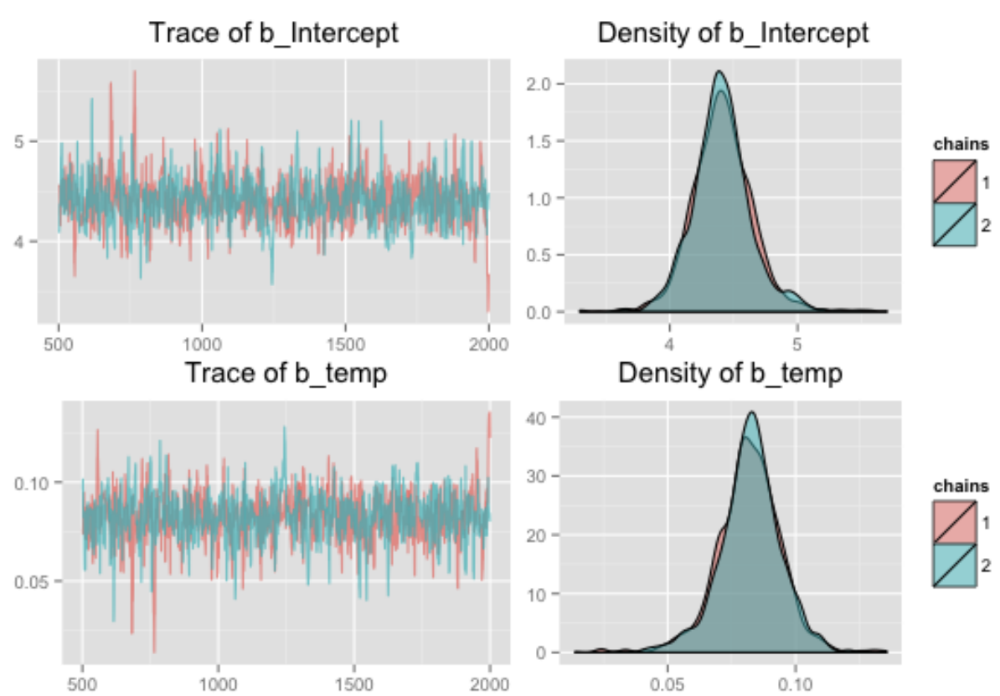

# [Metropolis Hastings](https://paperswithcode.com/method/metropolis-hastings)

**Metropolis-Hastings** is a Markov Chain Monte Carlo (MCMC) algorithm for approximate inference. It allows for sampling from a probability distribution where direct sampling is difficult - usually owing to the presence of an intractable integral.

M-H consists of a proposal distribution $q\left(\theta^{'}\mid\theta\right)$ to draw a parameter value. To decide whether $\theta^{'}$ is accepted or rejected, we then calculate a ratio:

$$ \frac{p\left(\theta^{'}\mid{D}\right)}{p\left(\theta\mid{D}\right)} $$

We then draw a random number $r \in \left[0, 1\right]$ and accept if it is under the ratio, reject otherwise. If we accept, we set $\theta_{i} = \theta^{'}$ and repeat.

By the end we have a sample of $\theta$ values that we can use to form quantities over an approximate posterior, such as the expectation and uncertainty bounds. In practice, we typically have a period of tuning to achieve an acceptable acceptance ratio for the algorithm, as well as a warmup period to reduce bias towards initialization values.

Image: [Samuel Hudec](https://static1.squarespace.com/static/52e69d46e4b05a145935f24d/t/5a7dbadcf9619a745c5b2513/1518189289690/Stan.pdf)

