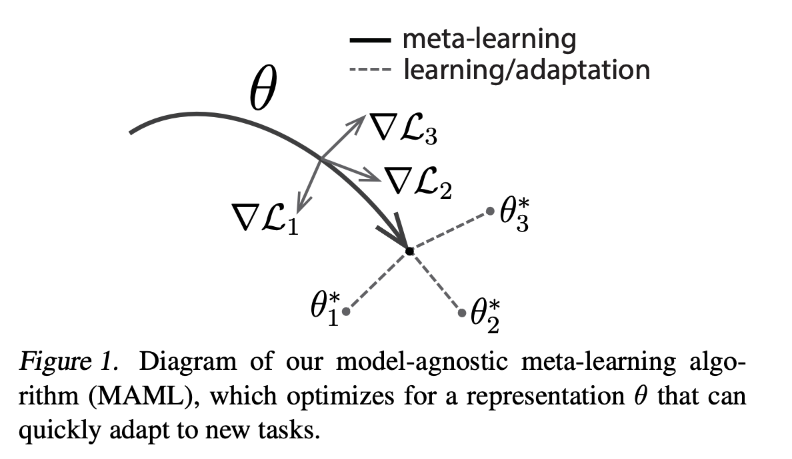
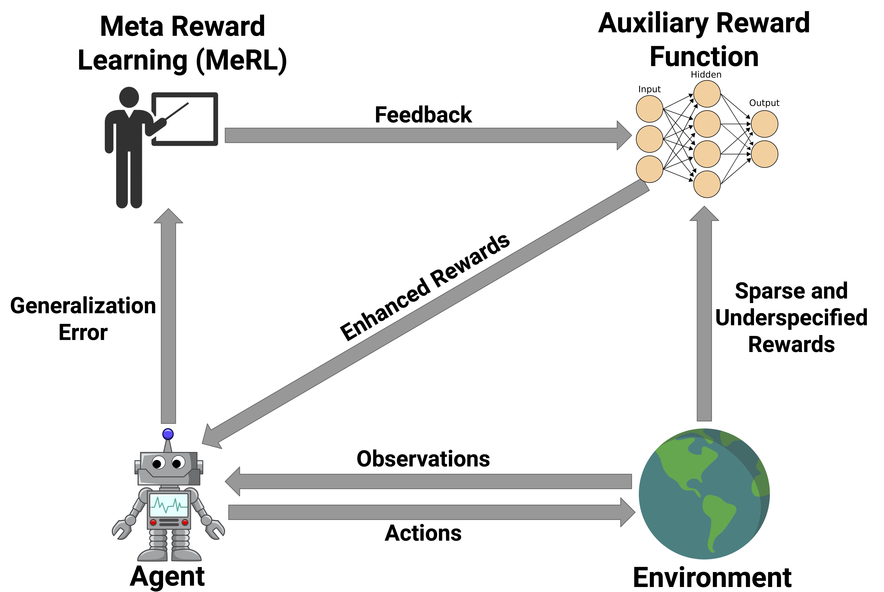

# [MAML](https://paperswithcode.com/method/maml)

**MAML**, or **Model-Agnostic Meta-Learning**, is a model and task-agnostic algorithm for meta-learning that trains a model’s parameters such that a small number of gradient updates will lead to fast learning on a new task.

Consider a model represented by a parametrized function $f_{\theta}$ with parameters $\theta$. When adapting to a new task $\mathcal{T}_{i}$, the model’s parameters $\theta$ become $\theta'_{i}$. With MAML, the updated parameter vector $\theta'_{i}$ is computed using one or more gradient descent updates on task $\mathcal{T}_{i}$. For example, when using one gradient update,

$$ \theta'_{i} = \theta - \alpha\nabla_{\theta}\mathcal{L}_{\mathcal{T}_{i}}\left(f_{\theta}\right) $$

The step size $\alpha$ may be fixed as a hyperparameter or metalearned. The model parameters are trained by optimizing for the performance of $f_{\theta'_{i}}$ with respect to $\theta$ across tasks sampled from $p\left(\mathcal{T}_{i}\right)$. More concretely the meta-objective is as follows:

$$ \min_{\theta} \sum_{\mathcal{T}_{i} \sim p\left(\mathcal{T}\right)} \mathcal{L}_{\mathcal{T_{i}}}\left(f_{\theta'_{i}}\right) = \sum_{\mathcal{T}_{i} \sim p\left(\mathcal{T}\right)} \mathcal{L}_{\mathcal{T_{i}}}\left(f_{\theta - \alpha\nabla_{\theta}\mathcal{L}_{\mathcal{T}_{i}}\left(f_{\theta}\right)}\right) $$

Note that the meta-optimization is performed over the model parameters $\theta$, whereas the objective is computed using the updated model parameters $\theta'$. In effect MAML aims to optimize the model parameters such that one or a small number of gradient steps on a new task will produce maximally effective behavior on that task. The meta-optimization across tasks is performed via stochastic gradient descent (SGD), such that the model parameters $\theta$ are updated as follows:

$$ \theta \leftarrow \theta - \beta\nabla_{\theta} \sum_{\mathcal{T}_{i} \sim p\left(\mathcal{T}\right)} \mathcal{L}_{\mathcal{T_{i}}}\left(f_{\theta'_{i}}\right)$$

where $\beta$ is the meta step size.

source: [source]http://arxiv.org/abs/1703.03400v3
# [MeRL](https://paperswithcode.com/method/merl)

The key insight of MeRL in dealing with underspecified rewards is that spurious trajectories and programs that achieve accidental success are detrimental to the agent's generalization performance. For example, an agent might be able to solve a specific instance of the maze problem above. However, if it learns to perform spurious actions during training, it is likely to fail when provided with unseen instructions. To mitigate this issue, MeRL optimizes a more refined auxiliary reward function, which can differentiate between accidental and purposeful success based on features of action trajectories. The auxiliary reward is optimized by maximizing the trained agent's performance on a hold-out validation set via meta learning.

source: [source]https://arxiv.org/abs/1902.07198v4
