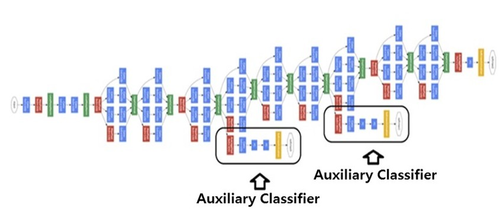
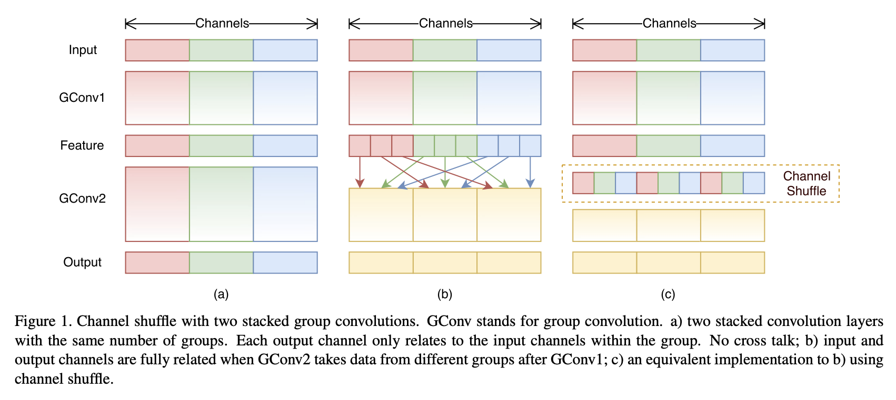
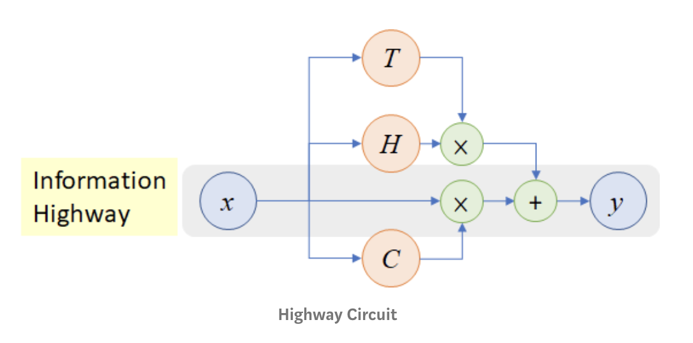
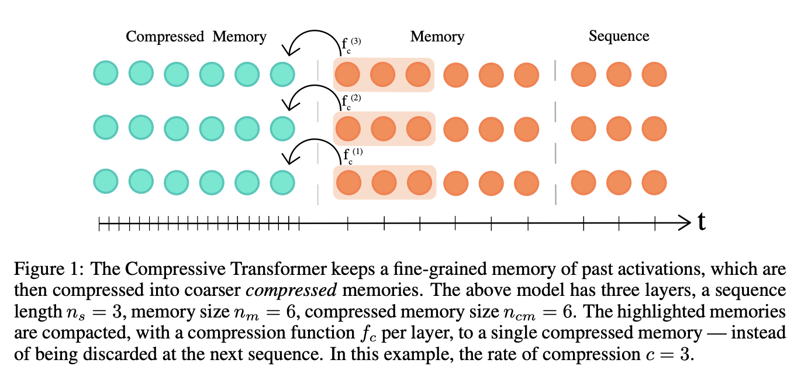

# Auxiliary Classifier

**Auxiliary Classifiers** are an architecture feature that seek to improve the convergence of very deep networks. They connect an auxiliary classifier head to layers before the end of the network. The motivation is to push useful gradients to the lower layers to make them immediately useful and improve the convergence during training by combating the vanishing gradient problem in very deep networks. They are notably used in the Inception family of convolutional neural networks.

# Channel Shuffle

**Channel Shuffle** is an operation to help the information flowing across feature channels in convolutional neural networks. If we allow a group convolution to obtain input data from different groups, the input and output channels will be fully related. Specifically, for the feature map generated from the previous group layer, we can first divide the channels in each group into several subgroups, then feed each group in the next layer with different subgroups. This can be efficiently and elegantly implemented by a channel shuffle operation: suppose a convolutional layer with $g$ groups whose output has $g \times n$ channels; we first reshape the output channel dimension into $\left(g, n\right)$, transposing and then flattening it back as the input of next layer. Channel shuffle is also differentiable, which means it can be embedded into network structures for end-to-end training.

# Highway Layer

A **Highway Layer** contains an information highway to other layers that helps with information flow. It is characterised by the use of a gating unit to help this information flow. 

A plain feedforward neural network typically consists of $L$ layers where the $l$th layer ($l \in ${$1, 2, \dots, L$}) applies a nonlinear transform $H$ (parameterized by $\mathbf{W_{H,l}}$) on its input $\mathbf{x_{l}}$ to produce its output $\mathbf{y_{l}}$. Thus, $\mathbf{x_{1}}$ is the input to the network and $\mathbf{y_{L}}$ is the network’s output. Omitting the layer index and biases for clarity,

$$ \mathbf{y} = H\left(\mathbf{x},\mathbf{W_{H}}\right) $$

$H$ is usually an affine transform followed by a non-linear activation function, but in general it may take other forms. 

For a highway network, we additionally define two nonlinear transforms $T\left(\mathbf{x},\mathbf{W_{T}}\right)$ and $C\left(\mathbf{x},\mathbf{W_{C}}\right)$ such that:

$$ \mathbf{y} = H\left(\mathbf{x},\mathbf{W_{H}}\right)·T\left(\mathbf{x},\mathbf{W_{T}}\right) + \mathbf{x}·C\left(\mathbf{x},\mathbf{W_{C}}\right)$$

We refer to T as the transform gate and C as the carry gate, since they express how much of the output is produced by transforming the input and carrying it, respectively. In the original paper, the authors set $C = 1 − T$, giving:

$$ \mathbf{y} = H\left(\mathbf{x},\mathbf{W_{H}}\right)·T\left(\mathbf{x},\mathbf{W_{T}}\right) + \mathbf{x}·\left(1-T\left(\mathbf{x},\mathbf{W_{T}}\right)\right)$$

The authors set:

$$ T\left(x\right) = \sigma\left(\mathbf{W_{T}}^{T}\mathbf{x} + \mathbf{b_{T}}\right) $$

Image: [Sik-Ho Tsang](https://towardsdatascience.com/review-highway-networks-gating-function-to-highway-image-classification-5a33833797b5)

# Scatter Connection

A **Scatter Connection** is a type of connection that allows a vector to be "scattered" onto a layer representing a map, so that a vector at a specific location corresponds to objects of interest at that location (e.g. units in Starcraft II). This allows for the integration of spatial and non-spatial features.

# Holographic Reduced Representation

**Holographic Reduced Representations** are a simple mechanism to represent an associative array of key-value pairs in a fixed-size vector. Each individual key-value pair is the same size as the entire associative array; the array is represented by the sum of the pairs. Concretely, consider a complex vector key $r = (a_{r}[1]e^{iφ_{r}[1]}, a_{r}[2]e^{iφ_{r}[2]}, \dots)$, which is the same size as the complex vector value x. The pair is "bound" together by element-wise complex multiplication, which multiplies the moduli and adds the phases of the elements:

$$ y = r \otimes x $$

$$ y =  \left(a_{r}[1]a_{x}[1]e^{i(φ_{r}[1]+φ_{x}[1])}, a_{r}[2]a_{x}[2]e^{i(φ_{r}[2]+φ_{x}[2])}, \dots\right) $$

Given keys $r_{1}$, $r_{2}$, $r_{3}$ and input vectors $x_{1}$, $x_{2}$, $x_{3}$, the associative array is:

$$c = r_{1} \otimes x_{1} + r_{2} \otimes x_{2} + r_{3} \otimes x_{3} $$

where we call $c$ a memory trace. Define the key inverse:

$$ r^{-1} = \left(a_{r}[1]^{−1}e^{−iφ_{r}[1]}, a_{r}[2]^{−1}e^{−iφ_{r}[2]}, \dots\right) $$

To retrieve the item associated with key $r_{k}$, we multiply the memory trace element-wise by the vector $r^{-1}_{k}$. For example: 

$$ r_{2}^{−1} \otimes c = r_{2}^{-1} \otimes \left(r_{1} \otimes x_{1} + r_{2} \otimes x_{2} + r_{3} \otimes x_{3}\right) $$

$$ r_{2}^{−1} \otimes c = x_{2} + r^{-1}_{2} \otimes \left(r_{1} \otimes x_{1} + r_{3} \otimes x3\right) $$

$$ r_{2}^{−1} \otimes c = x_{2} + noise $$

The product is exactly $x_{2}$ together with a noise term. If the phases of the elements of the key vector are randomly distributed, the noise term has zero mean.

Source: [Associative LSTMs](https://arxiv.org/pdf/1602.03032.pdf)

# Compressed Memory

**Compressed Memory** is a secondary FIFO memory component proposed as part of the [Compressive Transformer](https://paperswithcode.com/method/compressive-transformer) model. The Compressive Transformer keeps a fine-grained memory of past activations, which are then compressed into coarser compressed memories. 

For choices of compression functions $f_{c}$ the authors consider (1) max/mean pooling, where the kernel and stride is set to the compression rate $c$; (2) 1D convolution also with kernel &amp; stride set to $c$; (3) dilated convolutions; (4) **most-used** where the memories are sorted by their average attention (usage) and the most-used are preserved.

