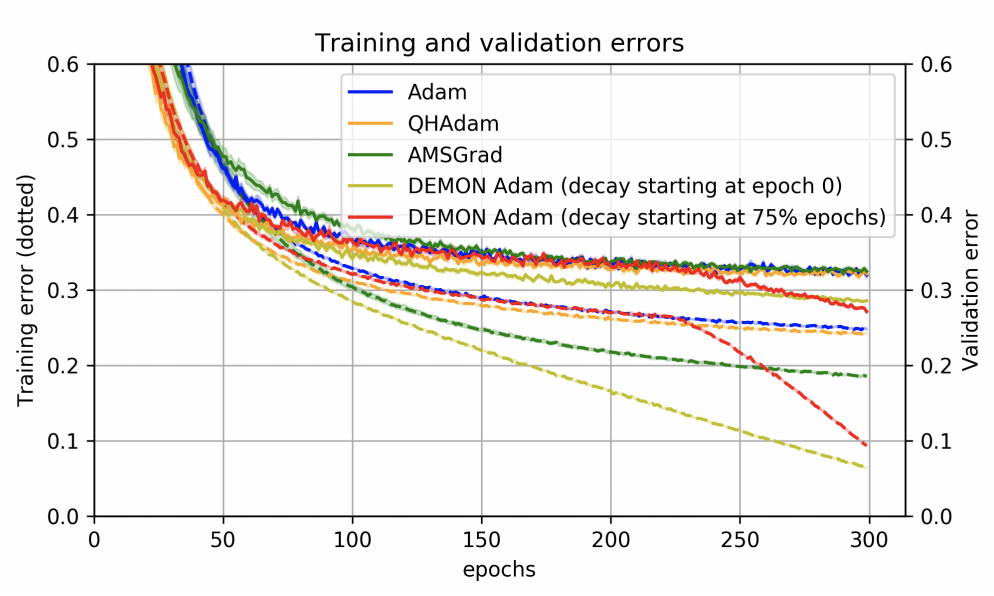

# [Demon](https://paperswithcode.com/method/demon)

**Decaying Momentum**, or **Demon**, is a stochastic optimizer motivated by decaying the total contribution of a gradient to all future updates. By decaying the momentum parameter, the total contribution of a gradient to all future updates is decayed. A particular gradient term $g_{t}$ contributes a total of  $\eta\sum_{i}\beta^{i}$ of its "energy" to all future gradient updates, and this results in the geometric sum, $\sum^{\infty}_{i=1}\beta^{i} = \beta\sum^{\infty}_{i=0}\beta^{i} = \frac{\beta}{\left(1-\beta\right)}$. Decaying this sum results in the Demon algorithm. Letting $\beta_{init}$ be the initial $\beta$; then at the current step $t$ with total $T$ steps, the decay routine is given by solving the below for $\beta_{t}$:

$$ \frac{\beta_{t}}{\left(1-\beta_{t}\right)} =  \left(1-t/T\right)\beta_{init}/\left(1-\beta_{init}\right)$$

Where $\left(1-t/T\right)$ refers to the proportion of iterations remaining. Note that Demon typically requires no hyperparameter tuning as it is usually decayed to $0$ or a small negative value at time 
$T$. Improved performance is observed by delaying the decaying. Demon can be applied to any gradient descent algorithm with a momentum parameter.

source: [source](https://arxiv.org/abs/1910.04952v2)
