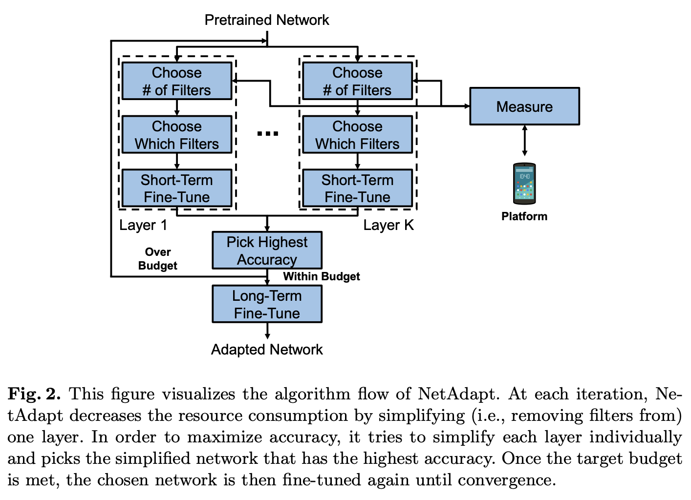

# [NetAdapt](https://paperswithcode.com/method/netadapt)

**NetAdapt** is a network shrinking algorithm to adapt a pretrained network to a mobile platform given a real resource budget. NetAdapt can incorporate direct metrics, such as latency and energy, into the optimization to maximize the adaptation performance based on the characteristics of the platform. By using empirical measurements, NetAdapt can be applied to any platform as long as we can measure the desired metrics, without any knowledge of the underlying implementation of the platform. 

While many existing algorithms simplify networks based on the number of MACs or weights, optimizing those indirect metrics may not necessarily reduce the direct metrics, such as latency and energy consumption. To solve this problem, NetAdapt incorporates direct metrics into its adaptation algorithm. These direct metrics are evaluated using **empirical measurements**, so that detailed knowledge of the platform and toolchain is not required. NetAdapt automatically and progressively simplifies a pre-trained network until the resource budget is met while maximizing the accuracy.

source: [source](http://arxiv.org/abs/1804.03230v2)
