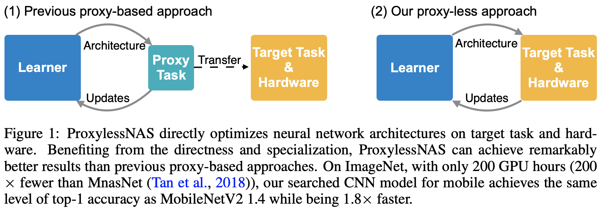
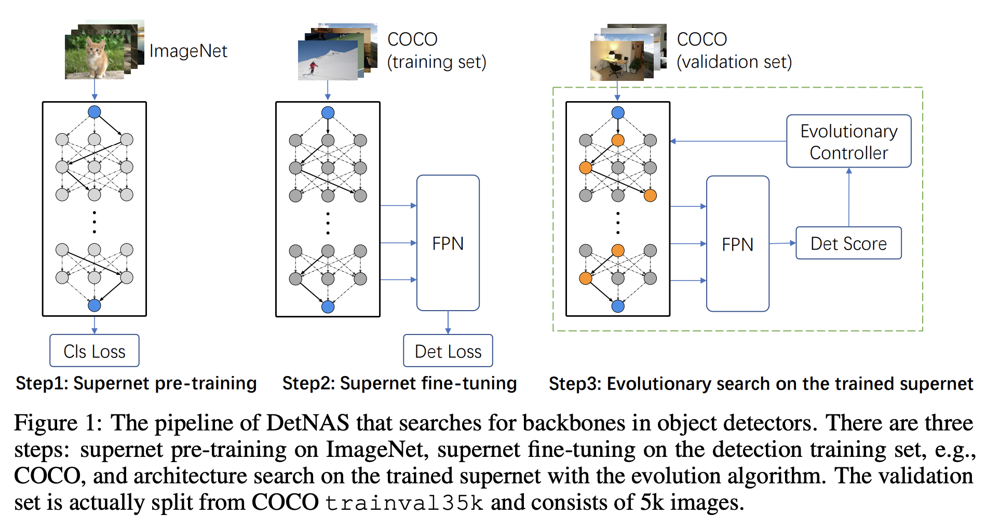
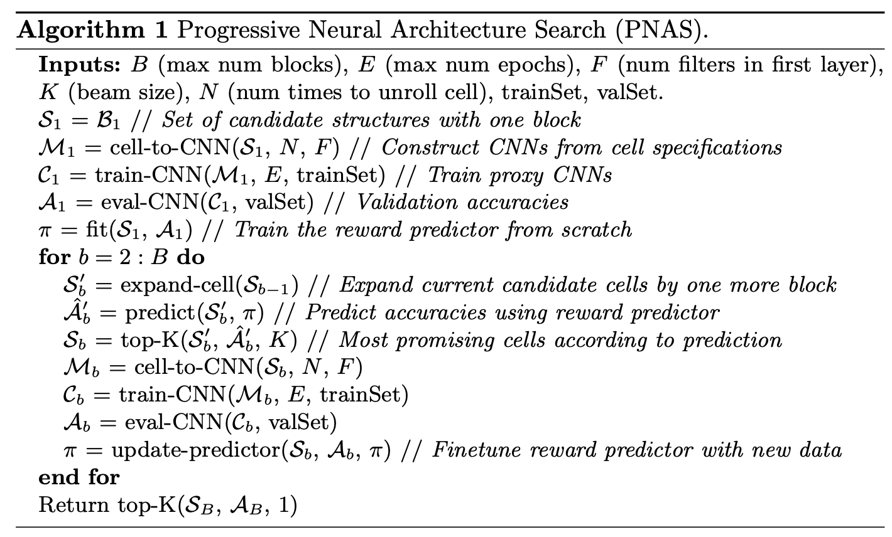
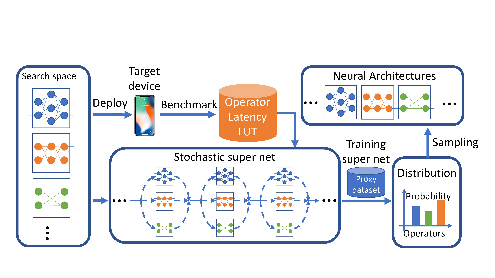
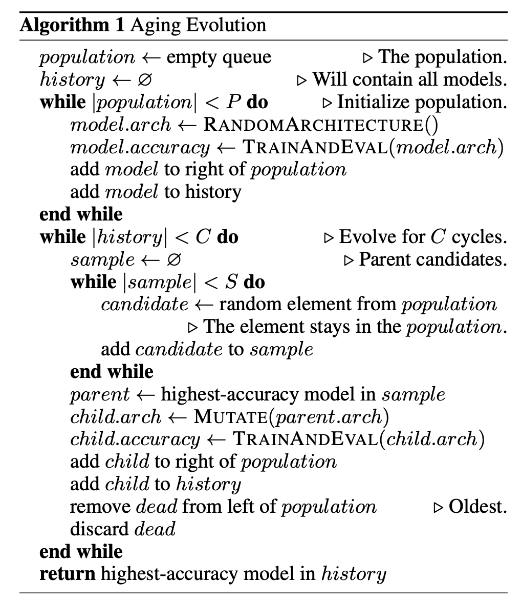
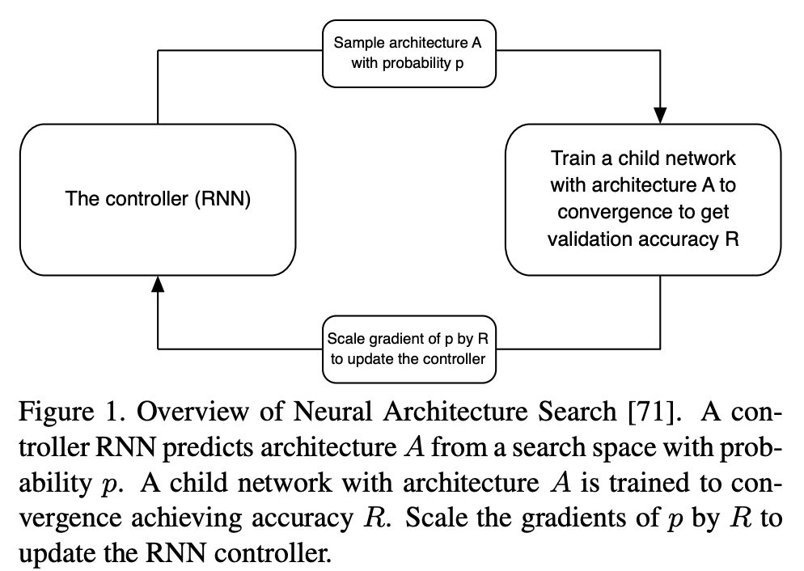
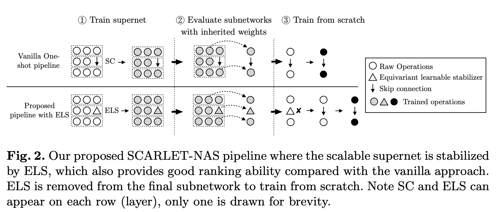
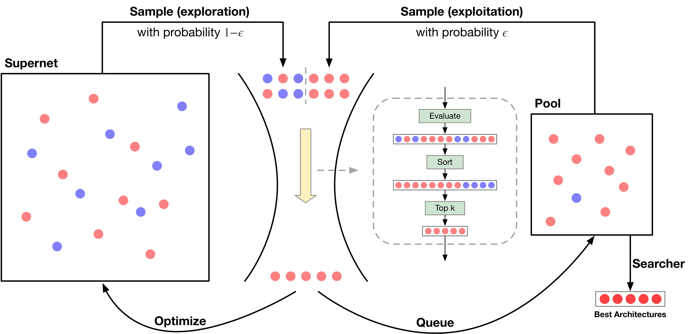
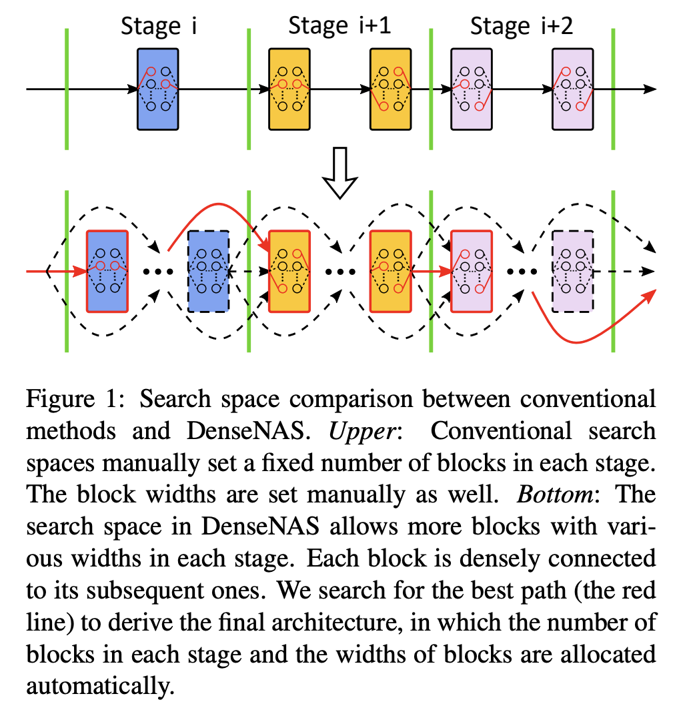
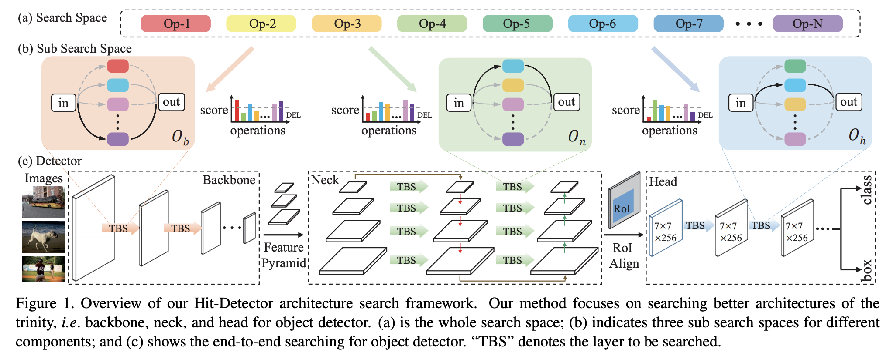

# ProxylessNAS

**ProxylessNAS** directly learns neural network architectures on the target task and target hardware without any proxy. Other contributions include:

<li>Using a new path-level pruning perspective for NAS, showing a close connection
between NAS and model compression. Memory consumption is saved by one order of magnitude by using path-level binarization.</li>
- Using a novel gradient-based approach (latency regularization loss) for handling hardware objectives (e.g. latency). Given different hardware platforms: CPU/GPU/Mobile, ProxylessNAS enables hardware-aware neural network specialization that’s exactly optimized for the target hardware.

# DetNAS

**DetNAS** is a neural architecture search algorithm for the design of better backbones for object detection. It is based on the technique of one-shot supernet, which contains all possible networks in the search space, we propose a framework for backbone search on object detection. The supernet is trained under the typical detector training schedule: ImageNet pre-training and detection fine-tuning. Then, the architecture search is performed on the trained supernet, using the detection task as the guidance. DetNAS uses evolutionary search as opposed to RL-based methods or gradient-based methods.

# PNAS

**Progressive Neural Architecture Search**, or **PNAS**, is a method for learning the structure of convolutional neural networks (CNNs). It uses a sequential model-based optimization (SMBO) strategy, where we search the space of cell structures, starting with simple (shallow) models and progressing to complex ones, pruning out unpromising structures as we go. At iteration $b$ of the algorithm, we have a set of $K$ candidate cells (each of size $b$ blocks), which we train and evaluate on a dataset of interest. Since this process is expensive, PNAS also learns a model or surrogate function which can predict the performance of a structure without needing to training it. We expand the $K$ candidates of size $b$ into $K' \gg K$ children, each of size $b+1$. The surrogate function is used to rank all of the $K'$ children, pick the top $K$, and then train and evaluate them. We continue in this way until $b=B$, which is the maximum number of blocks we want to use in our cell.

# DNAS

**DNAS**, or **Differentiable Neural Architecture Search**, uses gradient-based methods to optimize ConvNet architectures, avoiding enumerating and training individual architectures separately as in previous methods. DNAS allows us to explore a layer-wise search space where we can choose a different block for each layer of the network. DNAS represents the search space by a super net whose operators execute stochastically. We relax the problem of finding the optimal architecture to find a distribution that yields the optimal architecture. By using the Gumbel Softmax technique, we can directly train the architecture distribution using gradient-based optimization such as SGD.

The loss used to train the stochastic super net consists of both the cross-entropy loss that leads to better accuracy and the latency loss that penalizes the network's latency on a target device. To estimate the latency of an architecture, we measure the latency of each operator in the search space and use a lookup table model to compute the overall latency by adding up the latency of each operator. Using this model allows us to quickly estimate the latency of architectures in this enormous search space. More importantly, it makes the latency differentiable with respect to layer-wise block choices.

# Aging Evolution

**Aging Evolution**, or **Regularized Evolution**, is an evolutionary algorithm for neural architecture search. Whereas in tournament selection, the best architectures are kept, in aging evolution we associate each genotype with an age, and bias the tournament selection to choose
the younger genotypes. In the context of architecture search, aging evolution allows us to explore the search space more, instead of zooming in on good models too early, as non-aging evolution would.

# Neural Architecture Search

**Neural Architecture Search (NAS)** learns a modular architecture which can be transferred from a small dataset to a large dataset. The method does this by reducing the problem of learning best convolutional architectures to the problem of learning a small convolutional cell. The cell can then be stacked in series to handle larger images and more complex datasets.

Note that this refers to the original method referred to as NAS - there is also a broader category of methods called "neural architecture search".

# SCARLET-NAS

**SCARLET-NAS** is a type of neural architecture search that utilises a learnable stabilizer to calibrate feature deviation, named the Equivariant Learnable Stabilizer (ELS). Previous one-shot approaches can be limited by fixed-depth search spaces. With SCARLET-NAS, we use the equivariant learnable stabilizer on each skip connection. This can lead to improved convergence, more reliable evaluation, and retained equivalence. The third benefit is deemed most important by the authors for scalability. As appending stabilizers to a model doesn't change its representational capacity, we can now evaluate the stabilized counterpart as an identical proxy.

# GreedyNAS

**GreedyNAS** is a one-shot neural architecture search method. Previous methods held the assumption that a supernet should give a reasonable ranking over all paths. They thus treat all paths equally, and spare much effort to train paths. However, it is harsh for a single supernet to evaluate accurately on such a huge-scale search space (eg, $7^{21}$). GreedyNAS eases the burden of supernet by encouraging focus more on evaluation of potentially-good candidates, which are identified using a surrogate portion of validation data. 

Concretely, during training, GreedyNAS utilizes a multi-path sampling strategy with rejection, and greedily filters the weak paths. The training efficiency is thus boosted since the training space has been greedily shrunk from all paths to those potentially-good ones. An exploration and exploitation policy is adopted by introducing an empirical candidate path pool.

# DenseNAS

**DenseNAS** is a neural architecture search method that utilises a densely connected search space. The search space is represented as a dense super network, which is built upon our designed routing blocks. In the super network, routing blocks are densely connected and we search for the best path between them to derive the final architecture. A chained cost estimation algorithm is used to approximate the model cost during the search.

# Hit-Detector

**Hit-Detector** is a neural architectures search algorithm that simultaneously searches all components of the detector in an end-to-end manner. It is a hierarchical approach to mine the proper subsearch space from the large volume of operation candidates. It consists of two main procedures. First, given a large search space containing all the operation candidates, we screen out the customized sub search space suitable for each part of detector with the help of group sparsity regularization. Secondly, we search the architectures for each part within the corresponding sub search space by adopting the differentiable manner.

