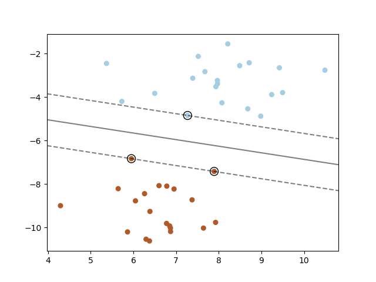
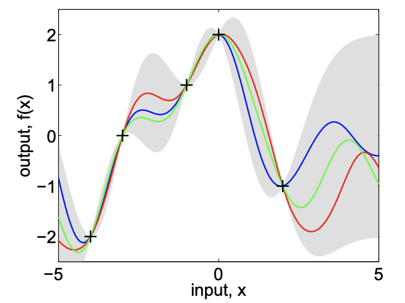

# [SVM](https://paperswithcode.com/method/svm)

A **Support Vector Machine**, or **SVM**, is a non-parametric supervised learning model. They can For non-linear classification and regression, they utilise the kernel trick to map inputs to high-dimensional feature spaces. SVMs construct a hyper-plane or set of hyper-planes in a high or infinite dimensional space, which can be used for classification, regression or other tasks. Intuitively, a good separation is achieved by the hyper-plane that has the largest distance to the nearest training data points of any class (so-called functional margin), since in general the larger the margin the lower the generalization error of the classifier. The figure to the right shows the decision function for a linearly separable problem, with three samples on the margin boundaries, called “support vectors”. 

Source: [scikit-learn](https://scikit-learn.org/stable/modules/svm.html)

# [Gaussian Process](https://paperswithcode.com/method/gaussian-process)

**Gaussian Processes** are non-parametric models for approximating functions. They rely upon a measure of similarity between points (the kernel function) to predict the value for an unseen point from training data. The models are fully probabilistic so uncertainty bounds are baked in with the model.

Image Source: Gaussian Processes for Machine Learning, C. E. Rasmussen &amp; C. K. I. Williams

# [k-NN](https://paperswithcode.com/method/k-nn)

**$k$-Nearest Neighbors** is a clustering-based algorithm for classification and regression. It is a a type of instance-based learning as it does not attempt to construct a general internal model, but simply stores instances of the training data. Prediction is computed from a simple majority vote of the nearest neighbors of each point: a query point is assigned the data class which has the most representatives within the nearest neighbors of the point.

Source of Description and Image: [scikit-learn](https://scikit-learn.org/stable/modules/neighbors.html#classification)

