# Layer Normalization
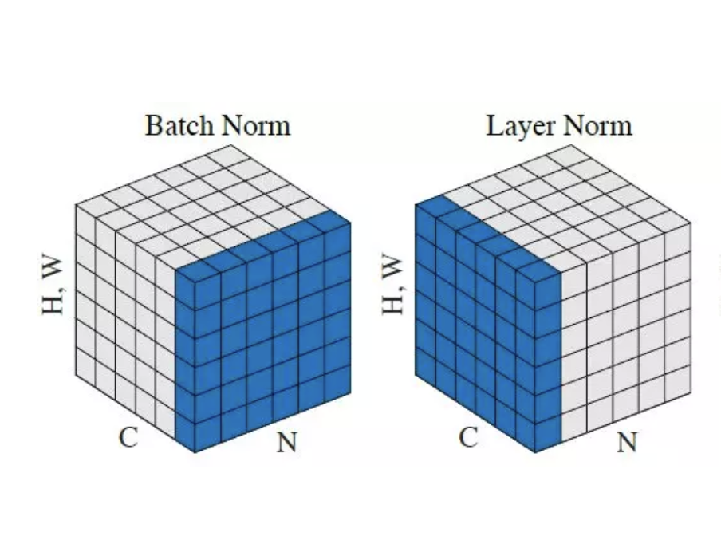

Unlike [batch normalization](https://paperswithcode.com/method/batch-normalization), **Layer Normalization** directly estimates the normalization statistics from the summed inputs to the neurons within a hidden layer so the normalization does not introduce any new dependencies between training cases. It works well for [RNNs](https://paperswithcode.com/methods/category/recurrent-neural-networks) and improves both the training time and the generalization performance of several existing RNN models. More recently, it has been used with [Transformer](https://paperswithcode.com/methods/category/transformers) models.

We compute the layer normalization statistics over all the hidden units in the same layer as follows:

$$ \mu^{l} = \frac{1}{H}\sum^{H}_{i=1}a_{i}^{l} $$

$$ \sigma^{l} = \sqrt{\frac{1}{H}\sum^{H}_{i=1}\left(a_{i}^{l}-\mu^{l}\right)^{2}}  $$

where $H$ denotes the number of hidden units in a layer. Under layer normalization, all the hidden units in a layer share the same normalization terms $\mu$ and $\sigma$, but different training cases have different normalization terms. Unlike batch normalization, layer normalization does not impose any constraint on the size of a mini-batch and it can be used in the pure online regime with batch size 1.

# Batch Normalization
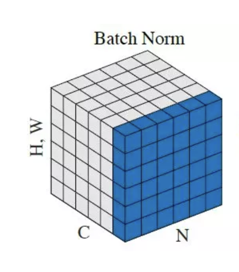

**Batch Normalization** aims to reduce internal covariate shift, and in doing so aims to accelerate the training of deep neural nets. It accomplishes this via a normalization step that fixes the means and variances of layer inputs. Batch Normalization also has a beneficial effect on the gradient flow through the network, by reducing the dependence of gradients on the scale of the parameters or of their initial values. This allows for use of much higher learning rates without the risk of divergence. Furthermore, batch normalization regularizes the model and reduces the need for Dropout.

We apply a batch normalization layer as follows for a minibatch $\mathcal{B}$:

$$ \mu_{\mathcal{B}} = \frac{1}{m}\sum^{m}_{i=1}x_{i} $$

$$ \sigma^{2}_{\mathcal{B}} = \frac{1}{m}\sum^{m}_{i=1}\left(x_{i}-\mu_{\mathcal{B}}\right)^{2} $$

$$ \hat{x}_{i} = \frac{x_{i} - \mu_{\mathcal{B}}}{\sqrt{\sigma^{2}_{\mathcal{B}}+\epsilon}} $$

$$ y_{i} = \gamma\hat{x}_{i} + \beta = \text{BN}_{\gamma, \beta}\left(x_{i}\right) $$

Where $\gamma$ and $\beta$ are learnable parameters.

# Local Response Normalization
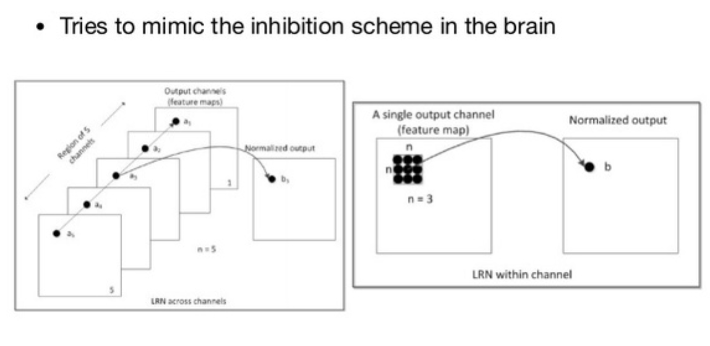

**Local Response Normalization** is a normalization layer that implements the idea of lateral inhibition. Lateral inhibition is a concept in neurobiology that refers to the phenomenon of an excited neuron inhibiting its neighbours: this leads to a peak in the form of a local maximum, creating contrast in that area and increasing sensory perception. In practice, we can either normalize within the same channel or normalize across channels when we apply LRN to convolutional neural networks.

# Instance Normalization
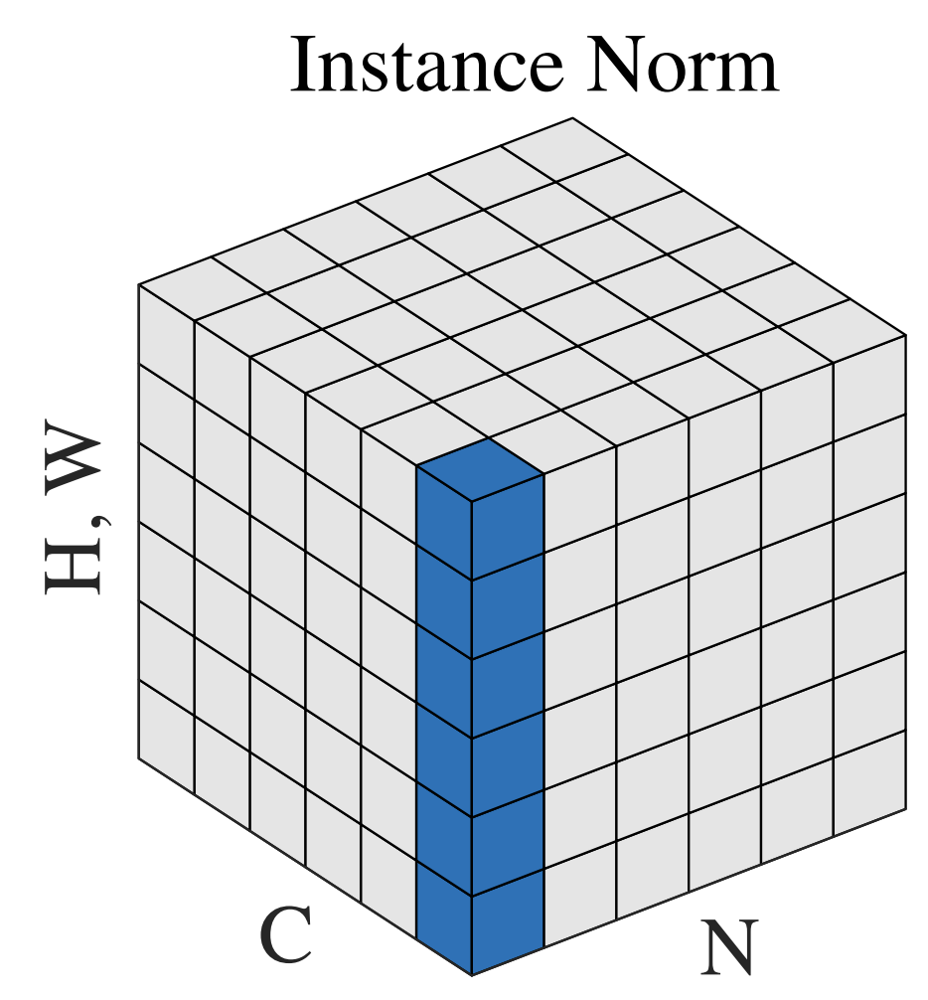

**Instance Normalization** (also known as contrast normalization) is a normalization layer where:

$$
    y_{tijk} =  \frac{x_{tijk} - \mu_{ti}}{\sqrt{\sigma_{ti}^2 + \epsilon}},
    \quad
    \mu_{ti} = \frac{1}{HW}\sum_{l=1}^W \sum_{m=1}^H x_{tilm},
    \quad
    \sigma_{ti}^2 = \frac{1}{HW}\sum_{l=1}^W \sum_{m=1}^H (x_{tilm} - mu_{ti})^2.
$$

This prevents instance-specific mean and covariance shift simplifying the learning process. Intuitively, the normalization process allows to remove instance-specific contrast information from the content image in a task like image stylization, which simplifies generation.

# Spectral Normalization
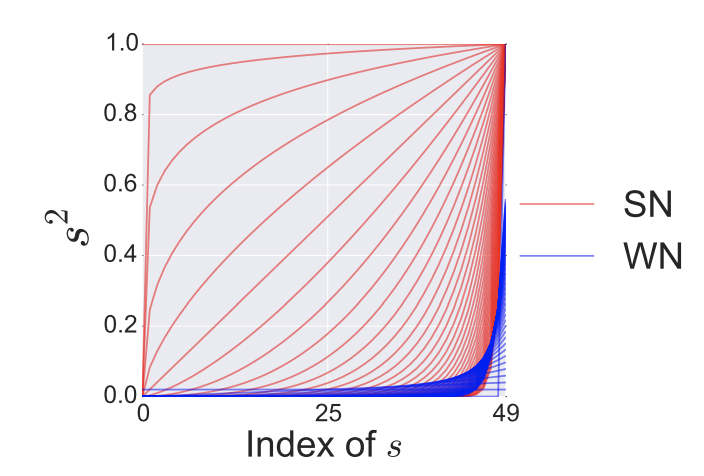

**Spectral Normalization** is a normalization technique used for generative adversarial networks, used to stabilize training of the discriminator. Spectral normalization has the convenient property that the Lipschitz constant is the only hyper-parameter to be tuned.

It controls the Lipschitz constant of the discriminator $f$ by constraining the spectral norm of each layer $g : \textbf{h}_{in} \rightarrow \textbf{h}_{out}$. The Lipschitz norm $\Vert{g}\Vert_{\text{Lip}}$ is equal to $\sup_{\textbf{h}}\sigma\left(\nabla{g}\left(\textbf{h}\right)\right)$, where $\sigma\left(a\right)$ is the spectral norm of the matrix $A$ ($L_{2}$ matrix norm of $A$):

$$ \sigma\left(a\right) = \max_{\textbf{h}:\textbf{h}\neq{0}}\frac{\Vert{A\textbf{h}}\Vert_{2}}{\Vert\textbf{h}\Vert_{2}} = \max_{\Vert\textbf{h}\Vert_{2}\leq{1}}{\Vert{A\textbf{h}}\Vert_{2}} $$

which is equivalent to the largest singular value of $A$. Therefore for a linear layer $g\left(\textbf{h}\right) = W\textbf{h}$ the norm is given by $\Vert{g}\Vert_{\text{Lip}} = \sup_{\textbf{h}}\sigma\left(\nabla{g}\left(\textbf{h}\right)\right) = \sup_{\textbf{h}}\sigma\left(W\right) = \sigma\left(W\right) $. Spectral normalization normalizes the spectral norm of the weight matrix $W$ so it satisfies the Lipschitz constraint $\sigma\left(W\right) = 1$:

$$ \bar{W}_{\text{SN}}\left(W\right) = W / \sigma\left(W\right) $$

# Adaptive Instance Normalization
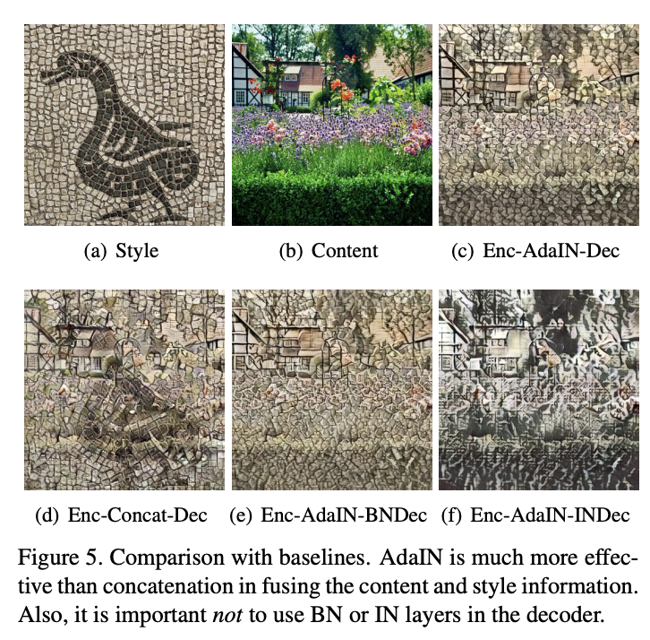

**Adaptive Instance Normalization** is a normalization method that aligns the mean and variance of the content features with those of the style features. 

[Instance Normalization](https://paperswithcode.com/method/instance-normalization) normalizes the input to a single style specified by the affine parameters. Adaptive Instance Normaliation is an extension. In AdaIN, we receive a content input $x$ and a style input $y$, and we simply align the channel-wise mean and variance of $x$ to match those of $y$. Unlike [Batch Normalization](https://paperswithcode.com/method/batch-normalization), Instance Normalization or Conditional Instance Normalization, AdaIN has no learnable affine parameters. Instead, it adaptively computes the affine parameters from the style input:

$$
\textrm{AdaIN}(x, y)= \sigma(y)\left(\frac{x-\mu(x)}{\sigma(x)}\right)+\mu(y)
$$

# Weight Normalization
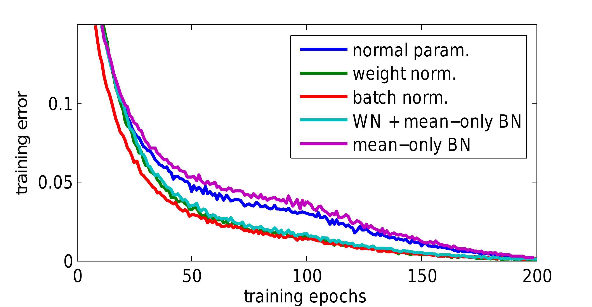

**Weight Normalization** is a normalization method for training neural networks. It is inspired by [batch normalization](https://paperswithcode.com/method/batch-normalization), but it is a deterministic method that does not share batch normalization's property of adding noise to the gradients. It reparameterizes each weight vector $\textbf{w}$ in terms of a parameter vector $\textbf{v}$ and a scalar parameter $g$ and to perform stochastic gradient descent with respect to those parameters instead. Weight vectors are expressed in terms of the new parameters using:

$$ \textbf{w} = \frac{g}{\Vert\textbf{v}\Vert}\textbf{v}$$

where $\textbf{v}$ is a $k$-dimensional vector, $g$ is a scalar, and $\Vert\textbf{v}\Vert$ denotes the Euclidean norm of $\textbf{v}$. This reparameterization has the effect of fixing the Euclidean norm of the weight vector $\textbf{w}$: we now have $\Vert\textbf{w}\Vert = g$, independent of the parameters $\textbf{v}$.

# Conditional Batch Normalization
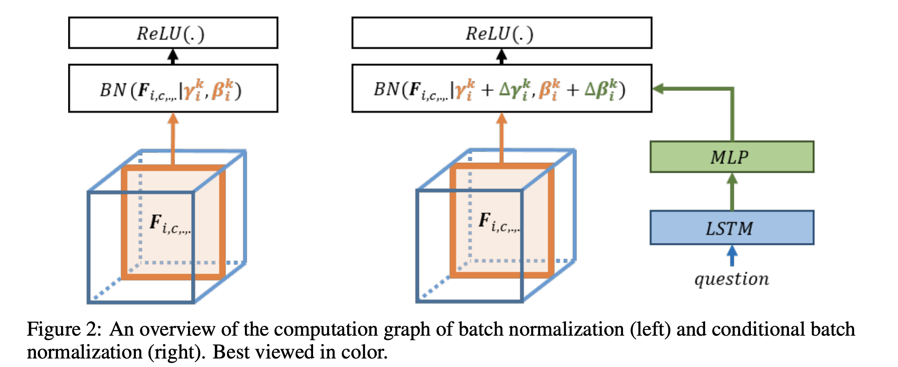

**Conditional Batch Normalization (CBN)** is a class-conditional variant of [batch normalization](https://paperswithcode.com/method/batch-normalization). The key idea is to predict the $\gamma$ and $\beta$ of the batch normalization from an embedding - e.g. a language embedding in VQA. CBN enables the linguistic embedding to manipulate entire feature maps by scaling them up or down, negating them, or shutting them off. CBN has also been used in [GANs](https://paperswithcode.com/methods/category/generative-adversarial-networks) to allow class information to affect the batch normalization parameters.

Consider a single convolutional layer with batch normalization module $\text{BN}\left(F_{i,c,h,w}|\gamma_{c}, \beta_{c}\right)$ for which pretrained scalars $\gamma_{c}$ and $\beta_{c}$ are available. We would like to directly predict these affine scaling parameters from, e.g., a language embedding $\mathbf{e_{q}}$. When starting the training procedure, these parameters must be close to the pretrained values to recover the original ResNet model as a poor initialization could significantly deteriorate performance. Unfortunately, it is difficult to initialize a network to output the pretrained $\gamma$ and $\beta$. For these reasons, the authors propose to predict a change $\delta\beta_{c}$ and $\delta\gamma_{c}$ on the frozen original scalars, for which it is straightforward to initialize a neural network to produce an output with zero-mean and small variance.

The authors use a one-hidden-layer MLP to predict these deltas from a question embedding $\mathbf{e_{q}}$ for all feature maps within the layer:

$$\Delta\beta = \text{MLP}\left(\mathbf{e_{q}}\right)$$

$$\Delta\gamma = \text{MLP}\left(\mathbf{e_{q}}\right)$$

So, given a feature map with $C$ channels, these MLPs output a vector of size $C$. We then add these predictions to the $\beta$ and $\gamma$ parameters:

$$ \hat{\beta}_{c} = \beta_{c} + \Delta\beta_{c} $$

$$ \hat{\gamma}_{c} = \gamma_{c} + \Delta\gamma_{c} $$

Finally, these updated $\hat{β}$ and $\hat{\gamma}$ are used as parameters for the batch normalization: $\text{BN}\left(F_{i,c,h,w}|\hat{\gamma_{c}}, \hat{\beta_{c}}\right)$. The authors freeze all ResNet parameters, including $\gamma$ and $\beta$, during training. A ResNet consists of
four stages of computation, each subdivided in several residual blocks. In each block, the authors apply CBN to the three convolutional layers.

# Group Normalization
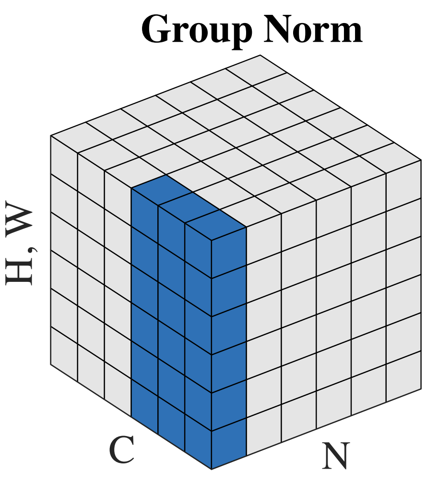

**Group Normalization** is a normalization layer that divides channels into groups and normalizes the features within each group. GN does not exploit the batch dimension, and its computation is independent of batch sizes. In the case where the group size is 1, it is equivalent to [Instance Normalization](https://paperswithcode.com/method/instance-normalization).

As motivation for the method, many classical features like SIFT and HOG had **group-wise** features and involved **group-wise normalization**. For example, a HOG vector is the outcome of several spatial cells where each cell is represented by a normalized orientation histogram.

Formally, Group Normalization is defined as:

$$ \mu_{i} = \frac{1}{m}\sum_{k\in\mathcal{S}_{i}}x_{k} $$

$$ \sigma^{2}_{i} = \frac{1}{m}\sum_{k\in\mathcal{S}_{i}}\left(x_{k}-\mu_{i}\right)^{2} $$

$$ \hat{x}_{i} = \frac{x_{i} - \mu_{i}}{\sqrt{\sigma^{2}_{i}+\epsilon}} $$

Here $x$ is the feature computed by a layer, and $i$ is an index. Formally, a Group Norm layer computes $\mu$ and $\sigma$ in a set $\mathcal{S}_{i}$ defined as: $\mathcal{S}_{i} = ${$k \mid k_{N} = i_{N} ,\lfloor\frac{k_{C}}{C/G}\rfloor = \lfloor\frac{I_{C}}{C/G}\rfloor $}.

Here $G$ is the number of groups, which is a pre-defined hyper-parameter ($G = 32$ by default). $C/G$ is the number of channels per group. $\lfloor$ is the floor operation, and the final term means that the indexes $i$ and $k$ are in the same group of channels, assuming each group of channels are stored in a sequential order along the $C$ axis.

# Activation Normalization
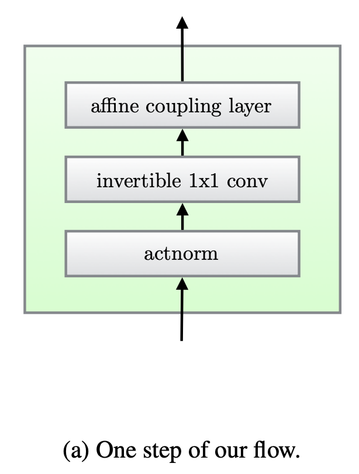

**Activation Normalization** is a type of normalization used for flow-based generative models; specifically it was introduced in the [GLOW](https://paperswithcode.com/method/glow) architecture. An ActNorm layer performs an affine transformation of the activations using a scale and bias parameter per channel, similar to batch normalization. These parameters are initialized such that the post-actnorm activations per-channel have zero mean and unit variance given an initial minibatch of data. This is a form of data dependent initilization. After initialization, the scale and bias are treated as regular trainable parameters that are independent of the data.

# Weight Demodulation
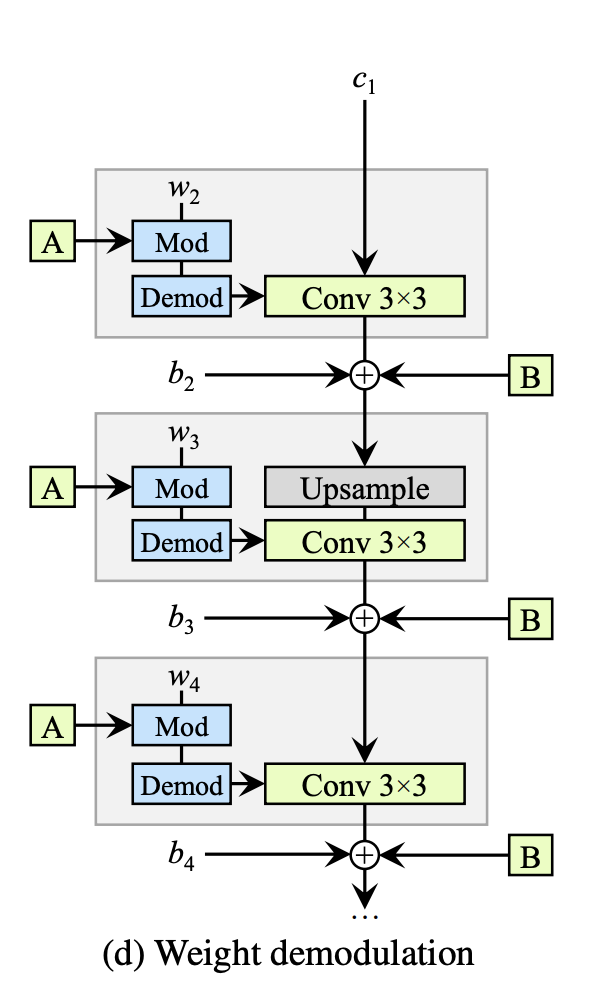

**Weight Modulation** is an alternative to [adaptive instance normalization](https://paperswithcode.com/method/adaptive-instance-normalization) for use in generative adversarial networks, specifically it is introduced in [StyleGAN2](https://paperswithcode.com/method/stylegan2). The purpose of instance normalization is to remove the effect of $s$ - the scales of the features maps - from the statistics of the convolution’s output feature maps. Weight modulation tries to achieve this goal more directly. Assuming that input activations are i.i.d. random variables with unit standard deviation. After modulation and convolution, the output activations have standard deviation of:

$$ \sigma_{j} = \sqrt{{\sum_{i,k}w_{ijk}'}^{2}} $$

i.e., the outputs are scaled by the $L_{2}$ norm of the corresponding weights. The subsequent normalization aims to restore the outputs back to unit standard deviation. This can be achieved if we scale (“demodulate”) each output feature map $j$ by $1/\sigma_{j}$ . Alternatively, we can again bake this into the convolution weights:

$$ w''_{ijk} = w'_{ijk} / \sqrt{{\sum_{i, k}w'_{ijk}}^{2} + \epsilon} $$

where $\epsilon$ is a small constant to avoid numerical issues.

# Switchable Normalization
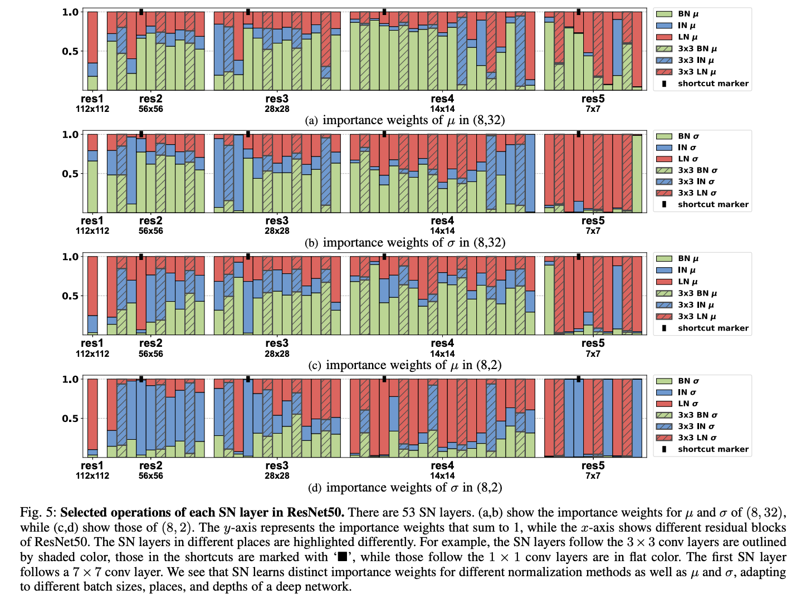

**Switchable Normalization** combines three types of statistics estimated channel-wise, layer-wise, and minibatch-wise by using [instance normalization](https://paperswithcode.com/method/instance-normalization), [layer normalization](https://paperswithcode.com/method/layer-normalization), and batch normalization respectively. [Switchable Normalization](https://paperswithcode.com/method/switchable-normalization) switches among them by learning their importance weights.

# Weight Standardization
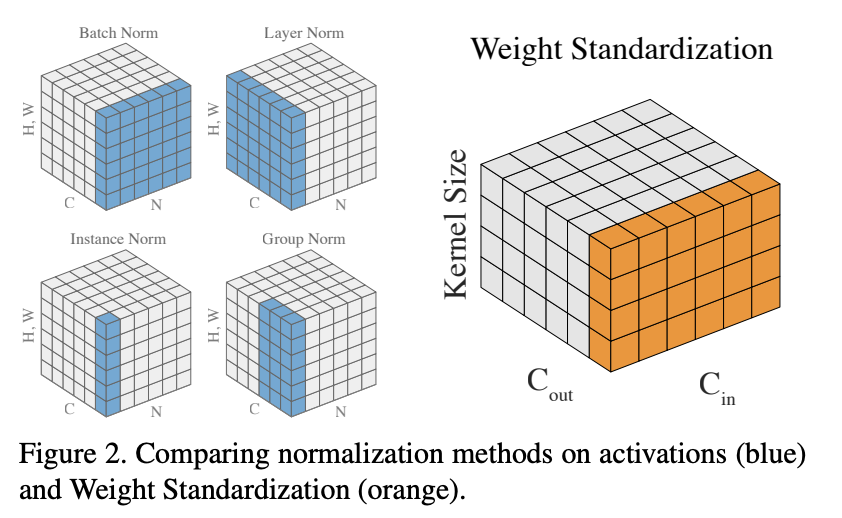

**Weight Standardization** is a normalization technique that smooths the loss landscape by standardizing the weights in convolutional layers. Different from the previous normalization methods that focus on **activations**, WS considers the smoothing effects of **weights** more than just length-direction decoupling. Theoretically, WS reduces the Lipschitz constants of the loss and the gradients.
Hence, WS smooths the loss landscape and improves training.

In Weight Standardization, instead of directly optimizing the loss $\mathcal{L}$ on the original weights $\hat{W}$, we reparameterize the weights $\hat{W}$ as a function of $W$, i.e. $\hat{W}=\text{WS}(W)$, and optimize the loss $\mathcal{L}$ on $W$ by SGD:

$$
    \hat{W} = \Big[ \hat{W}_{i,j}~\big|~ \hat{W}_{i,j} = \dfrac{W_{i,j} - \mu_{W_{i,\cdot}}}{\sigma_{W_{i,\cdot}+\epsilon}}\Big]
$$

$$
    y = \hat{W}*x
$$

where

$$
    \mu_{W_{i,\cdot}} = \dfrac{1}{I}\sum_{j=1}^{I}W_{i, j},~~\sigma_{W_{i,\cdot}}=\sqrt{\dfrac{1}{I}\sum_{i=1}^I(W_{i,j} - \mu_{W_{i,\cdot}})^2}
$$

Similar to [Batch Normalization](https://paperswithcode.com/method/batch-normalization), WS controls the first and second moments of the weights of each output channel individually in convolutional layers. Note that many initialization methods also initialize the weights in some similar ways. Different from those methods, WS standardizes the weights in a differentiable way which aims to normalize gradients during back-propagation. Note that we do not have any affine transformation on $\hat{W}$. This is because we assume that normalization layers such as BN or [GN](https://paperswithcode.com/method/group-normalization) will normalize this convolutional layer again.

# Local Contrast Normalization
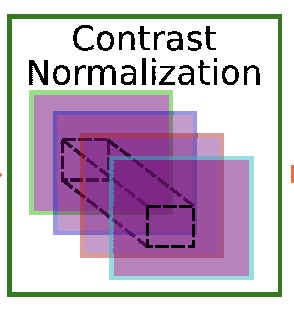

**Local Contrast Normalization** is a type of normalization that performs local subtraction and division normalizations, enforcing a sort of local competition between adjacent features in a feature map, and between features at the same spatial location in different feature maps.

# Conditional Instance Normalization
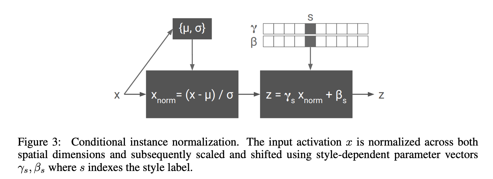

**Conditional Instance Normalization** is a normalization technique where all convolutional weights of a style transfer network are shared across many styles.  The goal of the procedure is transform
a layer’s activations $x$ into a normalized activation $z$ specific to painting style $s$. Building off
[instance normalization](https://paperswithcode.com/method/instance-normalization), we augment the $\gamma$ and $\beta$ parameters so that they’re $N \times C$ matrices, where $N$ is the number of styles being modeled and $C$ is the number of output feature maps. Conditioning on a style is achieved as follows:

$$ z = \gamma_{s}\left(\frac{x - \mu}{\sigma}\right) + \beta_{s}$$

where $\mu$ and $\sigma$ are $x$’s mean and standard deviation taken across spatial axes and $\gamma_{s}$ and $\beta_{s}$ are obtained by selecting the row corresponding to $s$ in the $\gamma$ and $\beta$ matrices. One added benefit of this approach is that one can stylize a single image into $N$ painting styles with a single feed forward pass of the network with a batch size of $N$.

# Attentive Normalization
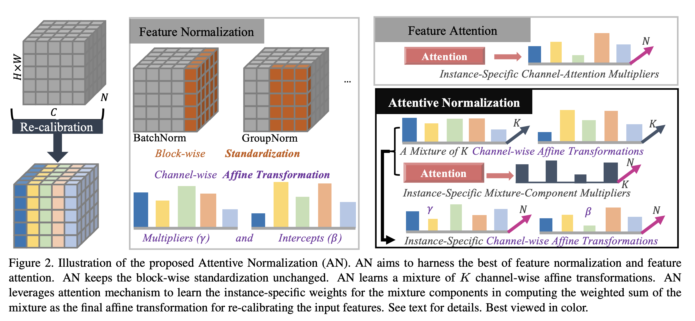

**Attentive Normalization** generalizes the common affine transformation component in the vanilla feature normalization. Instead of learning a single affine transformation, AN learns a mixture of affine transformations and utilizes their weighted-sum as the final affine transformation applied to re-calibrate features in an instance-specific way. The weights are learned by leveraging feature attention.

# Decorrelated Batch Normalization
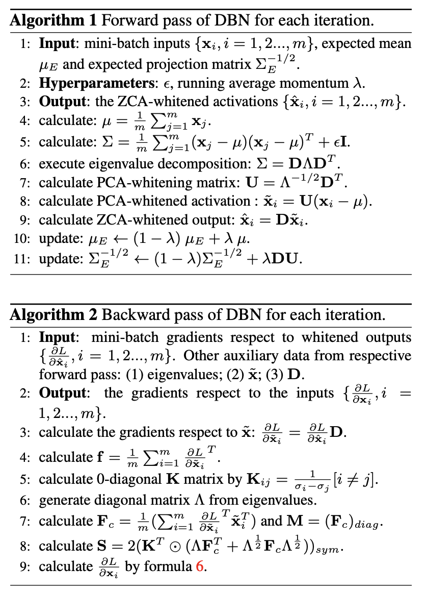

**Decorrelated Batch Normalization (DBN)** 
is a normalization technique which not just centers and scales activations but whitens them. ZCA whitening instead of PCA whitening is employed since PCA whitening causes a problem called **stochastic axis swapping**, which is detrimental to learning. 

# InPlace-ABN

# SyncBN

**Synchronized Batch Normalization (SyncBN)** is a type of [batch normalization](https://paperswithcode.com/method/batch-normalization) used for multi-GPU training. Standard batch normalization only normalizes the data within each device (GPU). SyncBN normalizes the input within the whole mini-batch.

# SRN

**Stable Rank Normalization (SRN)** is a weight-normalization scheme which minimizes the
stable rank of a linear operator.

# Cosine Normalization
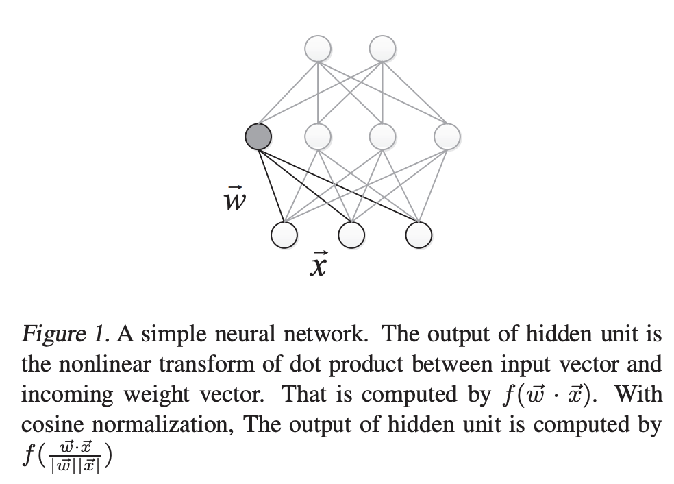

Multi-layer neural networks traditionally use  dot products between the output vector of previous layer and the incoming weight vector as the input to activation function. The result of dot product is unbounded. To bound dot product and decrease the variance, **Cosine Normalization** uses cosine similarity or centered cosine similarity (Pearson Correlation Coefficient) instead of dot products in neural networks. 

Using cosine normalization, the output of a hidden unit is computed by:

$$o = f(net_{norm})= f(\cos \theta) = f(\frac{\vec{w} \cdot \vec{x}} {\left|\vec{w}\right|  \left|\vec{x}\right|})$$

where $net_{norm}$ is the normalized pre-activation,  $\vec{w}$ is the incoming weight vector and $\vec{x}$ is the input vector, ($\cdot$) indicates dot product, $f$ is nonlinear activation function. Cosine normalization bounds the pre-activation between -1 and 1. 

# BatchChannel Normalization
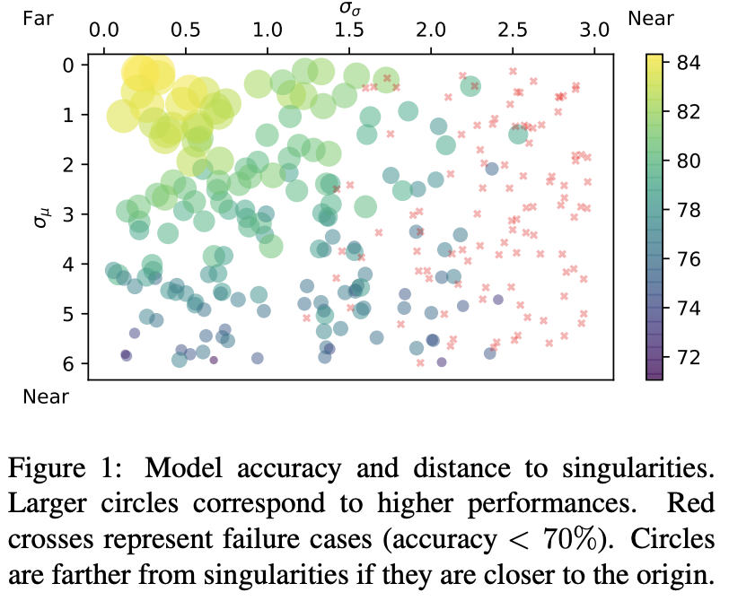

**Batch-Channel Normalization**, or **BCN**, uses batch knowledge to prevent channel-normalized models from getting too close to "elimination singularities". Elimination singularities correspond to the points on the training trajectory where neurons become consistently deactivated. They cause degenerate manifolds in the loss landscape which will slow down training and harm model performances.

# Instance-Level Meta Normalization
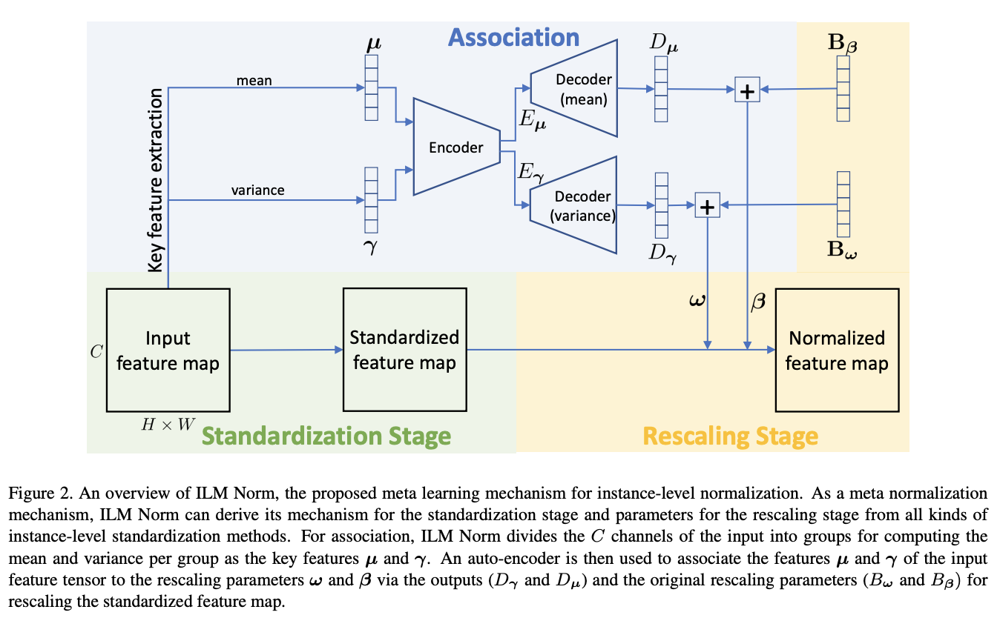

**Instance-Level Meta Normalization** addresses a learning-to-normalize problem. ILM-Norm learns to predict the normalization parameters via both the feature feed-forward and the gradient back-propagation paths. It uses an auto-encoder to predict the weights $\omega$ and bias $\beta$ as the rescaling parameters for recovering the distribution of the tensor $x$ of feature maps. Instead of using the entire feature tensor $x$ as the input for the auto-encoder, it uses he mean $\mu$ and variance $\gamma$ of $x$ for characterizing its statistics. Here we define the key features as the mean $\mu$ and variance $\gamma$ extracted from the feature tensor $x$.

# Mixture Normalization
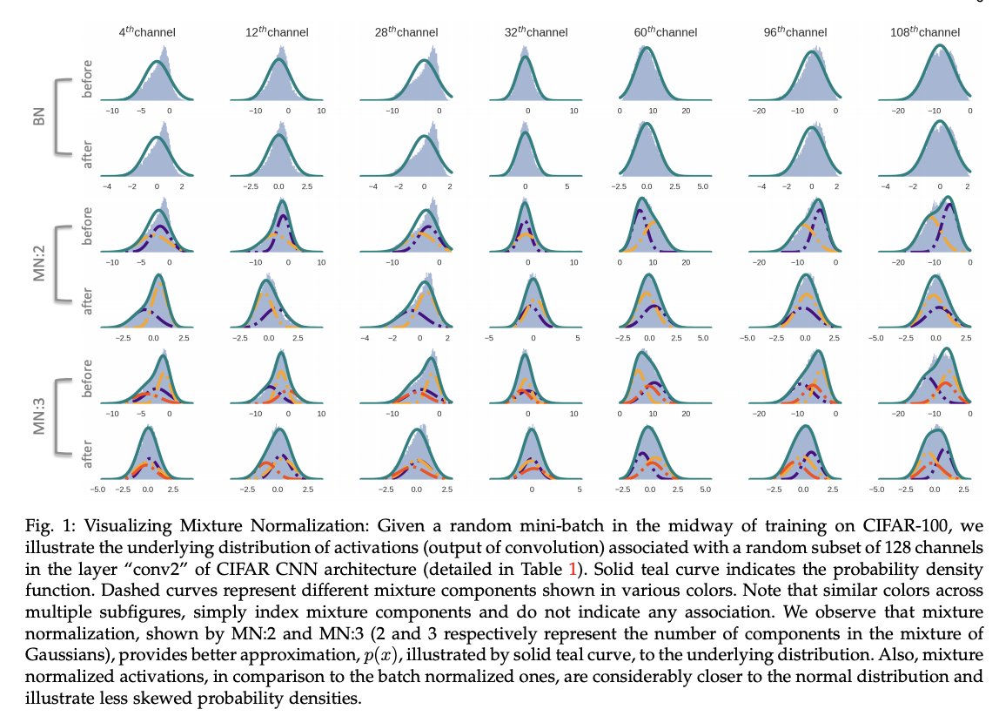

**Mixture Normalization** is normalization technique that relies on an approximation of the probability density function of the internal representations. Any continuous distribution can be approximated with arbitrary precision using a Gaussian Mixture Model (GMM). Hence, instead of computing one set of statistical measures from the entire population (of instances in the mini-batch) as [Batch Normalization](https://paperswithcode.com/method/batch-normalization) does, Mixture Normalization works on sub-populations which can be identified by disentangling modes of the distribution, estimated via GMM. 

While BN can only scale and/or shift the whole underlying probability density function, mixture normalization operates like a soft piecewise normalizing transform, capable of completely re-structuring the data distribution by independently scaling and/or shifting individual modes of distribution.

# Mode Normalization
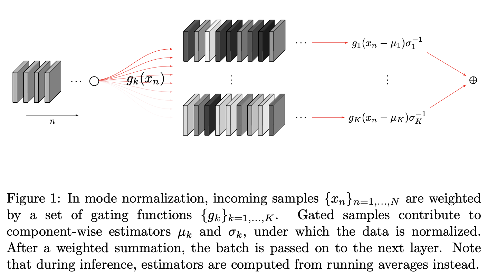

**Mode Normalization** extends normalization to more than a single mean and variance, allowing for detection of modes of data on-the-fly, jointly normalizing samples that share common features. It first assigns samples in a mini-batch to different modes via a gating network, and then normalizes each sample with estimators for its corresponding mode.

# Sparse Switchable Normalization
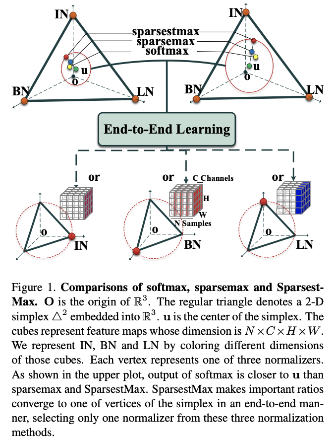

**Sparse Switchable Normalization (SSN)** is a variant on Switchable Normalization where the importance ratios are constrained to be sparse. Unlike $\ell_1$ and $\ell_0$ constraints that impose difficulties in optimization, the constrained optimization problem is turned into feed-forward computation through SparseMax, which is a sparse version of softmax.

# Filter Response Normalization
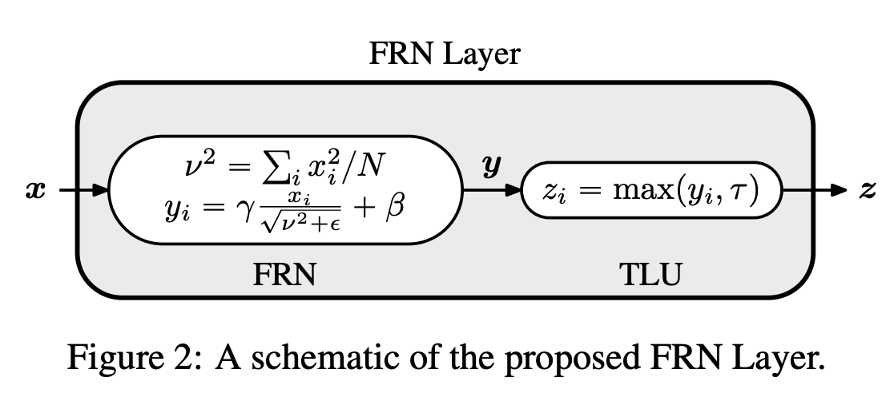

**Filter Response Normalization (FRN)** is a type of normalization that combines normalization and an activation function, which can be used as a replacement for other normalizations and activations. It operates on each activation channel of each batch element independently, eliminating the dependency on other batch elements. 

We will assume for the purpose of exposition that we are dealing with the feed-forward convolutional neural network. We follow the usual convention that the filter responses (activation maps) produced after a convolution operation are a 4D tensor $X$ with shape $[B, W, H, C]$, where $B$ is the mini-batch size, $W, H$ are the spatial extents of the map, and $C$ is the number of filters used in convolution. $C$ is also referred to as output channels. Let $x = X_{b,:,:,c} \in \mathcal{R}^{N}$, where $N = W \times H$, be the vector of filter responses for the $c^{th}$ filter for the $b^{th}$ batch point. 
Let $\nu^2 = \sum_i x_i^2/N$, be the mean squared norm of $x$. 

Then we propose Filter Response Normalization as following:

$$
\hat{x} = \frac{x}{\sqrt{\nu^2 + \epsilon}},
$$

where $\epsilon$ is a small positive constant to prevent division by zero.  Lack of mean centering in FRN can lead to activations having an arbitrary bias away from zero. Such a bias in conjunction with [ReLU](https://paperswithcode.com/method/relu) can have a detrimental effect on learning and lead to poor performance and dead units. To address this the authors augment ReLU with a learned threshold $\tau$ to yield:

$$
z = \max(y, \tau)
$$

Since $\max(y, \tau){=}\max(y-\tau,0){+}\tau{=}\text{ReLU}{(y{-}\tau)}{+}\tau$, the effect of this activation is the same as having a shared bias before and after ReLU.

# Virtual Batch Normalization
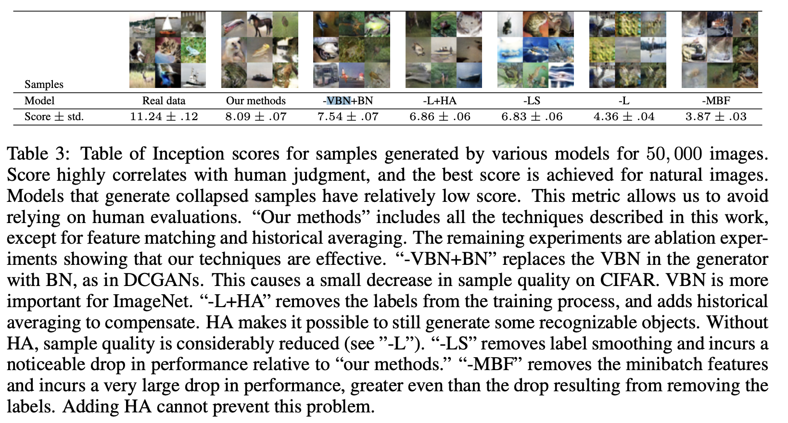

**Virtual Batch Normalization** is a normalization method used for training generative adversarial networks that extends batch normalization. Regular [batch normalization](https://paperswithcode.com/method/batch-normalization) causes the output of a neural network for an input example $\mathbf{x}$ to be highly dependent on several other inputs $\mathbf{x}'$ in the same minibatch. To avoid this problem in virtual batch normalization (VBN), each example $\mathbf{x}$ is normalized based on the statistics collected on a reference batch of examples that are chosen once and fixed at the start of training, and on $\mathbf{x}$ itself. The reference batch is normalized using only its own statistics. VBN is computationally expensive because it requires running forward propagation on two minibatches of data, so the authors use it only in the generator network.

# Online Normalization
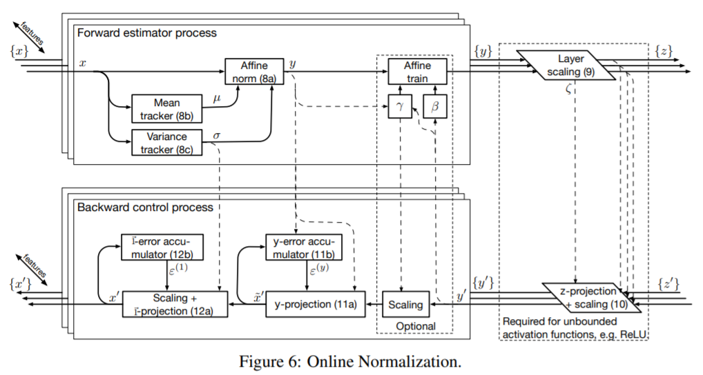

**Online Normalization** is a normalization technique for training deep neural networks. To define Online Normalization. we replace arithmetic averages over the full dataset in with exponentially decaying averages of online samples. The decay factors $\alpha_{f}$ and $\alpha_{b}$ for forward and backward passes respectively are hyperparameters for the technique.

We allow incoming samples $x_{t}$, such as images, to have multiple scalar components and denote
feature-wide mean and variance by $\mu\left(x_{t}\right)$ and $\sigma^{2}\left(x_{t}\right)$. The algorithm also applies to outputs of fully connected layers with only one scalar output per feature. In fact, this case simplifies to $\mu\left(x_{t}\right) = x_{t}$ and $\sigma\left(x_{t}\right) = 0$. Denote scalars $\mu_{t}$ and $\sigma_{t}$ to denote running estimates of mean and variance across
all samples. The subscript $t$ denotes time steps corresponding to processing new incoming samples.

Online Normalization uses an ongoing process during the forward pass to estimate activation means
and variances. It implements the standard online computation of mean and variance generalized to processing multi-value samples and exponential averaging of sample statistics. The
resulting estimates directly lead to an affine normalization transform.

$$ y_{t} = \frac{x_{t} - \mu_{t-1}}{\sigma_{t-1}} $$ 

$$ \mu_{t} = \alpha_{f}\mu_{t-1} + \left(1-\alpha_{f}\right)\mu\left(x_{t}\right) $$

$$ \sigma^{2}_{t} = \alpha_{f}\sigma^{2}_{t-1} + \left(1-\alpha_{f}\right)\sigma^{2}\left(x_{t}\right) + \alpha_{f}\left(1-\alpha_{f}\right)\left(\mu\left(x_{t}\right) - \mu_{t-1}\right)^{2} $$

