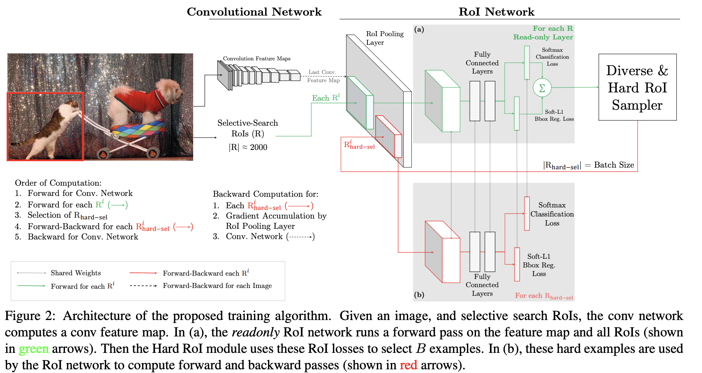

# Adam

**Adam** is an adaptive learning rate optimization algorithm that utilises both momentum and scaling, combining the benefits of [RMSProp](https://paperswithcode.com/method/rmsprop) and [SGD w/th Momentum](https://paperswithcode.com/method/sgd-with-momentum).

The weight updates are performed as:

$$ w_{t} = w_{t-1} - \eta\frac{\hat{m}_{t}}{\sqrt{\hat{v}_{t}} + \epsilon}  $$

$$ m_{t} = \beta_{1}m_{t-1} + (1-\beta_{1})g_{t} $$

$$ v_{t} = \beta_{2}v_{t-1} + (1-\beta_{2})g_{t}^{2}  $$

$$ \hat{m}_{t} = \frac{m_{t}}{1-\beta^{t}_{1}} $$

$$ \hat{v}_{t} = \frac{v_{t}}{1-\beta^{t}_{2}} $$

# SGD

**Stochastic Gradient Descent** is an iterative optimization technique that uses minibatches of data to form an expectation of the gradient, rather than the full gradient using all available data. That is for weights $w$ and a loss function $L$ we have:

$$ w_{t+1} = w_{t} - \eta\hat{\nabla}_{w}{L(w_{t})} $$

Where $\eta$ is a learning rate. SGD reduces redundancy compared to batch gradient descent - which recomputes gradients for similar examples before each parameter update - so it is usually much faster.

(Image Source: [here](http://rasbt.github.io/mlxtend/user_guide/general_concepts/gradient-optimization/))

# ADMM

The **alternating direction method of multipliers** (**ADMM**) is an algorithm that solves convex optimization problems by breaking them into smaller pieces, each of which are then easier to handle. It takes the form of a decomposition-coordination procedure, in which the solutions to small
local subproblems are coordinated to find a solution to a large global problem. ADMM can be viewed as an attempt to blend the benefits of dual decomposition and augmented Lagrangian methods for constrained optimization. It turns out to be equivalent or closely related to many other algorithms
as well, such as Douglas-Rachford splitting from numerical analysis, Spingarn’s method of partial inverses, Dykstra’s alternating projections method, Bregman iterative algorithms for l1 problems in signal processing, proximal methods, and many others.

Text Source: [https://stanford.edu/~boyd/papers/pdf/admm_distr_stats.pdf](https://stanford.edu/~boyd/papers/pdf/admm_distr_stats.pdf)

Image Source: [here](https://www.slideshare.net/derekcypang/alternating-direction)

# RMSProp

**RMSProp** is an unpublished adaptive learning rate optimizer [proposed by Geoff Hinton](https://ruder.io/optimizing-gradient-descent/index.html#rmsprop).  The gradient updates are performed as:

$$E\left[g^{2}\right]_{t} = 0.9E\left[g^{2}\right]_{t-1} + 0.1g^{2}_{t}$$

$$\theta_{t+1} = \theta_{t} - \frac{\eta}{\sqrt{E\left[g^{2}\right]_{t} + \epsilon}}g_{t}$$

Hinton suggests $\gamma=0.9$, with a good default for $\eta$ as $0.001$.

Image: [Alec Radford](https://twitter.com/alecrad)

# SGD with Momentum

**SGD with Momentum** is a stochastic optimization method that adds a momentum term to regular stochastic gradient descent:

$$v_{t} = \gamma{v}_{t-1} + \eta\nabla_{\theta}J\left(\theta\right)$$
$$\theta_{t} = \theta_{t-1} - v_{t} $$

A typical value for $\gamma$ is $0.9$.

Image Source: [Juan Du](https://www.researchgate.net/figure/The-compare-of-the-SGD-algorithms-with-and-without-momentum-Take-Task-1-as-example-The_fig1_333469047)

# AdaGrad

**AdaGrad** is a stochastic optimization method that adapts the learning rate to the parameters. It performs smaller updates for parameters associated with frequently occurring features, and larger updates for parameters associated with infrequently occurring features. In its update rule, Adagrad modifies the general learning rate $\eta$ at each time step $t$ for every parameter $\theta_{i}$ based on the past gradients for $\theta_{i}$: 

$$ \theta_{t+1, i} = \theta_{t, i} - \frac{\eta}{\sqrt{G_{t, ii} + \epsilon}}g_{t, i} $$

The benefit of AdaGrad is that it eliminates the need to manually tune the learning rate; most leave it at a default value of $0.01$. Its main weakness is the accumulation of the squared gradients in the denominator. Since every added term is positive, the accumulated sum keeps growing during training, causing the learning rate to shrink and becoming infinitesimally small.

Image: [Alec Radford](https://twitter.com/alecrad)

# TTUR

The **Two Time-scale Update Rule (TTUR)** is an update rule for generative adversarial networks trained with stochastic gradient descent. TTUR has an individual learning rate for both the discriminator and the generator. The main premise is that the discriminator converges to a local minimum when the generator is fixed. If the generator changes slowly enough, then the discriminator still converges, since the generator perturbations are small. Besides ensuring convergence, the performance may also improve since the discriminator must first learn new patterns before they are transferred to the generator. In contrast, a generator which is overly fast, drives the discriminator steadily into new regions without capturing its gathered information.

# Gradient Clipping

One difficulty that arises with optimization of deep neural networks is that large parameter gradients can lead an SGD optimizer to update the parameters strongly into a region where the loss function is much greater, effectively undoing much of the work that was needed to get to the current solution.

**Gradient Clipping** clips the size of the gradients to ensure optimization performs more reasonably near sharp areas of the loss surface. It can be performed in a number of ways. One option is to simply clip the parameter gradient element-wise before a parameter update. Another option is to clip the norm ||$\textbf{g}$|| of the gradient $\textbf{g}$ before a parameter update:

$$\text{ if } ||\textbf{g}||  &gt; v \text{ then } \textbf{g} \leftarrow \frac{\textbf{g}^{v}}{||\textbf{g}||}$$

where $v$ is a norm threshold.

Source: Deep Learning, Goodfellow et al

Image Source: [Pascanu et al](https://arxiv.org/pdf/1211.5063.pdf)

# LAMB

**LAMB** is a a layerwise adaptive large batch optimization technique. It provides a strategy for adapting the learning rate in large batch settings. LAMB uses ADAM as the base algorithm and then forms an update as:

$$r_{t} = \frac{m_{t}}{\sqrt{v_{t}} + \epsilon}$$
$$x_{t+1}^{\left(i\right)} = x_{t}^{\left(i\right)}  - \eta_{t}\frac{\phi\left(|| x_{t}^{\left(i\right)} ||\right)}{|| m_{t}^{\left(i\right)} || }\left(r_{t}^{\left(i\right)}+\lambda{x_{t}^{\left(i\right)}}\right) $$

Unlike LARS, the adaptivity of LAMB is two-fold: (i) per dimension normalization with respect to the square root of the second moment used in ADAM and (ii) layerwise normalization obtained due to layerwise adaptivity.

# Nesterov Accelerated Gradient

**Nesterov Accelerated Gradient** is a momentum-based SGD optimizer that "looks ahead" to where the parameters will be to calculate the gradient **ex post** rather than **ex ante**:

$$ v_{t} = \gamma{v}_{t-1} + \eta\nabla_{\theta}J\left(\theta-\gamma{v_{t-1}}\right) $$
$$\theta_{t} = \theta_{t-1} + v_{t}$$

Like SGD with momentum $\gamma$ is usually set to $0.9$.

Image Source: [Geoff Hinton lecture notes](http://www.cs.toronto.edu/~tijmen/csc321/slides/lecture_slides_lec6.pdf)

# AMSGrad

**AMSGrad** is a stochastic optimization method that seeks to fix a convergence issue with Adam based optimizers. AMSGrad uses the maximum of past squared gradients 
$v_{t}$ rather than the exponential average to update the parameters:

$$m_{t} = \beta_{1}m_{t-1} + \left(1-\beta_{1}\right)g_{t} $$

$$v_{t} = \beta_{2}v_{t-1} + \left(1-\beta_{2}\right)g_{t}^{2}$$

$$ \hat{v}_{t} = \max\left(\hat{v}_{t-1}, v_{t}\right) $$

$$\theta_{t+1} = \theta_{t} - \frac{\eta}{\sqrt{\hat{v}_{t}} + \epsilon}m_{t}$$

# Natural Gradient Descent

**Natural Gradient Descent** is an approximate second-order optimisation method. It has an interpretation as optimizing over a Riemannian manifold using an intrinsic distance metric, which implies the updates are invariant to transformations such as whitening. By using the positive semi-definite (PSD) Gauss-Newton matrix to approximate the (possibly negative definite) Hessian, NGD can often work better than exact second-order methods.

Given the gradient of $z$, $g = \frac{\delta{f}\left(z\right)}{\delta{z}}$, NGD computes the update as:

$$\Delta{z} = \alpha{F}^{−1}g$$

where the Fisher information matrix $F$ is defined as:

$$ F = \mathbb{E}_{p\left(t\mid{z}\right)}\left[\nabla\ln{p}\left(t\mid{z}\right)\nabla\ln{p}\left(t\mid{z}\right)^{T}\right] $$

The log-likelihood function $\ln{p}\left(t\mid{z}\right)$ typically corresponds to commonly used error functions such as the cross entropy loss.

Source: [LOGAN](https://arxiv.org/pdf/1912.00953.pdf)

Image: <a href="https://arxiv.org/abs/1905.10961">Fast Convergence of Natural Gradient Descent for Overparameterized Neural Networks
</a>

# Adafactor

**Adafactor** is a stochastic optimization method based on [Adam](https://paperswithcode.com/method/adam) that reduces memory usage while retaining the empirical benefits of adaptivity. This is achieved through maintaining a factored representation of the squared gradient accumulator across training steps. Specifically, by tracking moving averages of the row and column sums of the squared gradients for matrix-valued variables, we are able to reconstruct a low-rank approximation of the exponentially smoothed accumulator at each training step that is optimal with respect to the generalized Kullback-Leibler divergence. For an $n \times m$ matrix, this reduces the memory requirements from $O(n m)$ to $O(n + m)$. We demonstrate empirically using Adam on a large-scale machine translation task known for its expensive models that our approach achieves comparable performance to that obtained using full accumulators.

Instead of defining the optimization algorithm in terms of absolute step sizes {$\alpha_t$}$_{t=1}^T$, we propose defining the optimization algorithm in terms of relative step sizes {$\rho_t$}$_{t=1}^T$, which get multiplied by the scale of the parameters.  We define the scale of a parameter vector or matrix as the root-mean-square of its components, lower-bounded by a small constant $\epsilon_2$.  The reason for this lower bound is to allow zero-initialized parameters to escape 0.   Combining this with the other proposals in this paper gives the Adafactor algorithm. 

Proposed hyperparameters are: $\epsilon_{1} = 10^{-30}$, $\epsilon_{2} = 10^{-3}$, $d=1$, $p_{t} = \min\left(10^{-2}, \frac{1}{\sqrt{t}}\right)$, $\hat{\beta}_{2_{t}} = 1 - t^{-0.8}$.

# AdamW

**AdamW** is a stochastic optimization method that modifies the typical implementation of weight decay in [Adam](https://paperswithcode.com/method/adam), by decoupling [weight decay](https://paperswithcode.com/method/weight-decay) from the gradient update. To see this, $L_{2}$ regularization in Adam is usually implemented with the below modification where $w_{t}$ is the rate of the weight decay at time $t$:

$$ g_{t} = \nabla{f\left(\theta_{t}\right)} + w_{t}\theta_{t}$$

while AdamW adjusts the weight decay term to appear in the gradient update:

$$ \theta_{t+1, i} = \theta_{t, i} - \eta\left(\frac{1}{\sqrt{\hat{v}_{t} + \epsilon}}\cdot{\hat{m}_{t}} + w_{t, i}\theta_{t, i}\right), \forall{t}$$

# Population Based Training

**Population Based Training**, or **PBT**, is an optimization method for finding parameters and hyperparameters, and extends upon parallel search methods and sequential optimisation methods.
It leverages information sharing across a population of concurrently running optimisation processes, and allows for online propagation/transfer of parameters and hyperparameters between members of the population based on their performance. Furthermore, unlike most other adaptation schemes, the method is capable of performing online adaptation of hyperparameters -- which can be particularly important in problems with highly non-stationary learning dynamics, such as reinforcement learning settings. PBT is decentralised and asynchronous, although it could also be executed semi-serially or with partial synchrony if there is a binding budget constraint.

# LARS

**Layer-wise Adaptive Rate Scaling**, or **LARS**, is a large batch optimization technique.  There are two notable differences between LARS and other adaptive algorithms such as ADAM or RMSProp : first, LARS uses a separate learning rate for each layer and not for each weight. And second, the magnitude of the update is controlled with respect to the weight norm for better control of training speed.

$$m_{t} = \beta_{1}m_{t-1} + \left(1-\beta_{1}\right)\left(g_{t} + \lambda{x_{t}}\right)$$
$$x_{t+1}^{\left(i\right)} = x_{t}^{\left(i\right)}  - \eta_{t}\frac{\phi\left(|| x_{t}^{\left(i\right)} ||\right)}{|| m_{t}^{\left(i\right)} || }m_{t}^{\left(i\right)} $$

# AdaBound

**AdaBound** is a variant of the [Adam](https://paperswithcode.com/method/adabound) stochastic optimizer which is designed to be more robust to extreme learning rates. Dynamic bounds are employed on learning rates, where the lower and upper bound are initialized as zero and infinity respectively, and they both smoothly converge to a constant final step size. AdaBound can be regarded as an adaptive methods at the beginning of training, and it gradually and smoothly transforms to SGD (or with momentum) as time step increases. 

$$ g_{t} = \nabla{f}_{t}\left(x_{t}\right) $$

$$ m_{t} = \beta_{1t}m_{t-1} + \left(1-\beta_{1t}\right)g_{t} $$

$$ v_{t} = \beta_{2}v_{t-1} + \left(1-\beta_{2}\right)g_{t}^{2} \text{ and } V_{t} = \text{diag}\left(v_{t}\right) $$

$$ \hat{\eta}_{t} = \text{Clip}\left(\alpha/\sqrt{V_{t}}, \eta_{l}\left(t\right), \eta_{u}\left(t\right)\right) \text{ and } \eta_{t} = \hat{\eta}_{t}/\sqrt{t} $$

$$ x_{t+1} = \Pi_{\mathcal{F}, \text{diag}\left(\eta_{t}^{-1}\right)}\left(x_{t} - \eta_{t} \odot m_{t} \right) $$

Where $\alpha$ is the initial step size, and $\eta_{l}$ and $\eta_{u}$ are the lower and upper bound functions respectively.

# NT-ASGD

**NT-ASGD**, or **Non-monotonically Triggered ASGD**, is an averaged stochastic gradient descent technique. 

In regular ASGD, we take steps identical to regular SGD but instead of returning the last iterate as the solution, we return $\frac{1}{\left(K-T+1\right)}\sum^{T}_{i=T}w_{i}$, where $K$ is the total number of iterations and $T &lt; K$ is a user-specified averaging trigger.

NT-ASGD has a non-monotonic criterion that conservatively triggers the averaging when the validation metric fails to improve for multiple cycles. Given that the choice of triggering is irreversible, this conservatism ensures that the randomness of training does not play a major role in the decision.

# OHEM

Some object detection datasets contain an overwhelming number of easy examples and a small number of hard examples. Automatic selection of these hard examples can make training more
effective and efficient. **OHEM**, or **Online Hard Example Mining**, is a bootstrapping technique that modifies SGD to sample from examples in a non-uniform way depending on the current loss of each example under consideration. The method takes advantage of detection-specific problem structure in which each SGD mini-batch consists of only one or two images, but thousands of candidate examples. The candidate examples are subsampled according to a distribution
that favors diverse, high loss instances.

# AdaDelta

**AdaDelta** is a stochastic optimization technique that allows for per-dimension learning rate method for SGD. It is an extension of Adagrad that seeks to reduce its aggressive, monotonically decreasing learning rate. Instead of accumulating all past squared gradients, Adadelta restricts the window of accumulated past gradients to a fixed size $w$.

Instead of inefficiently storing $w$ previous squared gradients, the sum of gradients is recursively defined as a decaying average of all past squared gradients. The running average $E\left[g^{2}\right]_{t}$ at time step $t$ then depends only on the previous average and current gradient:

$$E\left[g^{2}\right]_{t} = \gamma{E}\left[g^{2}\right]_{t-1} + \left(1-\gamma\right)g^{2}_{t}$$

Usually $\gamma$ is set to around $0.9$. Rewriting SGD updates in terms of the parameter update vector:

$$ \Delta\theta_{t} = -\eta\cdot{g_{t, i}}$$
$$\theta_{t+1}  = \theta_{t} + \Delta\theta_{t}$$

AdaDelta takes the form:

$$ \Delta\theta_{t} = -\frac{\eta}{\sqrt{E\left[g^{2}\right]_{t} + \epsilon}}g_{t} $$

The main advantage of AdaDelta is that we do not need to set a default learning rate.

# Stochastic Weight Averaging

**Stochastic Weight Averaging** is an optimization procedure that averages multiple points along the trajectory of SGD, with a cyclical or constant learning rate. On the one hand it averages weights, but it also has the property that, with a cyclical or constant learning rate, SGD proposals are approximately sampling from the loss surface of the network, leading to stochastic weights and helping to discover broader optima.

# NADAM

**NADAM**, or **Nesterov-accelerated Adaptive Moment Estimation**, combines [Adam](https://paperswithcode.com/method/adam) and [Nesterov Momentum](https://paperswithcode.com/method/nesterov-accelerated-gradient). The update rule is of the form:

$$ \theta_{t+1} = \theta_{t} - \frac{\eta}{\sqrt{\hat{v}_{t}}+\epsilon}\left(\beta_{1}\hat{m}_{t} + \frac{(1-\beta_{t})g_{t}}{1-\beta^{t}_{1}}\right)$$

Image Source: [Incorporating Nesterov Momentum into Adam](http://cs229.stanford.edu/proj2015/054_report.pdf)

# RAdam

**Rectified Adam**, or **RAdam**, is a variant of the [Adam](https://paperswithcode.com/method/adam) stochastic optimizer that introduces a term to rectify the variance of the adaptive learning rate. It seeks to tackle the bad convergence problem suffered by Adam. The authors argue that its root cause of this behaviour is that the adaptive learning rate has undesirably large variance in the early stage of model training, due to the limited amount of training samples being used. Thus, to reduce such variance, it is better to use smaller learning rates in the first few epochs of training - which justifies the warmup heuristic. This heuristic motivates RAdam which rectifies the variance problem:

$$g_{t} = \nabla_{\theta}f_{t}\left(\theta_{t-1}\right) $$

$$v_{t} = 1/\beta_{2}v_{t-1} + \left(1-\beta_{2}\right)g^{2}_{t} $$

$$m_{t} = \beta_{1}m_{t-1} + \left(1-\beta_{1}\right)g_{t} $$

$$ \hat{m_{t}} = m_{t} / \left(1-\beta^{t}_{1}\right) $$

$$ \rho_{t} = \rho_{\infty} - 2t\beta^{t}_{2}/\left(1-\beta^{t}_{2}\right) $$

If the variance is tractable - $\rho_{t} &gt; 4$ then:

...the adaptive learning rate is computed as:

$$ l_{t} = \sqrt{\left(1-\beta^{t}_{2}\right)/v_{t}}$$

...the variance rectification term is calculated as:

$$ r_{t} = \sqrt{\frac{(\rho_{t}-4)(\rho_{t}-2)\rho_{\infty}}{(\rho_{\infty}-4)(\rho_{\infty}-2)\rho_{t}}}$$

...and we update parameters with adaptive momentum:

$$ \theta_{t} = \theta_{t-1} - \alpha_{t}r_{t}\hat{m}_{t}l_{t} $$

If the variance isn't tractable we update instead with:

$$ \theta_{t} = \theta_{t-1} - \alpha_{t}\hat{m}_{t} $$

# Lookahead

**Lookahead** is a type of stochastic optimizer that iteratively updates two sets of weights: "fast" and "slow". Intuitively, the algorithm chooses a search direction by **looking ahead** at the sequence of **fast weights** generated by another optimizer.

**Algorithm 1** Lookahead Optimizer

**Require** Initial parameters $\phi_0$, objective function $L$ 

**Require** Synchronization period $k$, slow weights step size $\alpha$, optimizer $A$

    **for** $t=1, 2, \dots$

     Synchronize parameters $\theta_{t,0} \gets \phi_{t-1}$

     **for** $i=1, 2, \dots, k$

       sample minibatch of data $d \sim \mathcal{D}$

       $\theta_{t,i} \gets \theta_{t,i-1} + A(L, \theta_{t,i-1}, d)$

     **endfor**

     Perform outer update $\phi_t \gets \phi_{t-1} + \alpha (\theta_{t,k} - \phi_{t-1})$

   **endfor**

   **return** parameters $\phi$

# IoU-Balanced Sampling

**IoU-Balanced Sampling** is hard mining method for object detection. Suppose we need to sample $N$ negative samples from $M$ corresponding candidates. The selected probability for each sample under random sampling is:

$$ p = \frac{N}{M} $$

To raise the selected probability of hard negatives, we evenly split the sampling interval into $K$ bins according to IoU. $N$ demanded negative samples are equally distributed to each bin. Then we select samples from them uniformly. Therefore, we get the selected probability under IoU-balanced sampling:

$$ p_{k} = \frac{N}{K}*\frac{1}{M_{k}}\text{ , } k\in\left[0, K\right)$$

where $M_{k}$ is the number of sampling candidates in the corresponding interval denoted by $k$. $K$ is set to 3 by default in our experiments.

The sampled histogram with IoU-balanced sampling is shown by green color in the Figure to the right. The IoU-balanced sampling can guide the distribution of training samples close to the one of hard negatives.

# AdaMax

**AdaMax** is a generalisation of [Adam](https://paperswithcode.com/method/adam) from the $l_{2}$ norm to the $l_{\infty}$ norm. Define:

$$ u_{t} = \beta^{\infty}_{2}v_{t-1} + \left(1-\beta^{\infty}_{2}\right)|g_{t}|^{\infty}$$

$$ = \max\left(\beta_{2}\cdot{v}_{t-1}, |g_{t}|\right)$$

We can plug into the Adam update equation by replacing $\sqrt{\hat{v}_{t} + \epsilon}$ with $u_{t}$ to obtain the AdaMax update rule:

$$ \theta_{t+1} = \theta_{t} - \frac{\eta}{u_{t}}\hat{m}_{t} $$

Common default values are $\eta = 0.002$ and $\beta_{1}=0.9$ and $\beta_{2}=0.999$.

# Polyak Averaging

**Polyak Averaging** is an optimization technique that sets final parameters to an average of (recent) parameters visited in the optimization trajectory. Specifically if in $t$ iterations we have parameters $\theta_{1}, \theta_{2}, \dots, \theta_{t}$, then Polyak Averaging suggests setting 

$$ \theta_t =\frac{1}{t}\sum_{i}\theta_{i} $$

Image Credit: [Shubhendu Trivedi &amp; Risi Kondor](https://ttic.uchicago.edu/~shubhendu/Pages/Files/Lecture6_flat.pdf)

# QHM

**Quasi-Hyperbolic Momentum (QHM)** is a stochastic optimization technique that alters momentum SGD with a momentum step, averaging an SGD step with a momentum step:

$$ g_{t+1} = \beta{g_{t}} + \left(1-\beta\right)\cdot{\nabla}\hat{L}_{t}\left(\theta_{t}\right) $$
$$ \theta_{t+1} = \theta_{t} - \alpha\left[\left(1-v\right)\cdot\nabla\hat{L}_{t}\left(\theta_{t}\right) + v\cdot{g_{t+1}}\right]$$

The authors suggest a rule of thumb of $v = 0.7$ and $\beta = 0.999$.

# ATSS

**Adaptive Training Sample Selection**, or **ATSS**, is a method to automatically select positive and negative samples according to statistical characteristics of object. It bridges the gap between anchor-based and anchor-free detectors. 

For each ground-truth box $g$ on the image, we first find out its candidate positive samples. As described in Line $3$ to $6$, on each pyramid level, we select $k$ anchor boxes whose center are closest to the center of $g$ based on L2 distance. Supposing there are $\mathcal{L}$ feature pyramid levels, the ground-truth box $g$ will have $k\times\mathcal{L}$ candidate positive samples. After that, we compute the IoU between these candidates and the ground-truth $g$ as $\mathcal{D}_g$ in Line $7$, whose mean and standard deviation are computed as $m_g$ and $v_g$ in Line $8$ and Line $9$. With these statistics, the IoU threshold for this ground-truth $g$ is obtained as $t_g=m_g+v_g$ in Line $10$. Finally, we select these candidates whose IoU are greater than or equal to the threshold $t_g$ as final positive samples in Line $11$ to $15$. 

Notably ATSS also limits the positive samples' center to the ground-truth box as shown in Line $12$. Besides, if an anchor box is assigned to multiple ground-truth boxes, the one with the highest IoU will be selected. The rest are negative samples.

# YellowFin

**YellowFin** is a learning rate and momentum tuner motivated by robustness properties and analysis of quadratic objectives. It stems from a known but obscure fact: the momentum operator's spectral radius is constant in a large subset of the hyperparameter space. For quadratic objectives, the optimizer tunes both the learning rate and the momentum to keep the hyperparameters within a region in which the convergence rate is a constant rate equal to the root momentum. This notion is extended empirically to non-convex objectives. On every iteration, YellowFin optimizes the hyperparameters to minimize a local quadratic optimization.

# Demon ADAM

**Demon ADAM** is a stochastic optimizer where the [Demon](https://paperswithcode.com/method/demon) momentum rule applied to the [Adam](https://paperswithcode.com/method/adam) optimizer.

$$ \beta_{t} = \beta_{init}\cdot\frac{\left(1-\frac{t}{T}\right)}{\left(1-\beta_{init}\right) + \beta_{init}\left(1-\frac{t}{T}\right)} $$

$$ m_{t, i} = g_{t, i} + \beta_{t}m_{t-1, i} $$

$$ v_{t+1} = \beta_{2}v_{t}  + \left(1-\beta_{2}\right)g^{2}_{t} $$

$$ \theta_{t} = \theta_{t-1} - \eta\frac{\hat{m}_{t}}{\sqrt{\hat{v}_{t}} + \epsilon}  $$

# Demon

**Decaying Momentum**, or **Demon**, is a stochastic optimizer motivated by decaying the total contribution of a gradient to all future updates. By decaying the momentum parameter, the total contribution of a gradient to all future updates is decayed. A particular gradient term $g_{t}$ contributes a total of  $\eta\sum_{i}\beta^{i}$ of its "energy" to all future gradient updates, and this results in the geometric sum, $\sum^{\infty}_{i=1}\beta^{i} = \beta\sum^{\infty}_{i=0}\beta^{i} = \frac{\beta}{\left(1-\beta\right)}$. Decaying this sum results in the Demon algorithm. Letting $\beta_{init}$ be the initial $\beta$; then at the current step $t$ with total $T$ steps, the decay routine is given by solving the below for $\beta_{t}$:

$$ \frac{\beta_{t}}{\left(1-\beta_{t}\right)} =  \left(1-t/T\right)\beta_{init}/\left(1-\beta_{init}\right)$$

Where $\left(1-t/T\right)$ refers to the proportion of iterations remaining. Note that Demon typically requires no hyperparameter tuning as it is usually decayed to $0$ or a small negative value at time 
$T$. Improved performance is observed by delaying the decaying. Demon can be applied to any gradient descent algorithm with a momentum parameter.

# QHAdam

The **Quasi-Hyperbolic Momentum Algorithm (QHM)** is an extremely simple alteration of [momentum SGD](https://paperswithcode.com/method/sgd-with-momentum), averaging a plain SGD step with a momentum step. **QHAdam** is a QH augmented version of [Adam](https://paperswithcode.com/method/adam), where we replace both of Adam's moment estimators with quasi-hyperbolic terms. QHAdam decouples the momentum term from the current gradient when updating the weights, and decouples the mean squared gradients term from the current squared gradient when updating the weights. 

In essence, it is a weighted average of the momentum and plain SGD, weighting the current gradient with an immediate discount factor $v_{1}$ divided by a weighted average of the mean squared gradients and the current squared gradient, weighting the current squared gradient with an immediate discount factor $v_{2}$. 

$$ \theta_{t+1, i} = \theta_{t, i} - \eta\left[\frac{\left(1-v_{1}\right)\cdot{g_{t}} + v_{1}\cdot\hat{m}_{t}}{\sqrt{\left(1-v_{2}\right)g^{2}_{t} + v_{2}\cdot{\hat{v}_{t}}} + \epsilon}\right], \forall{t} $$

It is recommended to set $v_{2} = 1$ and $\beta_{2}$ same as in Adam.

# SGDW

**SGDW** is a stochastic optimization technique that decouples [weight decay](https://paperswithcode.com/method/weight-decay) from the gradient update:

$$ g_{t} =  \nabla{f_{t}}\left(\theta_{t-1}\right) + \lambda\theta_{t-1}$$

$$ m_{t} =  \beta_{1}m_{t-1} + \eta_{t}\alpha{g}_{t}$$

$$ \theta_{t} = \theta_{t-1} - m_{t} - \eta_{t}\lambda\theta_{t-1}$$

# AggMo

**Aggregated Momentum (AggMo)** is a variant of the classical momentum stochastic optimizer which maintains several velocity vectors with different $\beta$ parameters. AggMo averages the velocity vectors when updating the parameters. It resolves the problem of choosing a momentum parameter by taking a linear combination of multiple momentum buffers. Each of $K$ momentum buffers have a different discount factor $\beta \in \mathbb{R}^{K}$, and these are averaged for the update. The update rule is:

$$ \textbf{v}_{t}^{\left(i\right)} = \beta^{(i)}\textbf{v}_{t-1}^{\left(i\right)} - \nabla_{\theta}f\left(\mathbf{\theta}_{t-1}\right) $$

$$ \mathbf{\theta_{t}} = \mathbf{\theta_{t-1}} + \frac{\gamma_{t}}{K}\sum^{K}_{i=1}\textbf{v}_{t}^{\left(i\right)} $$

where $v^{\left(i\right)}_{0}$ for each $i$. The vector $\mathcal{\beta} = \left[\beta^{(1)}, \ldots, \beta^{(K)}\right]$ is the dampening factor.

# Demon CM

**Demon CM**, or **SGD with Momentum and Demon**,  is the [Demon](https://paperswithcode.com/method/demon) momentum rule applied to [SGD with momentum](https://paperswithcode.com/method/sgd-with-momentum).

$$ \beta_{t} = \beta_{init}\cdot\frac{\left(1-\frac{t}{T}\right)}{\left(1-\beta_{init}\right) + \beta_{init}\left(1-\frac{t}{T}\right)} $$

$$ \theta_{t+1} = \theta_{t} - \eta{g}_{t} + \beta_{t}v_{t} $$

$$ v_{t+1} = \beta_{t}{v_{t}} - \eta{g_{t}} $$

# AMSBound

**AMSBound** is a variant of the [AMSGrad](https://paperswithcode.com/method/amsgrad) stochastic optimizer which is designed to be more robust to extreme learning rates. Dynamic bounds are employed on learning rates, where the lower and upper bound are initialized as zero and infinity respectively, and they both smoothly converge to a constant final step size. AdaBound can be regarded as an adaptive methods at the beginning of training, and it gradually and smoothly transforms to SGD (or with momentum) as time step increases. 

$$ g_{t} = \nabla{f}_{t}\left(x_{t}\right) $$

$$ m_{t} = \beta_{1t}m_{t-1} + \left(1-\beta_{1t}\right)g_{t} $$

$$ v_{t} = \beta_{2}v_{t-1} + \left(1-\beta_{2}\right)g_{t}^{2}$$

$$ \hat{v}_{t} = \max\left(\hat{v}_{t-1}, v_{t}\right) \text{ and } V_{t} = \text{diag}\left(\hat{v}_{t}\right) $$

$$ \eta = \text{Clip}\left(\alpha/\sqrt{V_{t}}, \eta_{l}\left(t\right), \eta_{u}\left(t\right)\right) \text{ and } \eta_{t} = \eta/\sqrt{t} $$

$$ x_{t+1} = \Pi_{\mathcal{F}, \text{diag}\left(\eta_{t}^{-1}\right)}\left(x_{t} - \eta_{t} \odot m_{t} \right) $$

Where $\alpha$ is the initial step size, and $\eta_{l}$ and $\eta_{u}$ are the lower and upper bound functions respectively.

# HFPSO

A hybrid metaheuristic optimization algorithm that combines strong points of FA and PSO

