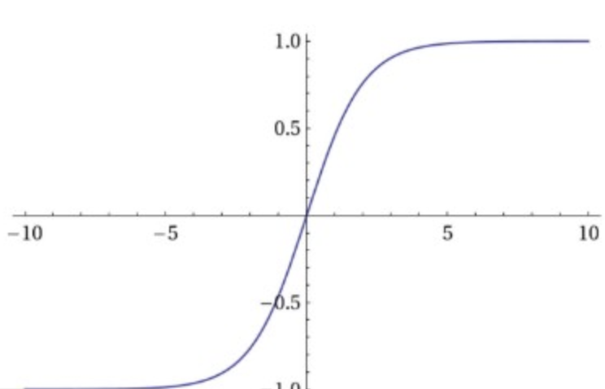
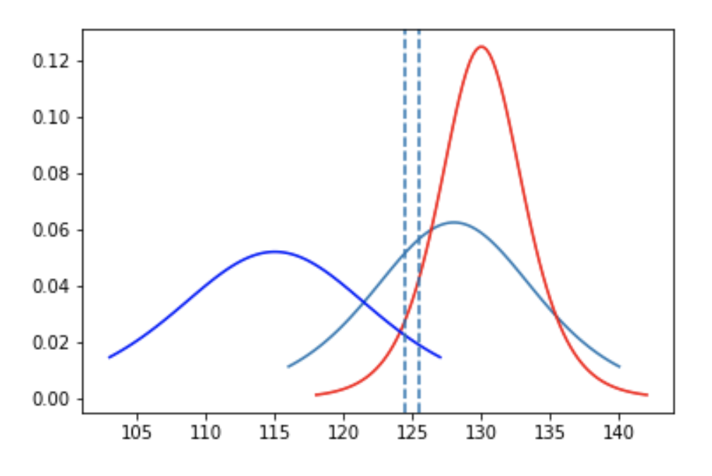
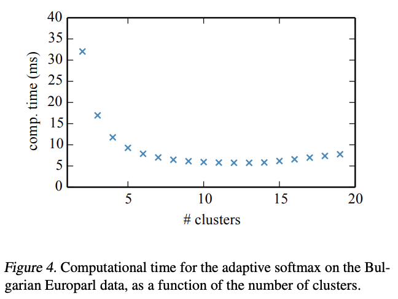
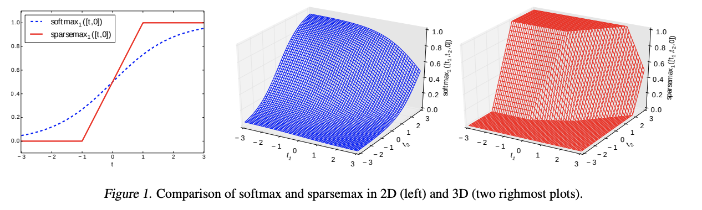

# Softmax

The **Softmax** output function transforms a previous layer's output into a vector of probabilities. It is commonly used for multiclass classification.  Given an input vector $x$ and a weighting vector $w$ we have:

$$ P(y=j \mid{x}) = \frac{e^{x^{T}w_{j}}}{\sum^{K}_{k=1}e^{x^{T}wk}} $$

# Mixture of Logistic Distributions

**Mixture of Logistic Distributions (MoL)** is a type of output function, and an alternative to a [softmax](https://paperswithcode.com/method/softmax) layer. Discretized logistic mixture likelihood is used in PixelCNN++ and [WaveNet](https://paperswithcode.com/method/wavenet) to predict discrete values.

Image Credit: [Hao Gao](https://medium.com/@smallfishbigsea/an-explanation-of-discretized-logistic-mixture-likelihood-bdfe531751f0)

# Mixture of Softmaxes

Please enter a description about the method here

# Adaptive Softmax

**Adaptive Softmax** is a speedup technique for the computation of probability distributions over words. The adaptive softmax is inspired by the class-based hierarchical softmax, where the word classes are built to minimize the computation time. Adaptive softmax achieves efficiency by explicitly taking into account the computation time of matrix-multiplication on parallel systems and combining it with a few important observations, namely keeping a shortlist of frequent words in the root node
and reducing the capacity of rare words.

# Sparsemax

**Sparsemax** is a type of activation/output function similar to the traditional softmax, but able to output sparse probabilities. 

$$ \text{sparsemax}\left(z\right) = \arg_{p∈\Delta^{K−1}}\min||\mathbf{p} - \mathbf{z}||^{2} $$

# Hierarchical Softmax

**Hierarchical Softmax** is a is an alternative to softmax that is faster to evaluate: it is $O\left(\log{n}\right)$ time to evaluate compared to $O\left(n\right)$ for softmax. It utilises a multi-layer binary tree, where the probability of a word is calculated through the product of probabilities on each edge on the path to that node. See the Figure to the right for an example of where the product calculation would occur for the word "I'm".

(Introduced by Morin and Bengio)

Image Credit: [Steven Schmatz](https://www.quora.com/profile/Steven-Schmatz)

