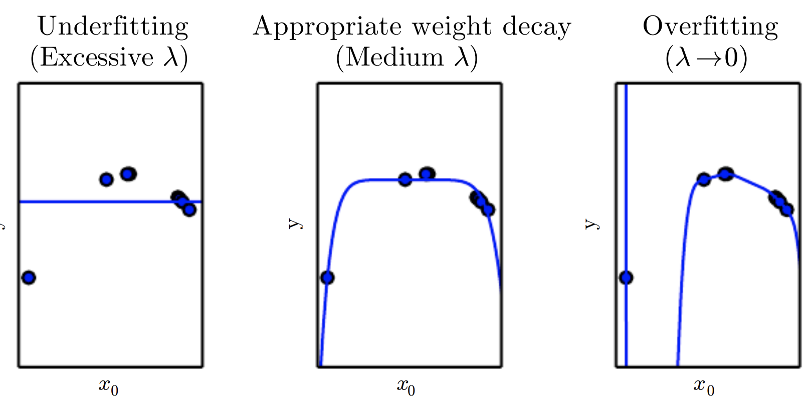
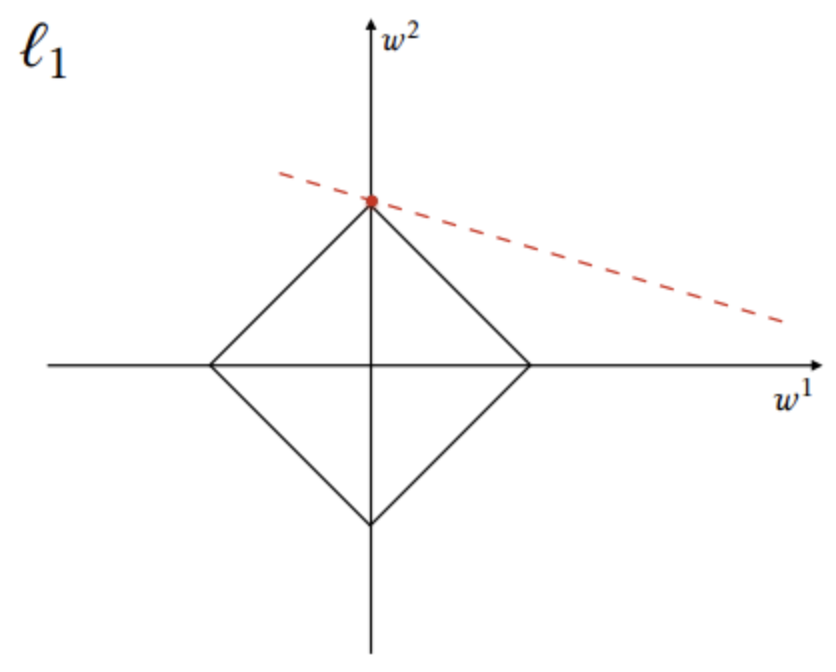

# [Weight Decay](https://paperswithcode.com/method/weight-decay)

**Weight Decay**, or **$L_{2}$ Regularization**, is a regularization technique applied to the weights of a neural network. We minimize a loss function compromising both the primary loss function and a penalty on the $L_{2}$ Norm of the weights:

$$L_{new}\left(w\right) = L_{original}\left(w\right) + \lambda{w^{T}w}$$

where $\lambda$ is a value determining the strength of the penalty (encouraging smaller weights).

Image Source: Deep Learning, Goodfellow et al

# [L1 Regularization](https://paperswithcode.com/method/l1-regularization)

**$L_{1}$ Regularization** is a regularization technique applied to the weights of a neural network. We minimize a loss function compromising both the primary loss function and a penalty on the $L_{1}$ Norm of the weights:

$$L_{new}\left(w\right) = L_{original}\left(w\right) + \lambda{||w||}_{1}$$

where $\lambda$ is a value determining the strength of the penalty. In contrast to weight decay, $L_{1}$ regularization promotes sparsity; i.e. some parameters have an optimal value of zero.

Image Source: [Wikipedia](https://en.wikipedia.org/wiki/Regularization_(mathematics)#/media/File:Sparsityl1.png)

