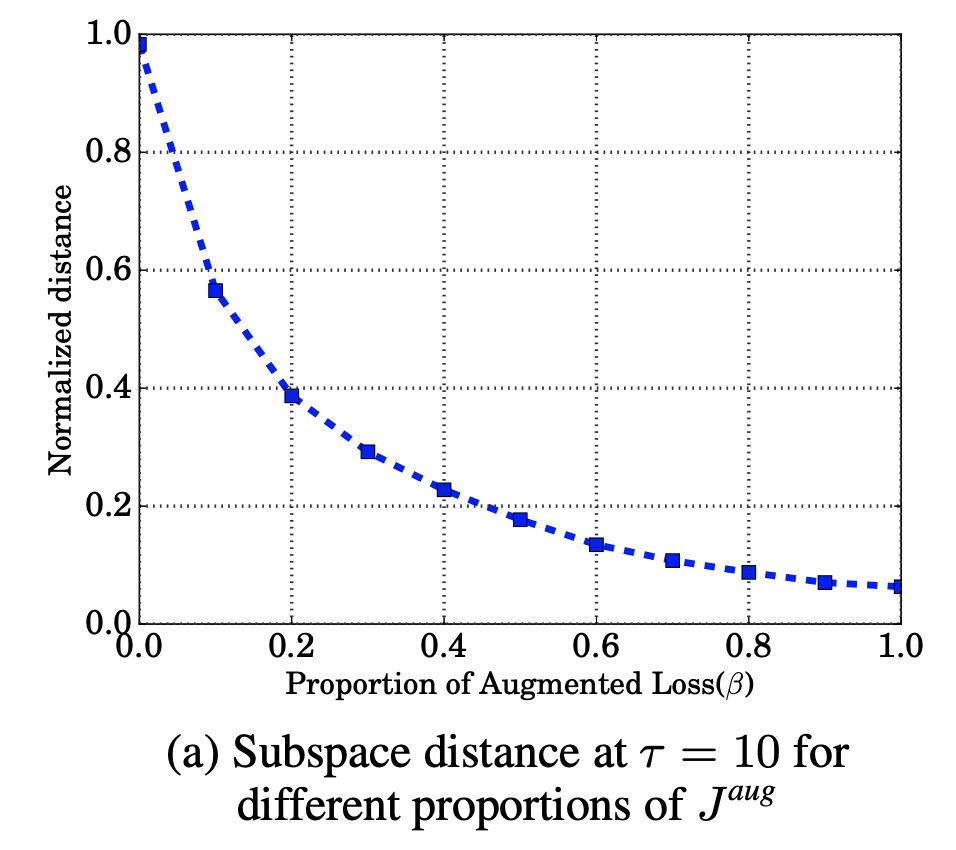

# [Weight Tying](https://paperswithcode.com/method/weight-tying)

**Weight Tying** shares the weights between an embedding and softmax layer, reducing the total parameter count in the natural language processing model. The technique prevents the model from having to learn a one-to-one correspondence between the input and output, improving the standard LSTM language model. In the formulation of Inan et al, this is achieved through an additional term in the loss function that minimizes the KL divergence between the predictive distribution and an estimate of the true data distribution. Given $y_{t}$ for the $t^{\text{th}}$ example, for $y_{t}$ and $y^{*}_{t}$ we have:

$$ J_{t} = D_{\text{KL}}\left(y^{*}_{t}\Vert{y_{t}}\right) $$

Source: Merity et al, Regularizing and Optimizing LSTM Models

source: [source](http://arxiv.org/abs/1611.01462v3)
