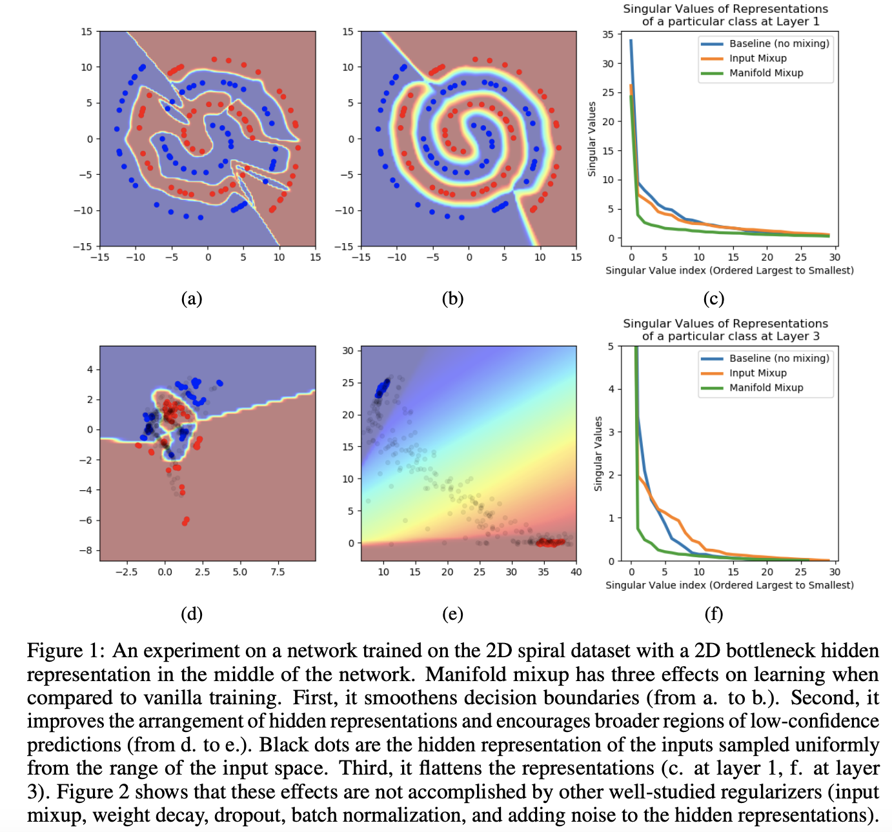
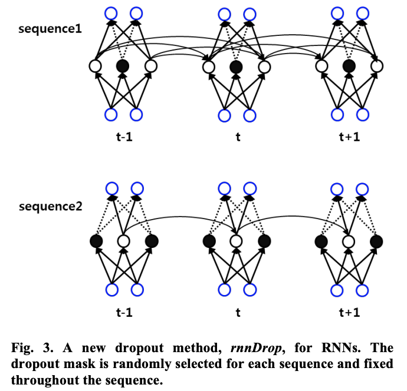

# Dropout

**Dropout** is a regularization technique for neural networks that drops a unit (along with connections) at training time with a specified probability $p$ (a common value is $p=0.5$). The idea is to prevent co-adaptation, where the neural network becomes too reliant on particular connections, as this could be symptomatic of overfitting. Intuitively, dropout can be thought of as creating an implicit ensemble of neural networks. Some papers have sought to show connections between dropout and variational inference in its averaging effect.

# Weight Decay

**Weight Decay**, or **$L_{2}$ Regularization**, is a regularization technique applied to the weights of a neural network. We minimize a loss function compromising both the primary loss function and a penalty on the $L_{2}$ Norm of the weights:

$$L_{new}\left(w\right) = L_{original}\left(w\right) + \lambda{w^{T}w}$$

where $\lambda$ is a value determining the strength of the penalty (encouraging smaller weights).

Image Source: Deep Learning, Goodfellow et al

# Label Smoothing

**Label Smoothing** is a regularization technique that introduces noise for the labels. This accounts for the fact that datasets may have mistakes in them, so maximizing the likelihood of $\log{p}\left(y\mid{x}\right)$ directly can be harmful. Assume for a small constant $\epsilon$, the training set label $y$ is correct with probability $1-\epsilon$ and incorrect otherwise. Label Smoothing regularizes a model based on a softmax with $k$ output values by replacing the hard $0$ and $1$ classification targets with targets of $\frac{\epsilon}{k-1}$ and $1-\epsilon$ respectively.

Source: Deep Learning, Goodfellow et al

Image Source: [When Does Label Smoothing Help?](https://arxiv.org/abs/1906.02629)

# Attention Dropout

**Attention Dropout** is a type of dropout used in attention-based architectures, where elements are randomly dropped out of the softmax in the attention equation. For example, for scaled-dot product attention, we would drop elements from the first term:

$$ {\text{Attention}}(Q, K, V) = \text{softmax}(\frac{QK^{T}}{\sqrt{d_k}})V $$

# Entropy Regularization

**Entropy Regularization** is a type of regularization used in [reinforcement learning](https://paperswithcode.com/methods/area/reinforcement-learning). For on-policy policy gradient based methods like [A3C](https://paperswithcode.com/method/a3c), the same mutual  reinforcement behaviour leads to a highly-peaked $\pi\left(a\mid{s}\right)$ towards a few actions or action sequences, since it is easier for the actor and critic to overoptimise to a small portion of the environment. To reduce this problem, entropy regularization adds an entropy term to the loss to promote action diversity:

$$H(X) = -\sum\pi\left(x\right)\log\left(\pi\left(x\right)\right) $$

Image Credit: Wikipedia

# Early Stopping

**Early Stopping** is a regularization technique for deep neural networks that stops training when parameter updates no longer begin to yield improves on a validation set. In essence we store and update the current best parameters during training, and when parameter updates no longer yield an improvement (after a set number of iterations) we stop training and use the last best parameters. It works as a regularizer by restricting the optimization procedure to a smaller volume of parameter space.

Image Source: [Ramazan Gençay](https://www.researchgate.net/figure/Early-stopping-based-on-cross-validation_fig1_3302948)

# Variational Dropout

**Variational Dropout** is a regularization technique based on [dropout](https://paperswithcode.com/method/dropout), but uses a variational inference grounded approach. In Variational Dropout, we repeat the same dropout mask at each time step for both inputs, outputs, and recurrent layers (drop the same network units at each time step). This is in contrast to ordinary Dropout where different dropout masks are sampled at each time step for the inputs and outputs alone.

# DropConnect

**DropConnect** generalizes [Dropout](https://paperswithcode.com/method/dropout) by randomly dropping the weights rather than the activations with probability $1-p$. DropConnect is similar to Dropout as it introduces dynamic sparsity within the model, but differs in that the sparsity is on the weights $W$, rather than the output vectors of a layer. In other words, the fully connected layer with DropConnect becomes a sparsely connected layer in which the connections are chosen at random during the training stage. Note that this is not equivalent to setting $W$ to be a fixed sparse matrix during training.

For a DropConnect layer, the output is given as:

$$ r = a \left(\left(M * W\right){v}\right)$$

where $M$ is a binary matrix encoding the connection information and $M_{ij} \sim \text{Bernoulli}\left(p\right)$. Each element of the mask $M$ is drawn independently for each example during training, essentially instantiating a different connectivity for each example seen. Additionally, the biases are also masked out during training.

# R1 Regularization

**R$_{1}$ Regularization** is a regularization technique and gradient penalty for training [generative adversarial networks](https://paperswithcode.com/methods/category/generative-adversarial-networks). It penalizes the discriminator from deviating from the Nash Equilibrium via penalizing the gradient on real data alone: when the generator distribution produces the true data distribution and the discriminator is equal to 0 on the data manifold, the gradient penalty ensures that the discriminator cannot create a non-zero gradient orthogonal to the data manifold without suffering a loss in the GAN game.

This leads to the following regularization term:

$$ R_{1}\left(\psi\right) = \frac{\gamma}{2}E_{p_{D}\left(x\right)}\left[||\nabla{D_{\psi}\left(x\right)}||^{2}\right] $$

# Embedding Dropout

**Embedding Dropout** is equivalent to performing [dropout](https://paperswithcode.com/method/dropout) on the embedding matrix at a word level, where the dropout is broadcast across all the word vector’s embedding. The remaining non-dropped-out word embeddings are scaled by $\frac{1}{1-p_{e}}$ where $p_{e}$ is the probability of embedding dropout. As the dropout occurs on the embedding matrix that is used for a full forward and backward pass, this means that all occurrences of a specific word will disappear within that pass, equivalent to performing variational dropout on the connection between the one-hot embedding and the embedding lookup.

Source: Merity et al, Regularizing and Optimizing LSTM Language Models

# Off-Diagonal Orthogonal Regularization

**Off-Diagonal Orthogonal Regularization** is a modified form of orthogonal regularization originally used in [BigGAN](https://paperswithcode.com/method/biggan). The original orthogonal regularization is known to be limiting so the authors explore several variants designed to relax the constraint while still imparting the desired smoothness to our models. They opt for a modification where they remove diagonal terms from the regularization, and aim to minimize the pairwise cosine similarity between filters but does not constrain their norm:

$$ R_{\beta}\left(W\right) = \beta|| W^{T}W \odot \left(\mathbf{1}-I\right) ||^{2}_{F} $$

where $\mathbf{1}$ denotes a matrix with all elements set to 1. The authors sweep $\beta$ values and select $10^{−4}$.

# Temporal Activation Regularization

**Temporal Activation Regularization (TAR)** is a type of slowness regularization for [RNNs](https://paperswithcode.com/methods/category/recurrent-neural-networks) that penalizes differences between states that have been explored in the past. Formally we minimize:

$$\beta{L_{2}}\left(h_{t} - h_{t+1}\right)$$

where $L_{2}$ is the $L_{2}$ norm, $h_{t}$ is the output of the RNN at timestep $t$, and $\beta$ is a scaling coefficient.

# Activation Regularization

**Activation Regularization (AR)**, or $L_{2}$ activation regularization, is regularization performed on activations as opposed to weights. It is usually used in conjunction with [RNNs](https://paperswithcode.com/methods/category/recurrent-neural-networks). It is defined as:

$$\alpha{L}_{2}\left(m\circ{h_{t}}\right) $$

where $m$ is a dropout mask used by later parts of the model, $L_{2}$ is the $L_{2}$ norm, and $h_{t}$ is the output of an RNN at timestep $t$, and $\alpha$ is a scaling coefficient. 

When applied to the output of a dense layer, AR penalizes activations that are substantially away from 0, encouraging activations to remain small.

# L1 Regularization

**$L_{1}$ Regularization** is a regularization technique applied to the weights of a neural network. We minimize a loss function compromising both the primary loss function and a penalty on the $L_{1}$ Norm of the weights:

$$L_{new}\left(w\right) = L_{original}\left(w\right) + \lambda{||w||}_{1}$$

where $\lambda$ is a value determining the strength of the penalty. In contrast to weight decay, $L_{1}$ regularization promotes sparsity; i.e. some parameters have an optimal value of zero.

Image Source: [Wikipedia](https://en.wikipedia.org/wiki/Regularization_(mathematics)#/media/File:Sparsityl1.png)

# DropBlock

**DropBlock** is a structured form of dropout directed at regularizing convolutional networks. In DropBlock, units in a contiguous region of a feature map are dropped together.  As DropBlock discards features in a correlated area, the networks must look elsewhere for evidence to fit the data.

# SpatialDropout

**SpatialDropout** is a type of dropout for convolutional networks. For a given convolution feature tensor of size $n_{\text{feats}}$×height×width, we perform only $n_{\text{feats}}$ dropout
trials and extend the dropout value across the entire feature map. Therefore, adjacent pixels in the dropped-out feature
map are either all 0 (dropped-out) or all active as illustrated in the figure to the right. 

# Target Policy Smoothing

**Target Policy Smoothing** is a regularization strategy for the value function in reinforcement learning. Deterministic policies can overfit to narrow peaks in the value estimate, making them highly susceptible to functional approximation error, increasing the variance of the target. To reduce this variance, target policy smoothing adds a small amount of random noise to the target policy and averages over mini-batches - approximating a [SARSA](https://paperswithcode.com/method/sarsa)-like expectation/integral.

The modified target update is:

$$ y = r + \gamma{Q}_{\theta'}\left(s', \pi_{\theta'}\left(s'\right) + \epsilon \right) $$

$$ \epsilon \sim \text{clip}\left(\mathcal{N}\left(0, \sigma\right), -c, c \right) $$

where the added noise is clipped to keep the target close to the original action. The outcome is an algorithm reminiscent of [Expected SARSA](https://paperswithcode.com/method/expected-sarsa), where the value estimate is instead learned off-policy and the noise added to the target policy is chosen independently of the exploration policy. The value estimate learned is with respect to a noisy policy defined by the parameter $\sigma$.

# GAN Feature Matching

**Feature Matching** is a regularizing objective for a generator in [generative adversarial networks](https://paperswithcode.com/methods/category/generative-adversarial-networks) that prevents it from overtraining on the current discriminator. Instead of directly maximizing the output of the discriminator, the new objective requires the generator to generate data that matches the statistics of the real data, where we use the discriminator only to specify the statistics that we think are worth matching. Specifically, we train the generator to match the expected value of the features on an intermediate layer of the discriminator. This is a natural choice of statistics for the generator to match, since by training the discriminator we ask it to find those features that are most discriminative of real data versus data generated by the current model.

Letting $\mathbf{f}\left(\mathbf{x}\right)$ denote activations on an intermediate layer of the discriminator, our new objective for the generator is defined as: $ ||\mathbb{E}_{x\sim p_{data} } \mathbf{f}\left(\mathbf{x}\right) − \mathbb{E}_{\mathbf{z}∼p_{\mathbf{z}}\left(\mathbf{z}\right)}\mathbf{f}\left(G\left(\mathbf{z}\right)\right)||^{2}_{2} $. The discriminator, and hence
$\mathbf{f}\left(\mathbf{x}\right)$, are trained as with vanilla GANs. As with regular GAN training, the objective has a fixed point where G exactly matches the distribution of training data.

# Stochastic Depth

**Stochastic Depth** aims to shrink the depth of a network during training, while
keeping it unchanged during testing. We can achieve this goal by randomly dropping entire [ResBlocks](https://paperswithcode.com/method/residual-block) during training and bypassing their transformations through skip connections. 

Let $b_{l} \in$ {$0, 1$} denote a Bernoulli random variable, which indicates whether the $l$th ResBlock is active ($b_{l} = 1$) or inactive ($b_{l} = 0$). Further, let us denote the “survival” probability of ResBlock $l$ as $p_{l} = \text{Pr}\left(b_{l} = 1\right)$. With this definition we can bypass the $l$th ResBlock by multiplying its function $f_{l}$ with $b_{l}$ and we extend the update rule to:

$$ H_{l} = \text{ReLU}\left(b_{l}f_{l}\left(H_{l-1}\right) + \text{id}\left(H_{l-1}\right)\right) $$

If $b_{l} = 1$, this reduces to the original ResNet update and this ResBlock remains unchanged. If $b_{l} = 0$, the ResBlock reduces to the identity function, $H_{l} = \text{id}\left((H_{l}−1\right)$.

# Path Length Regularization

**Path Length Regularization** is a type of regularization for [generative adversarial networks](https://paperswithcode.com/methods/category/generative-adversarial-networks) that encourages good conditioning in the mapping from latent codes to images. The idea is to encourage that a fixed-size step in $\mathcal{W}$ results in a non-zero, fixed-magnitude change in the image.

We can measure the deviation from this ideal empirically by stepping into random directions in the image space and observing the corresponding w gradients. These gradients should have close to an equal length regardless of $\mathbf{w}$ or the image-space direction, indicating that the mapping from the latent space to image space is well-conditioned.

At a single $\mathbf{w} \in \mathcal{W}$ the local metric scaling properties of the generator mapping $g\left(\mathbf{w}\right) : \mathcal{W} \rightarrow \mathcal{Y}$ are captured by the Jacobian matrix $\mathbf{J_{w}} = \delta{g}\left(\mathbf{w}\right)/\delta{\mathbf{w}}$. Motivated by the desire to preserve the expected lengths of vectors regardless of the direction, we formulate the regularizer as:

$$ \mathbb{E}_{\mathbf{w},\mathbf{y} \sim \mathcal{N}\left(0, \mathbf{I}\right)} \left(||\mathbf{J}^{\mathbf{T}}_{\mathbf{w}}\mathbf{y}||_{2} - a\right)^{2} $$

where $y$ are random images with normally distributed pixel intensities, and $w \sim f\left(z\right)$, where $z$ are normally distributed. 

To avoid explicit computation of the Jacobian matrix, we use the identity $\mathbf{J}^{\mathbf{T}}_{\mathbf{w}}\mathbf{y} = \nabla_{\mathbf{w}}\left(g\left(\mathbf{w}\right)·y\right)$, which is efficiently computable using standard backpropagation. The constant $a$ is set dynamically during optimization as the long-running exponential moving average of the lengths $||\mathbf{J}^{\mathbf{T}}_{\mathbf{w}}\mathbf{y}||_{2}$, allowing the optimization to find a suitable global scale by itself.

The authors note that they find that path length regularization leads to more reliable and consistently behaving models, making architecture exploration easier. They also observe that the smoother generator is significantly easier to invert.

# Zoneout

**Zoneout** is a  method for regularizing [RNNs](https://paperswithcode.com/methods/category/recurrent-neural-networks). At each timestep, zoneout stochastically forces some hidden units to maintain their previous values. Like [dropout](https://paperswithcode.com/method/dropout), zoneout uses random noise to train a pseudo-ensemble, improving generalization.
But by preserving instead of dropping hidden units, gradient information and state information are more readily propagated through time, as in feedforward stochastic depth networks.

# Manifold Mixup

**Manifold Mixup** is a regularization method that encourages neural networks to predict less confidently on interpolations of hidden representations. It leverages semantic interpolations as additional training signal, obtaining neural networks with smoother decision boundaries at multiple levels of representation. 
As a result, neural networks trained with Manifold Mixup learn class-representations with fewer directions of variance.

Consider training a deep neural network $f\left(x\right) = f_{k}\left(g_{k}\left(x\right)\right)$, where $g_{k}$ denotes the part of the neural network mapping the input data to the hidden representation at layer $k$, and $f_{k}$ denotes the
part mapping such hidden representation to the output $f\left(x\right)$. Training $f$ using Manifold Mixup is performed in five steps:

(1) Select a random layer $k$ from a set of eligible layers $S$ in the neural network. This set may include the input layer $g_{0}\left(x\right)$.

(2) Process two random data minibatches $\left(x, y\right)$ and $\left(x', y'\right)$ as usual, until reaching layer $k$. This provides us with two intermediate minibatches $\left(g_{k}\left(x\right), y\right)$ and $\left(g_{k}\left(x'\right), y'\right)$.

(3) Perform Input Mixup on these intermediate minibatches. This produces the mixed minibatch:

$$
\left(\tilde{g}_{k}, \tilde{y}\right) = \left(\text{Mix}_{\lambda}\left(g_{k}\left(x\right), g_{k}\left(x'\right)\right), \text{Mix}_{\lambda}\left(y, y'\right
)\right),
$$

where $\text{Mix}_{\lambda}\left(a, b\right) = \lambda \cdot a + \left(1 − \lambda\right) \cdot b$. Here, $\left(y, y'
\right)$ are one-hot labels, and the mixing coefficient
$\lambda \sim \text{Beta}\left(\alpha, \alpha\right)$ as in mixup. For instance, $\alpha = 1.0$ is equivalent to sampling $\lambda \sim U\left(0, 1\right)$.

(4) Continue the forward pass in the network from layer $k$ until the output using the mixed minibatch $\left(\tilde{g}_{k}, \tilde{y}\right)$.

(5) This output is used to compute the loss value and
gradients that update all the parameters of the neural network.

# Orthogonal Regularization

**Orthogonal Regularization** is a regularization technique for convolutional neural networks, introduced with generative modelling as the task in mind. Orthogonality is argued to be a desirable quality in ConvNet filters, partially because multiplication by an orthogonal matrix leaves the norm of the original matrix unchanged. This property is valuable in deep or recurrent networks, where repeated matrix multiplication can result in signals vanishing or exploding. To try to maintain orthogonality throughout training, Orthogonal Regularization encourages weights to be orthogonal by pushing them towards the nearest orthogonal manifold. The objective function is augmented with the cost:

$$ \mathcal{L}_{ortho} = \sum\left(|WW^{T} − I|\right) $$

Where $\sum$ indicates a sum across all filter banks, $W$ is a filter bank, and $I$ is the identity matrix

# Shake-Shake Regularization

**Shake-Shake Regularization**  aims to improve the generalization ability of multi-branch networks by replacing the standard summation of parallel branches with a stochastic affine combination. A typical pre-activation [ResNet](https://paperswithcode.com/method/resnet) with 2 residual branches would follow this equation:

$$x_{i+1} = x_{i} + \mathcal{F}\left(x_{i}, \mathcal{W}_{i}^{\left(1\right)}\right) + \mathcal{F}\left(x_{i}, \mathcal{W}_{i}^{\left(2\right)}\right) $$

Shake-shake regularization introduces a random variable $\alpha_{i}$  following a uniform distribution between 0 and 1 during training:

$$x_{i+1} = x_{i} + \alpha\mathcal{F}\left(x_{i}, \mathcal{W}_{i}^{\left(1\right)}\right) + \left(1-\alpha\right)\mathcal{F}\left(x_{i}, \mathcal{W}_{i}^{\left(2\right)}\right) $$

Following the same logic as for dropout, all $\alpha_{i}$ are set to the expected value of $0.5$ at test time.

# DropPath

Just as [dropout](https://paperswithcode.com/method/dropout) prevents co-adaptation of activations, **DropPath** prevents co-adaptation of parallel paths in networks such as [FractalNets](https://paperswithcode.com/method/fractalnet) by randomly dropping operands of the join layers. This
discourages the network from using one input path as an anchor and another as a corrective term (a
configuration that, if not prevented, is prone to overfitting). Two sampling strategies are:

- **Local**: a join drops each input with fixed probability, but we make sure at least one survives.
<li>**Global**: a single path is selected for the entire network. We restrict this path to be a single
column, thereby promoting individual columns as independently strong predictors.</li>

# Adaptive Dropout

**Adaptive Dropout** is a regularization technique that extends dropout by allowing the dropout probability to be different for different units. The intuition is that there may be hidden units that can individually make confident predictions for the presence or absence of an important feature or combination of features. [Dropout](https://paperswithcode.com/method/dropout) will ignore this confidence and drop the unit out 50% of the time. 

Denote the activity of unit $j$ in a deep neural network by $a_{j}$ and assume that its inputs are {$a_{i}: i &lt; j$}. In dropout, $a_{j}$ is randomly set to zero with probability 0.5. Let $m_{j}$ be a binary variable that is used to mask, the activity $a_{j}$, so that its value is:

$$ a_{j} = m_{j}g \left( \sum_{i: i&lt;j}w_{j, i}a_{i} \right)$$

where $w_{j,i}$ is the weight from unit $i$ to unit $j$ and $g\left(·\right)$ is the activation function and $a_{0} = 1$ accounts for biases. Whereas in standard dropout, $m_{j}$ is Bernoulli with probability $0.5$, adaptive dropout uses adaptive dropout probabilities that depends on input activities:

$$ P\left(m_{j} = 1\mid{{a_{i}: i &lt; j}}\right) = f \left( \sum_{i: i&lt;j}\pi{_{j, i}a_{i}} \right) $$

where $\pi_{j, i}$ is the weight from unit $i$ to unit $j$ in the standout network or the adaptive dropout network; $f(·)$ is a sigmoidal function.

# ShakeDrop

**ShakeDrop regularization** extends [Shake-Shake regularization](https://paperswithcode.com/method/shake-shake-regularization) and can be applied not only to [ResNeXt](https://paperswithcode.com/method/resnext) but also [ResNet](https://paperswithcode.com/method/resnet), [WideResNet](https://paperswithcode.com/method/wideresnet), and [PyramidNet](https://paperswithcode.com/method/pyramidnet). The proposed ShakeDrop is given as

$$G\left(x\right) = x + \left(b_{l} + \alpha − b_{l}\alpha\right)F\left(x\right), \text{ in train-fwd} $$
$$G\left(x\right) = x + \left(b_{l} + \beta − b_{l}\beta\right)F\left(x\right), \text{ in train-bwd} $$
$$G\left(x\right) = x + E\left[b_{l} + \alpha − b_{l}\alpha\right]F\left(x\right), \text{ in test} $$

where $b_{l}$ is a Bernoulli random variable with probability $P\left(b_{l} = 1\right) = E\left[b_{l}
\right] = p_{l}$ given by the linear decay rule in each layer, and $\alpha$ and $\beta$ are independent uniform random variables in each element. 

The most effective ranges of $\alpha$ and $\beta$ were experimentally found to be different from those of Shake-Shake, and are $\alpha$ = 0, $\beta \in \left[0, 1\right]$ and $\alpha \in \left[−1, 1\right]$, $\beta \in \left[0, 1\right]$.

# Recurrent Dropout

**Recurrent Dropout** is a regularization method for [recurrent neural networks](https://paperswithcode.com/methods/category/recurrent-neural-networks). Dropout is applied to the updates to LSTM memory cells (or GRU states), i.e. it drops out the input/update gate in LSTM/GRU.

# Euclidean Norm Regularization

**Euclidean Norm Regularization** is a regularization step used in [generative adversarial networks](https://paperswithcode.com/methods/category/generative-adversarial-networks), and is typically added to both the generator and discriminator losses:

$$ R_{z} = w_{r} \cdot ||\Delta{z}||^{2}_{2} $$

where the scalar weight $w_{r}$ is a parameter.

Image: [LOGAN](https://arxiv.org/pdf/1912.00953.pdf)

# SRN

**Stable Rank Normalization (SRN)** is a weight-normalization scheme which minimizes the
stable rank of a linear operator.

# ScheduledDropPath

**ScheduledDropPath** is a modified version of [DropPath](https://paperswithcode.com/method/droppath). In DropPath, each path in the cell is stochastically dropped with some fixed probability during training. In ScheduledDropPath, each path in the cell is dropped out with a probability that is linearly increased over the course of training.

# Auxiliary Batch Normalization

**Auxiliary Batch Normalization** is a type of regularization used in adversarial training schemes. The idea is that adversarial examples should have a separate [batch normalization](https://paperswithcode.com/method/batch-normalization) components to the clean examples, as they have different underlying statistics.

# Discriminative Regularization

**Discriminative Regularization** is a regularization technique for [variational autoencoders](https://paperswithcode.com/methods/category/likelihood-based-generative-models) that uses representations from discriminative classifiers to augment the VAE objective function (the lower bound) corresponding to a generative model. Specifically, it encourages the model’s reconstructions to be close to the data example in a representation space defined by the hidden layers of highly-discriminative, neural network based classifiers.

# rnnDrop

**rnnDrop** is a [dropout](https://paperswithcode.com/method/dropout) based regularization technique for [recurrent neural networks](https://paperswithcode.com/methods/category/recurrent-neural-networks). It
amounts to using the same dropout mask at every timestep. It drops both the non-recurrent and recurrent connections. 

If we apply different random omission patterns, i.e., dropout masks,  each hidden node would be omitted very frequently (every 2 time stamps on average if p=0.5 is used); hence the memory
on the past may be easily lost. This frequent memory reset will hurt the main power of RNNs, and LSTM networks in particular, which learns long-term dependencies in data through memory cells. 

In order to resolve the above problem and still realize the
effectiveness of dropout, rnnDrop generates the dropout mask only
at the beginning of each training sequence and fixes it
through the sequence. A simple figure to explain the idea is
shown to the right. The figure shows an RNN being trained
with rnnDrop for three frames $\left(t-1, t, t+1\right)$ on two different
training sequences in the data (denoted as ‘sequence1’ and
‘sequence2’). The black circles denote the randomly omitted
hidden nodes during training, and the dotted arrows stand
for the model weights connected to those omitted nodes.

**From: RnnDrop: A Novel Dropout for RNNs in ASR by Moon et al**

