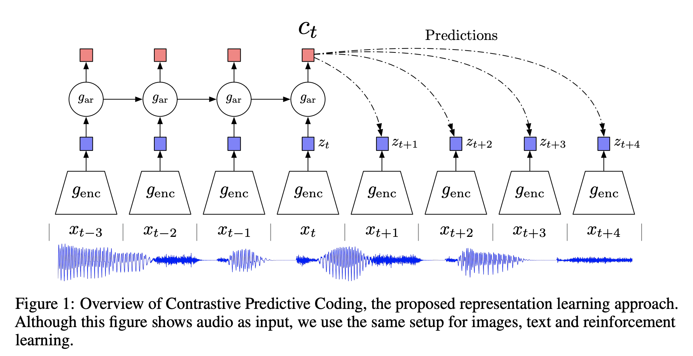
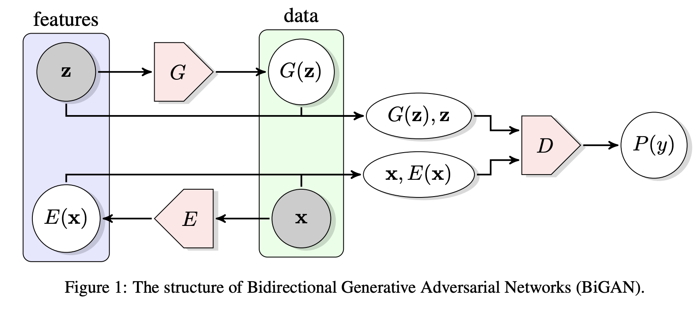
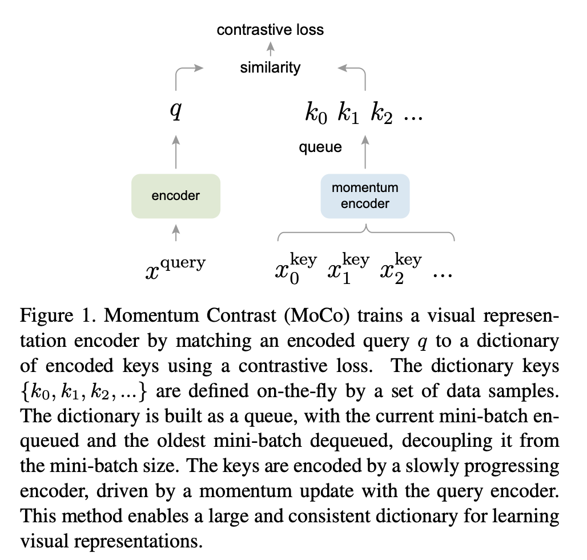
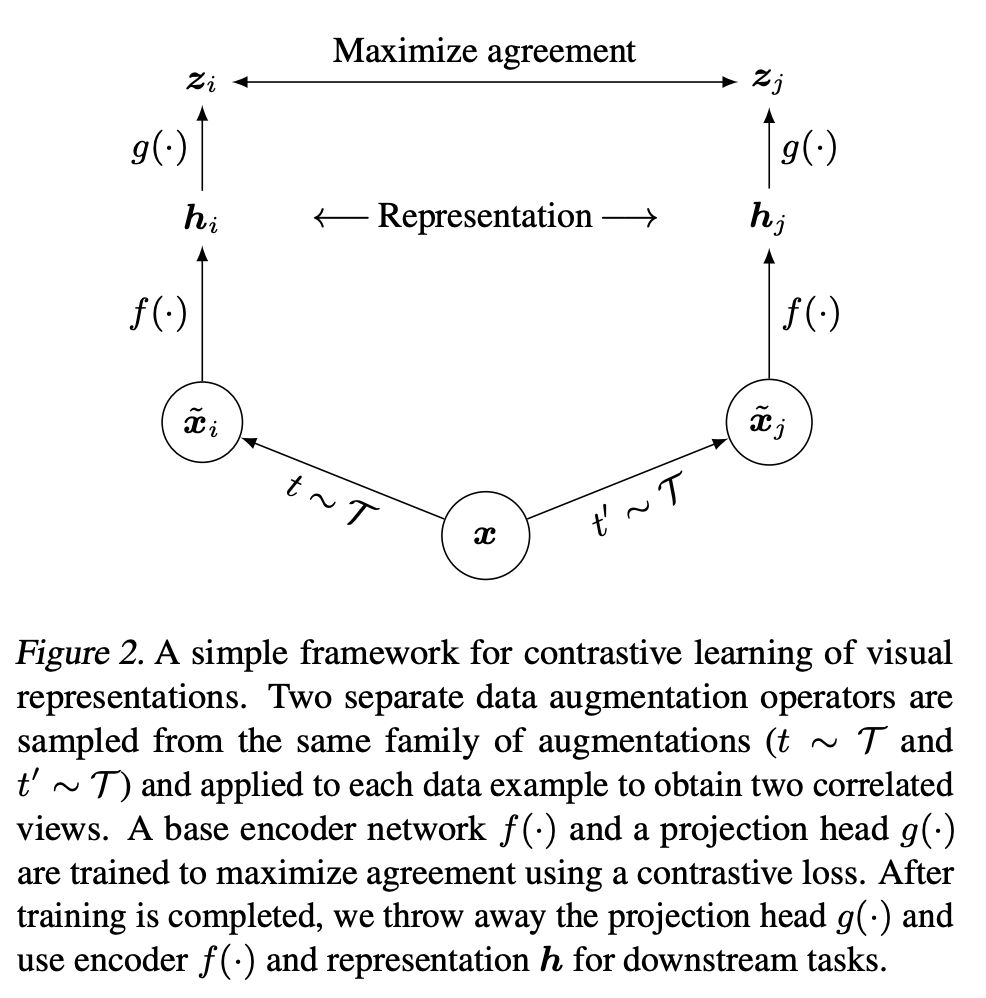
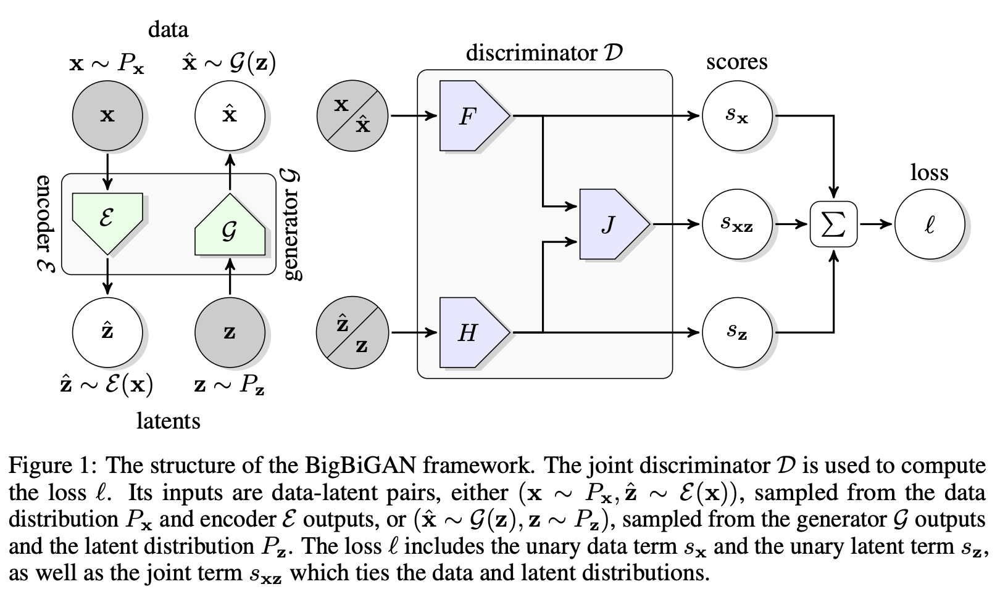
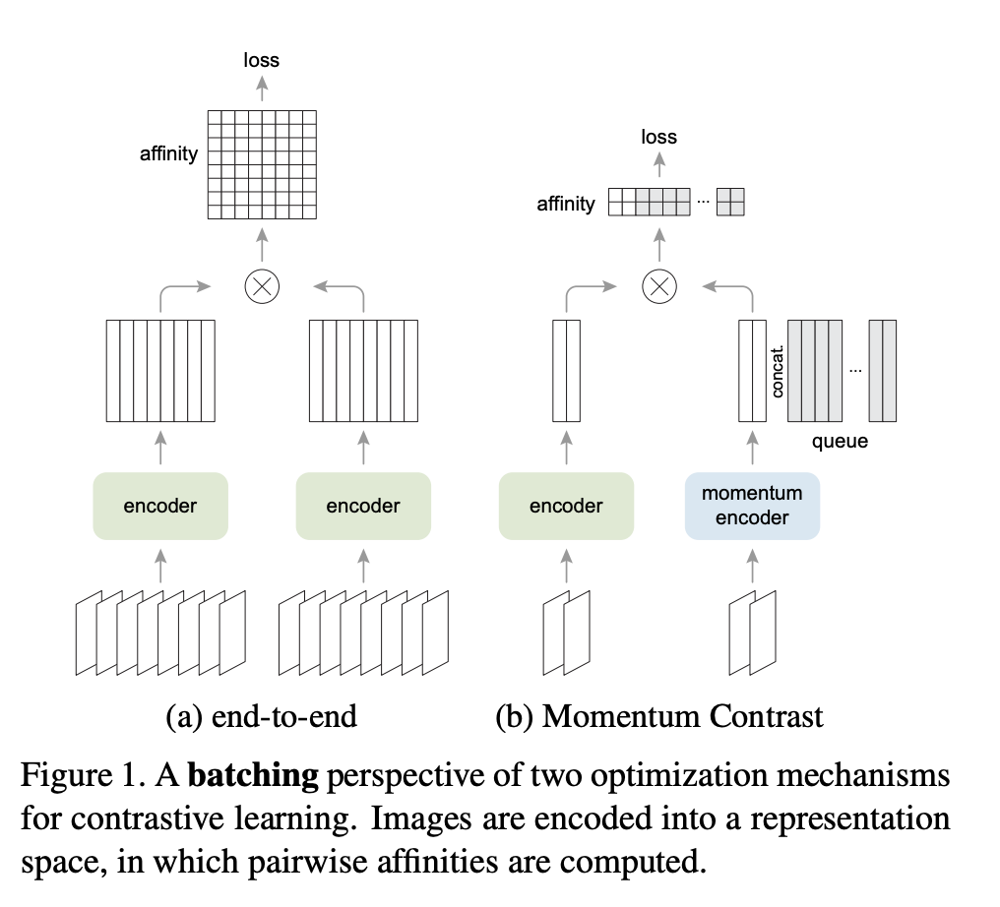
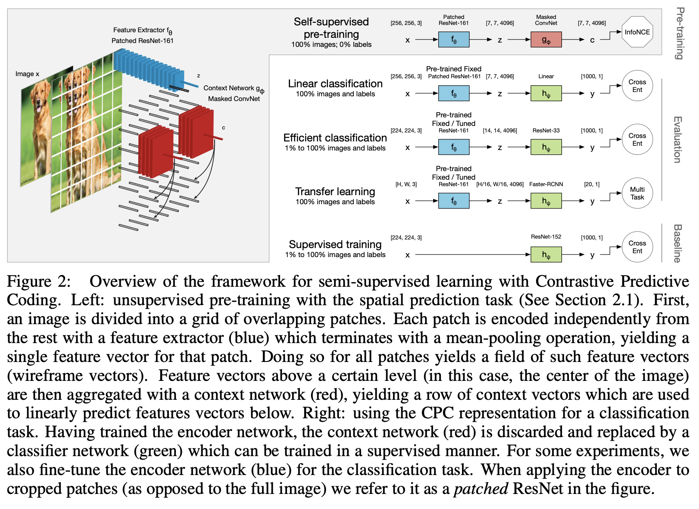
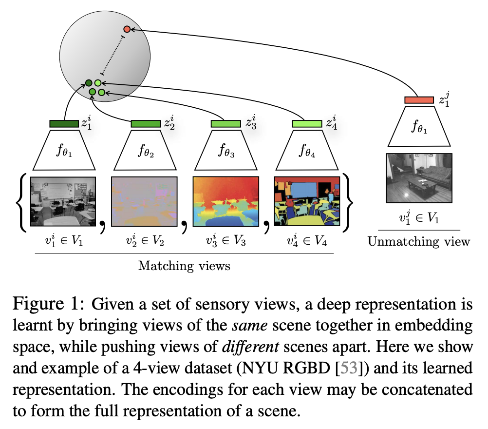

# Contrastive Predictive Coding

**Contrastive Predictive Coding (CPC)** learns self-supervised representations by predicting the future in latent space by using powerful autoregressive models. The model uses a probabilistic contrastive loss which induces the latent space to capture information that is maximally useful
to predict future samples.

First, a non-linear encoder $g_{enc}$ maps the input sequence of observations $x_{t}$ to a sequence of latent representations $z_{t} = g_{enc}\left(x_{t}\right)$, potentially with a lower temporal resolution. Next, an autoregressive model $g_{ar}$ summarizes all $z\leq{t}$ in the latent space and produces a context latent representation $c_{t} = g_{ar}\left(z\leq{t}\right)$.

A density ratio is modelled which preserves the mutual information between $x_{t+k}$ and $c_{t}$ as follows:

$$ f_{k}\left(x_{t+k}, c_{t}\right) \propto \frac{p\left(x_{t+k}|c_{t}\right)}{p\left(x_{t+k}\right)} $$

where $\propto$ stands for ’proportional to’ (i.e. up to a multiplicative constant). Note that the density ratio $f$ can be unnormalized (does not have to integrate to 1). The authors use a simple log-bilinear model:

$$ f_{k}\left(x_{t+k}, c_{t}\right) = \exp\left(z^{T}_{t+k}W_{k}c_{t}\right) $$

Any type of autoencoder and autoregressive can be used. An example the authors opt for is strided convolutional layers with residual blocks and GRUs.

The autoencoder and autoregressive models are trained to minimize an InfoNCE loss (see components).

# BiGAN

A **BiGAN**, or **Bidirectional GAN**, is a type of generative adversarial network where the generator  not only maps latent samples to generated data, but also has an inverse mapping from data to the latent representation. The motivation is to make a type of GAN that can learn rich representations for us in applications like unsupervised learning.

In addition to the generator $G$ from the standard [GAN](https://paperswithcode.com/method/gan) framework, BiGAN includes an encoder $E$ which maps data $\mathbf{x}$ to latent representations $\mathbf{z}$. The BiGAN discriminator $D$ discriminates not only in data space ($\mathbf{x}$ versus $G\left(\mathbf{z}\right)$), but jointly in data and latent space (tuples $\left(\mathbf{x}, E\left(\mathbf{x}\right)\right)$ versus $\left(G\left(z\right), z\right)$), where the latent component is either an encoder output $E\left(\mathbf{x}\right)$ or a generator input $\mathbf{z}$.

# MoCo

**MoCo**, or **Momentum Contrast**, is a self-supervised learning algorithm with a contrastive loss. 

Contrastive loss methods can be thought of as building dynamic dictionaries. The "keys" (tokens) in the dictionary are sampled from data (e.g., images or patches) and are represented by an encoder network. Unsupervised learning trains encoders to perform dictionary look-up: an encoded “query” should be similar to its matching key and dissimilar to others. Learning is formulated as minimizing a contrastive loss. 

MoCo can be viewed as a way to build large and consistent dictionaries for unsupervised learning with a contrastive loss. In MoCo, we maintain the dictionary as a queue of data samples: the encoded representations of the current mini-batch are enqueued, and the oldest are dequeued. The queue decouples the dictionary size from the mini-batch size, allowing it to be large. Moreover, as the dictionary keys come from the preceding several mini-batches, a slowly progressing key encoder, implemented as a momentum-based moving average of the query encoder, is proposed to maintain consistency.

# SimCLR

**SimCLR** is a framework for contrastive learning of visual representations. It learns representations by maximizing agreement between differently augmented views of the same data example via a contrastive loss in the latent space. It consists of:

<li>
A stochastic data augmentation module that transforms any given data example randomly resulting in two correlated views of the same example, denoted $\mathbf{\tilde{x}_{i}}$ and $\mathbf{\tilde{x}_{j}}$, which is considered a positive pair. SimCLR sequentially applies three simple augmentations: random cropping followed by resize back to the original size, random color distortions, and random Gaussian blur. The authors find random crop and color distortion is crucial to achieve good performance.
</li>
<li>
A neural network base encoder $f\left(·\right)$ that extracts representation vectors from augmented data examples. The framework allows various choices of the network architecture without any constraints. The authors opt for simplicity and adopt ResNet to obtain $h_{i} = f\left(\mathbf{\tilde{x}}_{i}\right) = \text{ResNet}\left(\mathbf{\tilde{x}}_{i}\right)$ where $h_{i} \in \mathbb{R}^{d}$ is the output after the average pooling layer.
</li>
<li>
A small neural network projection head $g\left(·\right)$ that maps representations to the space where contrastive loss is applied. Authors use a MLP with one hidden layer to obtain $z_{i} = g\left(h_{i}\right) = W^{(2)}\sigma\left(W^{(1)}h_{i}\right)$ where $\sigma$ is a ReLU nonlinearity. The authors find it beneficial to define the contrastive loss on $z_{i}$’s rather than $h_{i}$’s.
</li>
<li>
A contrastive loss function defined for a contrastive prediction task. Given a set {$\mathbf{\tilde{x}}_{k}$} including a positive pair of examples $\mathbf{\tilde{x}}_{i}$ and $\mathbf{\tilde{x}_{j}}$ , the contrastive prediction task aims to identify $\mathbf{\tilde{x}}_{j}$ in {$\mathbf{\tilde{x}}_{k}$}$_{k\neq{i}}$ for a given $\mathbf{\tilde{x}}_{i}$.
</li>

A minibatch of $N$ examples is randomly sampled and the contrastive prediction task is defined on pairs of augmented examples derived from the minibatch, resulting in $2N$ data points. Negative examples are not sampled explicitly. Instead, given a positive pair, the other $2(N − 1)$ augmented examples within a minibatch are treated as negative examples. A NT-Xent (the normalized
temperature-scaled cross entropy loss) loss function is used (see components).

# BigBiGAN

**BigBiGAN** is a type of [BiGAN](https://paperswithcode.com/method/bigan) with a [BigGAN](https://paperswithcode.com/method/biggan) image generator. The authors initially used ResNet as a baseline for the encoder $\mathcal{E}$ followed by a 4-layer MLP with skip connections, but they experimented with RevNets and found they outperformed with increased network width, so opted for this type of encoder for the final architecture.

# MoCo v2

**MoCo v2** is an improved version of the Momentum Contrast self-supervised learning algorithm. Improvements include:

- Replacing the 1-layer fully connected layer with a 2-layer MLP head.
- Including blur augmentation (the same used in SimCLR).

# CPC v2

**Contrastive Predictive Coding v2 (CPC v2)** is a self-supervised learning approach that builds upon the original CPC with several improvements. These improvements include:

<li>
**Model capacity** - The third residual stack of ResNet-101 (originally containing 23 blocks, 1024-dimensional feature maps, and 256-dimensional bottleneck layers), is converted to use 46 blocks, with 4096-dimensional feature maps and 512-dimensional bottleneck layers: ResNet-161.
</li>
<li>
**Layer Normalization** - The authors find CPC with batch normalization harms downstream performance. They hypothesize this is due to batch normalization allowing large models to find a trivial solution to CPC: it introduces a dependency between patches (through the batch statistics) that can be exploited to bypass the constraints on the receptive field. They replace batch normalization with layer normalization.
</li>
<li>
**Predicting lengths and directions** - patches are predicted with contexts from both directions rather than just spatially underneath.
</li>
<li>
**Patch-based Augmentation** - Utilising "color dropping" which randomly drops two of the three color channels in each patch, as well as random horizontal flips.
</li>

Consistent with prior results, this new architecture delivers better performance regardless of

# Contrastive Multiview Coding

**Contrastive Multiview Coding (CMC)** is a self-supervised learning approach, based on CPC, that  learns representations that capture information shared between multiple sensory views. The core idea is to set an anchor view and the sample positive and negative data points from the other view and maximise agreement between positive pairs in learning from two views. Contrastive learning is used to build the embedding.

