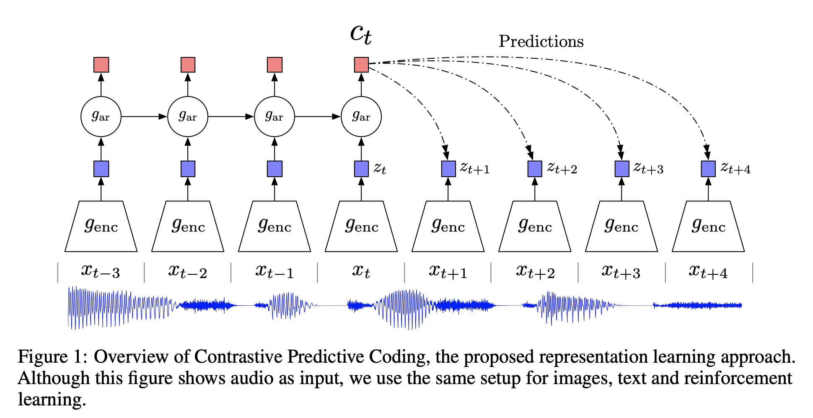

# Contrastive Predictive Coding

**Contrastive Predictive Coding (CPC)** learns self-supervised representations by predicting the future in latent space by using powerful autoregressive models. The model uses a probabilistic contrastive loss which induces the latent space to capture information that is maximally useful
to predict future samples.

First, a non-linear encoder $g_{enc}$ maps the input sequence of observations $x_{t}$ to a sequence of latent representations $z_{t} = g_{enc}\left(x_{t}\right)$, potentially with a lower temporal resolution. Next, an autoregressive model $g_{ar}$ summarizes all $z\leq{t}$ in the latent space and produces a context latent representation $c_{t} = g_{ar}\left(z\leq{t}\right)$.

A density ratio is modelled which preserves the mutual information between $x_{t+k}$ and $c_{t}$ as follows:

$$ f_{k}\left(x_{t+k}, c_{t}\right) \propto \frac{p\left(x_{t+k}|c_{t}\right)}{p\left(x_{t+k}\right)} $$

where $\propto$ stands for ’proportional to’ (i.e. up to a multiplicative constant). Note that the density ratio $f$ can be unnormalized (does not have to integrate to 1). The authors use a simple log-bilinear model:

$$ f_{k}\left(x_{t+k}, c_{t}\right) = \exp\left(z^{T}_{t+k}W_{k}c_{t}\right) $$

Any type of autoencoder and autoregressive can be used. An example the authors opt for is strided convolutional layers with residual blocks and GRUs.

The autoencoder and autoregressive models are trained to minimize an InfoNCE loss (see components).

# MoCo

**MoCo**, or **Momentum Contrast**, is a self-supervised learning algorithm with a contrastive loss. 

Contrastive loss methods can be thought of as building dynamic dictionaries. The "keys" (tokens) in the dictionary are sampled from data (e.g., images or patches) and are represented by an encoder network. Unsupervised learning trains encoders to perform dictionary look-up: an encoded “query” should be similar to its matching key and dissimilar to others. Learning is formulated as minimizing a contrastive loss. 

MoCo can be viewed as a way to build large and consistent dictionaries for unsupervised learning with a contrastive loss. In MoCo, we maintain the dictionary as a queue of data samples: the encoded representations of the current mini-batch are enqueued, and the oldest are dequeued. The queue decouples the dictionary size from the mini-batch size, allowing it to be large. Moreover, as the dictionary keys come from the preceding several mini-batches, a slowly progressing key encoder, implemented as a momentum-based moving average of the query encoder, is proposed to maintain consistency.

# Noisy Student

**Noisy Student Training** is a semi-supervised learning approach. It extends the idea of self-training
and distillation with the use of equal-or-larger student models and noise added to the student during learning. It has three main steps: 

1. train a teacher model on labeled images
1. use the teacher to generate pseudo labels on unlabeled images
1. train a student model on the combination of labeled images and pseudo labeled images. 

The algorithm is iterated a few times by treating the student as a teacher to relabel the unlabeled data and training a new student.

Noisy Student Training seeks to improve on self-training and distillation in two ways. First, it makes the student larger than, or at least equal to, the teacher so the student can better learn from a larger dataset. Second, it adds noise to the student so the noised student is forced to learn harder from the pseudo labels. To noise the student, it uses input noise such as RandAugment data augmentation, and model noise such as dropout and stochastic depth during training.

# MoCo v2

**MoCo v2** is an improved version of the Momentum Contrast self-supervised learning algorithm. Improvements include:

- Replacing the 1-layer fully connected layer with a 2-layer MLP head.
- Including blur augmentation (the same used in SimCLR).

# CPC v2

**Contrastive Predictive Coding v2 (CPC v2)** is a self-supervised learning approach that builds upon the original CPC with several improvements. These improvements include:

<li>
**Model capacity** - The third residual stack of ResNet-101 (originally containing 23 blocks, 1024-dimensional feature maps, and 256-dimensional bottleneck layers), is converted to use 46 blocks, with 4096-dimensional feature maps and 512-dimensional bottleneck layers: ResNet-161.
</li>
<li>
**Layer Normalization** - The authors find CPC with batch normalization harms downstream performance. They hypothesize this is due to batch normalization allowing large models to find a trivial solution to CPC: it introduces a dependency between patches (through the batch statistics) that can be exploited to bypass the constraints on the receptive field. They replace batch normalization with layer normalization.
</li>
<li>
**Predicting lengths and directions** - patches are predicted with contexts from both directions rather than just spatially underneath.
</li>
<li>
**Patch-based Augmentation** - Utilising "color dropping" which randomly drops two of the three color channels in each patch, as well as random horizontal flips.
</li>

Consistent with prior results, this new architecture delivers better performance regardless of

