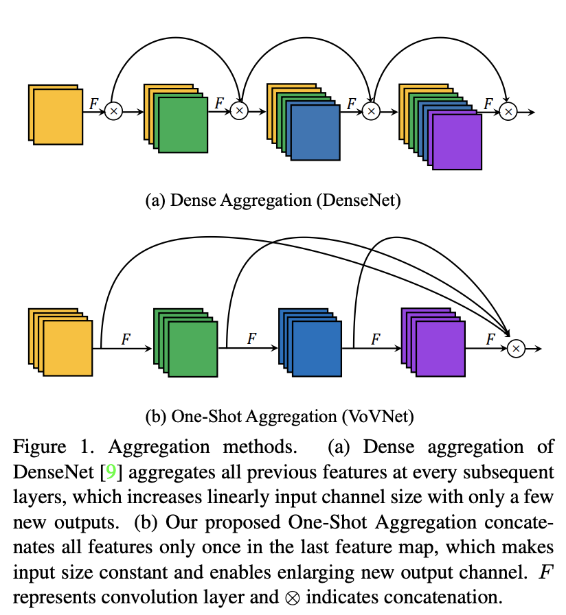

# Residual Block

**Residual Blocks** are skip-connection blocks that learn residual functions with reference to the layer inputs, instead of learning unreferenced functions. They were introduced as part of the [ResNet](https://paperswithcode.com/method/resnet) architecture.

Formally, denoting the desired underlying mapping as $\mathcal{H}({x})$, we let the stacked nonlinear layers fit another mapping of $\mathcal{F}({x}):=\mathcal{H}({x})-{x}$. The original mapping is recast into $\mathcal{F}({x})+{x}$.

The intuition is that it is easier to optimize the residual mapping than to optimize the original, unreferenced mapping. To the extreme, if an identity mapping were optimal, it would be easier to push the residual to zero than to fit an identity mapping by a stack of nonlinear layers.

# Bottleneck Residual Block

A **Bottleneck Residual Block** is a type of residual block that utilises 1x1 convolutions to create a bottleneck. The idea is to make residual blocks as thin as possible to increase depth and have less parameters. It is one of the residual blocks proposed for the [ResNet](https://paperswithcode.com/method/resnet) architecture.

# Dense Block

A **Dense Block** is a module used in convolutional neural networks that connects **all layers** (with matching feature-map sizes) directly with each other. It was originally proposed as part of the [DenseNet](https://paperswithcode.com/method/densenet) architecture. To preserve the feed-forward nature, each layer obtains additional inputs from all preceding layers and passes on its own feature-maps to all subsequent layers. In contrast to [ResNets](https://beta.paperswithcode.com/method/resnet), we never combine features through summation before they are passed into a layer; instead, we combine features by concatenating them. Hence, the $\ell^{th}$ layer has $\ell$ inputs, consisting of the feature-maps of all preceding convolutional blocks. Its own feature-maps are passed on to all $L-\ell$ subsequent layers. This introduces $\frac{L(L+1)}{2}$  connections in an $L$-layer network, instead of just $L$, as in traditional architectures: "dense connectivity".

# Inverted Residual Block

An **Inverted Residual Block**, sometimes called an **MBConv Block**, is a type of residual block used for image models that uses an inverted structure for efficiency reasons. It was originally proposed for the [MobileNetV2](https://paperswithcode.com/method/mobilenetv2) CNN architecture. It has since been reused for several mobile-optimized CNNs.

A traditional [Residual Block](https://paperswithcode.com/method/residual-block) has a wide -&gt; narrow -&gt; wide structure with the number of channels. The input has a high number of channels, which are compressed with a 1x1 convolution. The number of channels is then increased again with a 1x1 convolution so input and output can be added. 

In contrast, an Inverted Residual Block follows a narrow -&gt; wide -&gt; narrow approach, hence the inversion. We first widen with a 1x1 convolution, then use a 3x3 depthwise convolution (which greatly reduces the number of parameters), then we use a 1x1 convolution to to reduce the number of channels so input and output can be added.

# ResNeXt Block

A **ResNeXt Block** aggregates a set of transformations with the same topology. Compared to a Residual Block, it exposes a new dimension,  **cardinality** (the size of the set of transformations) $C$, as an essential factor in addition to the dimensions of depth and width. It was proposed as part of the [ResNeXt](https://paperswithcode.com/method/resnext) CNN architecture.

Formally, a set of aggregated transformations can be represented as: $\mathcal{F}(x)=\sum_{i=1}^{C}\mathcal{T}_i(x)$, where $\mathcal{T}_i(x)$ can be an arbitrary function. Analogous to a simple neuron, $\mathcal{T}_i$ should project $x$ into an (optionally low-dimensional) embedding and then transform it.

# Non-Local Block

A **Non-Local Block** is an image block module that wraps a non-local operation. We can define a non-local block as:

$$ \mathbb{z}_{i} = W_{z}\mathbb{y_{i}} + \mathbb{x}_{i} $$

where $y_{i}$ is the output from the non-local operation and $+ \mathbb{x}_{i}$ is a residual connection.

# CBHG

**CBHG** is a building block used in the [Tacotron](https://paperswithcode.com/method/tacotron) text-to-speech model. It consists of a
bank of 1-D convolutional filters, followed by highway networks and a bidirectional gated recurrent unit (BiGRU). The module is used to extract representations from sequences. The input sequence is first
convolved with $K$ sets of 1-D convolutional filters, where the $k$-th set contains $C_{k}$ filters of width $k$ (i.e. $k = 1, 2, \dots , K$). These filters explicitly model local and contextual information (akin to modeling unigrams, bigrams, up to K-grams). The convolution outputs are stacked together and further max pooled along time to increase local invariances. A stride of 1 is used to  preserve the original time resolution. The processed sequence is further passed to a few fixed-width 1-D convolutions, whose outputs are added with the original input sequence via residual connections. Batch normalization is used for all convolutional layers. The convolution outputs are fed into a multi-layer highway network to extract high-level features. Finally, a bidirectional GRU RNN is stacked on top to extract sequential features from both forward and backward context.

# Wide Residual Block

A **Wide Residual Block** is a type of residual block that utilises two conv 3x3 layers (with dropout). This is wider than other variants of residual blocks (for instance [bottleneck residual blocks](https://paperswithcode.com/method/bottleneck-residual-block)). It was proposed as part of the [WideResNet](https://paperswithcode.com/method/wideresnet) CNN architecture.

# ShuffleNet Block

A **ShuffleNet Block** is an image model block that utilises a channel shuffle operation, along with depthwise convolutions, for an efficient architectural design. It was proposed as part of the [ShuffleNet](https://paperswithcode.com/method/shufflenet) architecture. The starting point is the [Residual Block](https://paperswithcode.com/method/residual-block) unit from [ResNets](https://paperswithcode.com/method/resnet), which is then modified with a pointwise group convolution and a channel shuffle operation.

# Inception-ResNet-v2-C

**Inception-ResNet-v2-C** is an image model block used in the [Inception-ResNet-v2](https://paperswithcode.com/method/inception-resnet-v2) architecture. It largely follows the idea of Inception modules - and grouped convolutions - but also includes residual connections.

# Inception-ResNet-v2-B

**Inception-ResNet-v2-B** is an image model block used in the  [Inception-ResNet-v2](https://paperswithcode.com/method/inception-resnet-v2) architecture. It largely follows the idea of Inception modules - and grouped convolutions - but also includes residual connections.

# Pyramidal Residual Unit

A **Pyramidal Residual Unit** is a type of residual unit where the number of channels gradually increases as a function of the depth at which the layer occurs, which is similar to a pyramid structure of which the shape gradually widens from the top downwards. It was introduced as part of the [PyramidNet](https://paperswithcode.com/method/pyramidnet) architecture.

# DPN Block

A **Dual Path Network** block shares common features while maintaining the flexibility to explore new features through dual path architectures. In this sense it combines the benefits of [ResNets](https://paperswithcode.com/method/resnet) and [DenseNets](https://paperswithcode.com/method/densenet). It was proposed as part of the [DPN](https://paperswithcode.com/method/dpn) CNN architecture.

We formulate such a dual path architecture as follows:

$$x^{k} = \sum\limits_{t=1}^{k-1} f_t^{k}(h^t) \text{,}  $$

$$
y^{k} = \sum\limits_{t=1}^{k-1} v_t(h^t) = y^{k-1} + \phi^{k-1}(y^{k-1}) \text{,} \\
$$

$$
r^{k} = x^{k} + y^{k} \text{,} \\
$$

$$
h^k = g^k \left( r^{k} \right) \text{,}
$$

where $x^{k}$ and $y^{k}$ denote the extracted information at $k$-th step from individual path, $v_t(\cdot)$ is a feature learning function as $f_t^k(\cdot)$. The first equation refers to the densely connected path that enables exploring new features. The second equation refers to the residual path that enables common features re-usage. The third equation defines the dual path that integrates them and feeds them to the last transformation function in the last equation.

# Pyramidal Bottleneck Residual Unit

A **Pyramidal Bottleneck Residual Unit** is a type of residual unit where the number of channels gradually increases as a function of the depth at which the layer occurs, which is similar to a pyramid structure of which the shape gradually widens from the top downwards. It also consists of a bottleneck using 1x1 convolutions. It was introduced as part of the [PyramidNet](https://paperswithcode.com/method/pyramidnet) architecture.

# MelGAN Residual Block

The **MelGAN Residual Block** is a convolutional residual block used in the [MelGAN](https://paperswithcode.com/method/melgan) generative audio architecture. It employs residual connections with dilated convolutions. Dilations are used so that temporally far output activations of each subsequent layer has significant overlapping inputs. Receptive field of a stack of dilated convolution layers increases exponentially with the number of layers. Incorporating these into the MelGAN generator allows us to efficiently increase the induced receptive fields of each output time-step. This effectively implies larger overlap in the induced receptive field of far apart time-steps, leading to better long range correlation.

# Dilated Bottleneck Block

**Dilated Bottleneck Block** is an image model block used in the [DetNet](https://paperswithcode.com/method/detnet) convolutional neural network architecture. It employs a bottleneck structure with dilated convolutions to efficiently enlarge the receptive field.

# Dilated Bottleneck with Projection Block

**Dilated Bottleneck with Projection Block** is an image model block used in the [DetNet](https://paperswithcode.com/method/detnet) convolutional neural network architecture. It employs a bottleneck structure with dilated convolutions to efficiently enlarge the receptive field. It uses a 1x1 convolution to ensure the spatial size stays fixed.

# SqueezeNeXt Block

A **SqueezeNeXt Block** is a two-stage bottleneck module used in the [SqueezeNeXt](http://www.paperswithcode.com/squeezenext-block) to reduce the number of input channels to the 3 × 3 convolution. The
latter is further decomposed into separable convolutions to further reduce the number of parameters (orange parts), followed
by a 1 × 1 expansion module.

# One-Shot Aggregation

**One-Shot Aggregation** is an image model block that is an alternative to [Dense Blocks](https://paperswithcode.com/method/dense-block), by aggregating intermediate features. It is proposed as part of the [VoVNet](https://paperswithcode.com/method/vovnet) architecture. Each convolution layer is connected by two-way connection. One way is connected to the subsequent layer to produce the feature with a larger receptive field while the other way is aggregated only once into the final output feature map. The difference with DenseNet is that the output of each layer is not routed to all subsequent intermediate layers which makes the input size of intermediate layers constant.

# Two-Way Dense Layer

**Two-Way Dense Layer** is an image model block used in the [PeleeNet](https://paperswithcode.com/method/peleenet) architectures. Motivated by [GoogLeNet](https://paperswithcode.com/method/googlenet), the 2-way dense layer is used to get different scales of receptive fields. One way of the layer uses a 3x3 kernel size. The other way of the layer uses two stacked 3x3 convolution to learn visual patterns for large objects.

# FBNet Block

**FBNet Block** is an image model block used in the [FBNet](https://paperswithcode.com/method/fbnet) architectures discovered through [DNAS](https://paperswithcode.com/method/dnas) neural architecture search.

# Selective Kernel

A **Selective Kernel** unit is a bottleneck block consisting of a sequence of 1×1 convolution, SK convolution and 1×1 convolution. It was proposed as part of the [SKNet](https://paperswithcode.com/method/sknet) CNN architecture. In general, all the large kernel convolutions in the original bottleneck blocks in [ResNeXt](https://paperswithcode.com/method/resnext) are replaced by the proposed SK convolutions, enabling the network to choose appropriate receptive field sizes in an adaptive manner. 

In SK units, there are three important hyper-parameters which determine the final settings of SK convolutions: the number of paths $M$ that determines the number of choices of different kernels to be aggregated, the group number $G$ that controls the cardinality of each path, and the reduction ratio $r$ that controls the number of parameters in the fuse operator. One typical setting of SK convolutions is $\text{SK}\left[M, G, r\right]$ to be $\text{SK}\left[2, 32, 16\right]$.

# Reversible Residual Block

**Reversible Residual Blocks** are skip-connection blocks that learn **reversible** residual functions with reference to the layer inputs. It is proposed as part of the [RevNet](https://paperswithcode.com/method/revnet) CNN architecture. Units in each layer are partitioned into two groups, denoted $x_{1}$ and $x_{2}$; the authors find what works best is partitioning the channels. Each reversible block takes inputs $\left(x_{1}, x_{2}\right)$ and produces outputs $\left(y_{1}, y_{2}\right)$ according to the following additive coupling rules – inspired by the transformation in [NICE](https://paperswithcode.com/method/nice) (nonlinear independent components estimation) – and residual functions $F$ and $G$ analogous to those in standard [ResNets](https://paperswithcode.com/method/resnet):

$$y_{1} = x_{1} + F\left(x_{2}\right)$$
$$y_{2} = x_{2} + G\left(y_{1}\right)$$

Each layer’s activations can be reconstructed from the next layer’s activations as follows:

$$ x_{2} = y_{2} − G\left(y_{1}\right)$$
$$ x_{1} = y_{1} − F\left(x_{2}\right)$$

# DVD-GAN DBlock

**DVD-GAN DBlock** is a residual block for the discriminator used in the [DVD-GAN](https://paperswithcode.com/method/dvd-gan) architecture for video generation.

# CSPResNeXt Block

**CSPResNeXt Block** is an extended [ResNext Block](https://paperswithcode.com/method/resnext-block) where we partition the feature map of the base layer into two parts and then merges them through a cross-stage hierarchy. The use of a split and merge strategy allows for more gradient flow through the network.

# DVD-GAN GBlock

**DVD-GAN GBlock** is a residual block for the generator used in the [DVD-GAN](https://paperswithcode.com/method/dvd-gan) architecture for video generation.

# Big-Little Module

**Big-Little Modules** are blocks for image models that have two branches: each of which represents a separate block from a deep model and a less deep counterpart. They were proposed as part of the [BigLittle-Net](https://paperswithcode.com/method/big-little-net) architecture. The two branches are fused with a linear combination and unit weights. These two branches are known as Big-Branch (more layers and channels at low resolutions) and Little-Branch (fewer layers and channels at high resolution).

# Res2Net Block

A **Res2Net Block** is an image model block that constructs hierarchical residual-like connections
within one single residual block. It was proposed as part of the [Res2Net](https://paperswithcode.com/method/res2net) CNN architecture.

The block represents multi-scale features at a granular level and increases the range of receptive fields for each network layer. The $3 \times 3$ filters of $n$ channels is replaced with a set of smaller filter groups, each with $w$ channels. These smaller filter groups are connected in a hierarchical residual-like style to increase the number of scales that the output features can represent. Specifically, we divide input feature maps into several groups. A group of filters first extracts features from a group of input feature maps. Output features of the previous group are then sent to the next group of filters along with another group of input feature maps. 

This process repeats several times until all input feature maps are processed. Finally, feature maps from all groups are concatenated and sent to another group of $1 \times 1$ filters to fuse information altogether. Along with any possible path in which input features are transformed to output features, the equivalent receptive field increases whenever it passes a $3 \times 3$ filter, resulting in many equivalent feature scales due to combination effects.

One way of thinking of these blocks is that they expose new dimension, **scale**,  alongside the existing dimensions of depth, width, and cardinality.

# OSA (identity mapping + eSE)

**One-Shot Aggregation with an Identity Mapping and eSE** is an image model block that extends [one-shot aggregation](https://paperswithcode.com/method/one-shot-aggregation) with a residual connection and effective squeeze-and-excitation block. It is proposed as part of the [VoVNetV2](https://paperswithcode.com/method/vovnetv2) CNN architecture.

The module adds an identity mapping to the OSA module - the input path is connected to the end of an OSA module that is able to backpropagate the gradients of every OSA module in an end-to-end manner on each stage like a [ResNet](https://paperswithcode.com/method/resnet). Additionally, a channel attention module - effective Squeeze-Excitation - is used which is like regular squeeze-and-excitation but uses only one FC layer with $C$ channels instead of two FCs without a channel dimension reduction, which maintains channel information.

# Elastic Dense Block

**Elastic Dense Block** is a skip connection block that modifies the [Dense Block](https://paperswithcode.com/method/dense-block) with downsamplings and upsamplings in parallel branches at each layer to let the network learn from a data scaling policy in which inputs being processed at different resolutions in each layer. It is called "elastic" because each layer in the network is flexible in terms of choosing the best scale by a soft policy.

# NVAE Generative Residual Cell

The **NVAE Generative Residual Cell** is a skip connection block used as part of the [NVAE](https://paperswithcode.com/method/nvae) architecture for the generator. The residual cell expands the number of channels $E$ times before applying the depthwise separable convolution, and then maps it back to $C$ channels. The design motivation was to help model long-range correlations in the data by increasing the receptive field of the network, which explains the expanding path but also the use of depthwise convolutions to keep a handle on parameter count.

# NVAE Encoder Residual Cell

The **NVAE Encoder Residual Cell** is a residual connection block used in the [NVAE](https://paperswithcode.com/method/nvae) architecture for the encoder. It applies two series of BN-Swish-Conv layers without changing the number of channels.

# Efficient Channel Attention

**Efficient Channel Attention** is an architectural unit based on squeeze-and-excitation blocks that reduces model complexity without dimensionality reduction. It is proposed as part of the [ECA-Net](https://paperswithcode.com/method/eca-net) CNN architecture. After channel-wise global average pooling without dimensionality reduction, the ECA captures local cross-channel interaction by considering every channel and its $k$ neighbors. The ECA can be efficiently implemented by fast $1D$ convolution of size $k$, where kernel size $k$ represents the coverage of local cross-channel interaction, i.e., how many neighbors participate in attention prediction of one channel.

# GBlock

**GBlock** is a type of residual block used in the [GAN-TTS](https://paperswithcode.com/method/gan-tts) text-to-speech architecture - it is a stack of two residual blocks. As the generator is producing raw audio (e.g. a 2s training clip corresponds
to a sequence of 48000 samples), dilated convolutions are used to ensure that the receptive field of $G$ is large enough to capture long-term dependencies. The four kernel size-3 convolutions in each GBlock have increasing dilation factors: 1, 2, 4, 8. Convolutions are preceded by Conditional Batch Normalisation, conditioned on the linear embeddings of the noise term $z \sim N\left(0, \mathbf{I}_{128}\right)$ in the single-speaker case, or the concatenation of $z$ and a one-hot representation of the speaker ID in the multi-speaker case. The embeddings are different for
each BatchNorm instance. 

A GBlock contains two skip connections, the first of which in GAN-TTS performs upsampling if the output frequency is higher than the input, and it also contains a size-1 convolution
if the number of output channels is different from the input.

# Residual SRM

A **Residual SRM** is a module for convolutional neural networks that uses a Style-based Recalibration Module within a [residual block](https://paperswithcode.com/method/residual-block) like structure.

# Strided EESP

A **Strided EESP** unit is based on the [EESP Unit](https://paperswithcode.com/method/eesp) but is modified to learn representations more efficiently at multiple scales. Depth-wise dilated convolutions are given strides, an average pooling operation is added instead of an identity connection, and the element-wise addition operation is replaced with a concatenation operation, which helps in expanding the dimensions of feature maps efficiently.

# DBlock

**DBlock** is a residual based block used in the discriminator of the [GAN-TTS](https://paperswithcode.com/method/gan-tts) architecture. They are similar to the [GBlocks](https://paperswithcode.com/method/gblock) used in the generator, but without batch normalisation.

# EESP

An **EESP Unit**, or  Extremely Efficient Spatial Pyramid of Depth-wise Dilated Separable Convolutions, is an image model block designed for edge devices. It was proposed as part of the [ESPNetv2](https://paperswithcode.com/method/espnetv2) CNN architecture. 

This building block is based on a reduce-split-transform-merge strategy. The EESP unit first projects the high-dimensional input feature maps into low-dimensional space using groupwise pointwise convolutions and then learn the representations in parallel using depthwise dilated separable convolutions with different dilation rates. Different dilation rates in each branch allow the EESP unit to learn the representations from a large effective receptive field. To remove the gridding artifacts caused by dilated convolutions, the EESP fuses the feature maps using hierarchical feature fusion (HFF).

# Ghost Bottleneck

A **Ghost BottleNeck** is a skip connection block, similar to the basic residual block in ResNet in which several convolutional layers and shortcuts are integrated, but stacks Ghost Modules instead. The proposed ghost bottleneck mainly consists of two stacked Ghost modules. It was proposed as part of the [GhostNet](https://paperswithcode.com/method/ghostnet) CNN architecture.

The first Ghost module acts as an expansion layer increasing the number of channels. The ratio between the number of the output channels and that of the input is referred to as the **expansion ratio**. The second Ghost module reduces the number of channels to match the shortcut path. Then the shortcut is connected between the inputs and the outputs of these two Ghost modules. The batch normalization (BN) and ReLU nonlinearity are applied after each layer, except that ReLU is not used after the second Ghost module as suggested by [MobileNetV2](https://paperswithcode.com/method/mobilenetv2). The Ghost bottleneck described above is for stride=1. As for the case where stride=2, the shortcut path is implemented by a downsampling layer and a depthwise convolution with stride=2 is inserted between the two Ghost modules. In practice, the primary convolution in Ghost module here is pointwise convolution for its efficiency.

# Elastic ResNeXt Block

An **Elastic ResNeXt Block** is a modification of the [ResNeXt Block](https://paperswithcode.com/method/resnext-block) that adds downsamplings and upsamplings in parallel branches at each layer and let the network learn from a data scaling policy in which inputs being processed at different resolutions in each layer. It is called "elastic" because each layer in the network is flexible in terms of choosing the best scale by a soft policy.

# Conditional DBlock

**Conditional DBlock** is a residual based block used in the discriminator of the [GAN-TTS](https://paperswithcode.com/method/gan-tts) architecture. They are similar to the [GBlocks](https://paperswithcode.com/method/gblock) used in the generator, but without batch normalization. Unlike the [DBlock](https://paperswithcode.com/method/dblock), the Conditional DBlock adds the embedding of the linguistic features after the first convolution.

