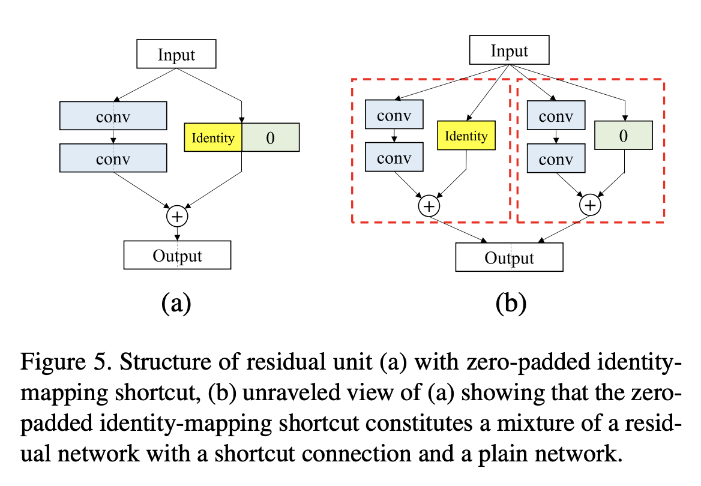

# [Residual Connection](https://paperswithcode.com/method/residual-connection)

**Residual Connections** are a type of skip-connection that learn residual functions with reference to the layer inputs, instead of learning unreferenced functions. 

Formally, denoting the desired underlying mapping as $\mathcal{H}({x})$, we let the stacked nonlinear layers fit another mapping of $\mathcal{F}({x}):=\mathcal{H}({x})-{x}$. The original mapping is recast into $\mathcal{F}({x})+{x}$.

The intuition is that it is easier to optimize the residual mapping than to optimize the original, unreferenced mapping. To the extreme, if an identity mapping were optimal, it would be easier to push the residual to zero than to fit an identity mapping by a stack of nonlinear layers.

source: [source]http://arxiv.org/abs/1512.03385v1
# [Concatenated Skip Connection](https://paperswithcode.com/method/concatenated-skip-connection)

A **Concatenated Skip Connection** is a type of skip connection that seeks to reuse features by concatenating them to new layers, allowing more information to be retained from previous layers of the network. This contrasts with say, residual connections, where element-wise summation is used instead to incorporate information from previous layers. This type of skip connection is prominently used in DenseNets (and also Inception networks), which the Figure to the right illustrates.

source: [source]http://openaccess.thecvf.com/content_cvpr_2017/html/Huang_Densely_Connected_Convolutional_CVPR_2017_paper.html
# [Zero-padded Shortcut Connection](https://paperswithcode.com/method/zero-padded-shortcut-connection)

A **Zero-padded Shortcut Connection** is a type of residual connection used in the [PyramidNet](https://paperswithcode.com/method/pyramidnet) architecture. For PyramidNets, identity mapping alone cannot be used for a shortcut because the feature map dimension differs among individual residual units. Therefore, only a zero-padded shortcut or projection shortcut can be used for all the residual units. However,  a projection shortcut can hamper information propagation and lead to optimization problems, especially for very deep networks. On the other hand, the zero-padded shortcut avoids the overfitting problem because no additional parameters exist.

source: [source]http://arxiv.org/abs/1610.02915v4
