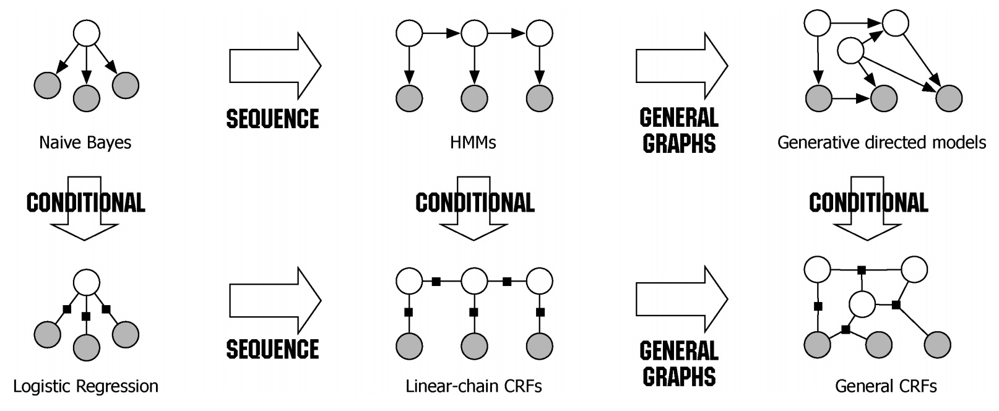

# [CRF](https://paperswithcode.com/method/crf)

**Conditional Random Fields** or **CRFs** are a type of probabilistic graph model that take neighboring sample context into account for tasks like classification. Prediction is modeled as a graphical model, which implements dependencies between the predictions. Graph choice depends on the application, for example linear chain CRFs are popular in natural language processing, whereas in image-based tasks, the graph would connect to neighboring locations in an image to enforce that they have similar predictions.

Image Credit: [Charles Sutton and Andrew McCallum, An Introduction to Conditional Random Fields](https://homepages.inf.ed.ac.uk/csutton/publications/crftut-fnt.pdf)

# [CRF](https://paperswithcode.com/method/crf)

**Conditional Random Fields** or **CRFs** are a type of probabilistic graph model that take neighboring sample context into account for tasks like classification. Prediction is modeled as a graphical model, which implements dependencies between the predictions. Graph choice depends on the application, for example linear chain CRFs are popular in natural language processing, whereas in image-based tasks, the graph would connect to neighboring locations in an image to enforce that they have similar predictions.

Image Credit: [Charles Sutton and Andrew McCallum, An Introduction to Conditional Random Fields](https://homepages.inf.ed.ac.uk/csutton/publications/crftut-fnt.pdf)

