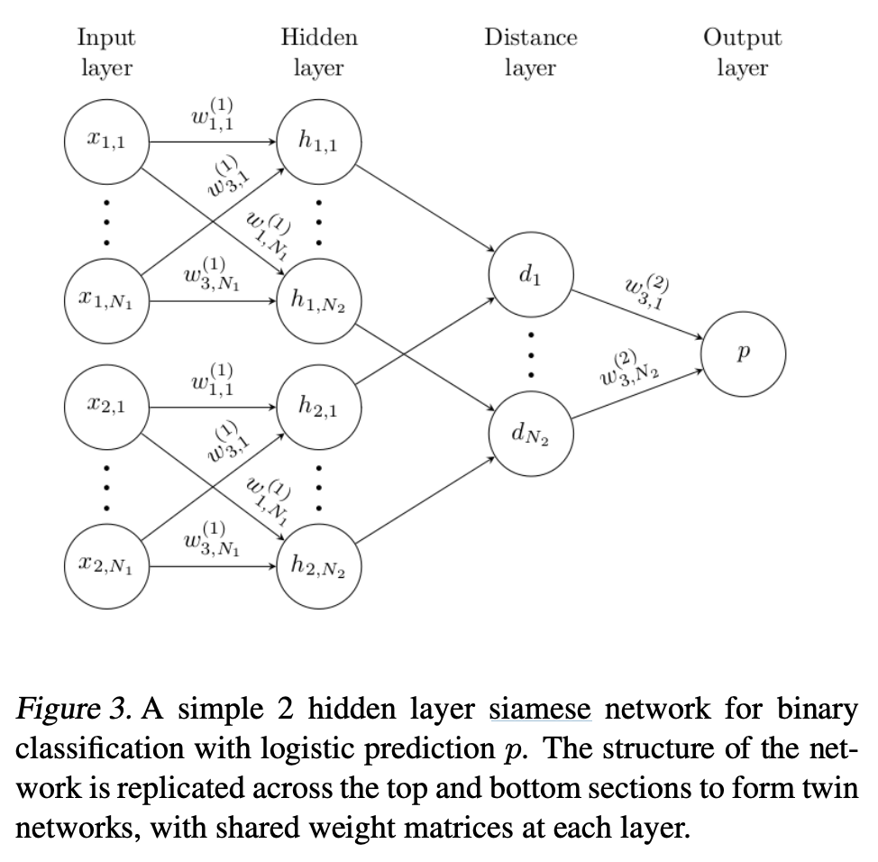

# [Siamese Network](https://paperswithcode.com/method/siamese-network)

A **Siamese Network** consists of twin networks which accept distinct inputs but are joined by an energy function at the top. This function computes a metric between the highest level feature representation on each side. The parameters between the twin networks are tied. Weight tying guarantees that two extremely similar images are not mapped by each network to very different locations in feature space because each network computes the same function. The network is symmetric, so that whenever we present two distinct images to the twin networks, the top conjoining layer will compute the same metric as if we were to we present the same two images but to the opposite twins.

Intuitively instead of trying to classify inputs, a siamese network learns to differentiate between inputs, learning their similarity. The loss function used is usually a form of contrastive loss.

Source: [Koch et al](https://www.cs.cmu.edu/~rsalakhu/papers/oneshot1.pdf)

