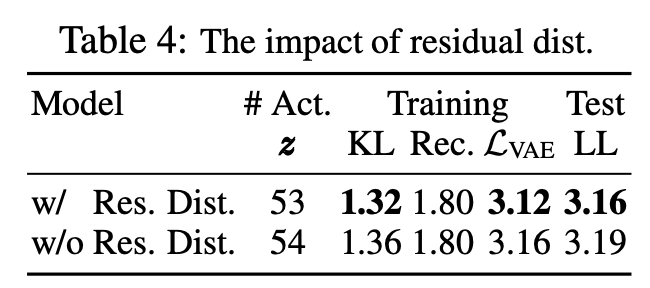

# [Residual Normal Distribution](https://paperswithcode.com/method/residual-normal-distribution)

**Residual Normal Distributions** are used to help the optimization of VAEs, preventing optimization from entering an unstable region. This can happen due to sharp gradients caused in situations where the encoder and decoder produce distributions far away from each other. The residual distribution parameterizes $q\left(\mathbf{z}|\mathbf{x}\right)$ relative to $p\left(\mathbf{z}\right)$. Let $p\left(z^{i}_{l}|\mathbf{z}_{&lt;l}\right) := N \left(\mu_{i}\left(\mathbf{z}_{&lt;l}\right), \sigma_{i}\left(\mathbf{z}_{&lt;l}\right)\right)$ be a Normal distribution for the $i$th variable in $\mathbf{z}_{l}$ in prior. Define $q\left(z^{i}_{l}|\mathbf{z}_{&lt;l}, x\right) := N\left(\mu_{i}\left(\mathbf{z}_{&lt;l}\right) + \Delta\mu_{i}\left(\mathbf{z}_{&lt;l}, x\right), \sigma_{i}\left(\mathbf{z}_{&lt;l}\right) \cdot \Delta\sigma_{i}\left(\mathbf{z}_{&lt;l}, x\right) \right)$, where $\Delta\mu_{i}\left(\mathbf{z}_{&lt;l}, \mathbf{x}\right)$ and $\Delta\sigma_{i}\left(\mathbf{z}_{&lt;l}, \mathbf{x}\right)$ are the relative location and scale of the approximate posterior with respect to the prior. With this parameterization, when the prior moves, the approximate posterior moves accordingly, if not changed.

source: [source](https://arxiv.org/abs/2007.03898v1)
