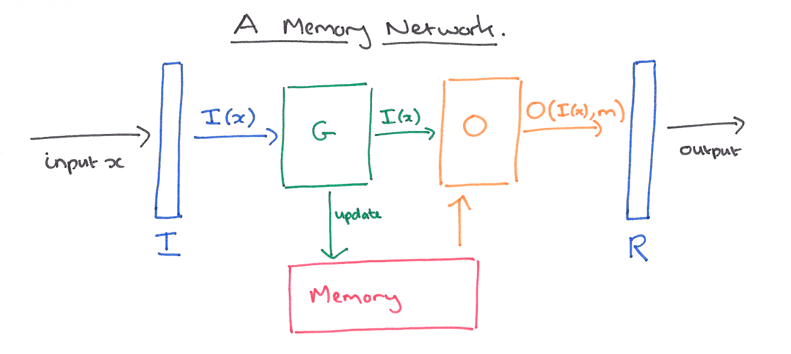
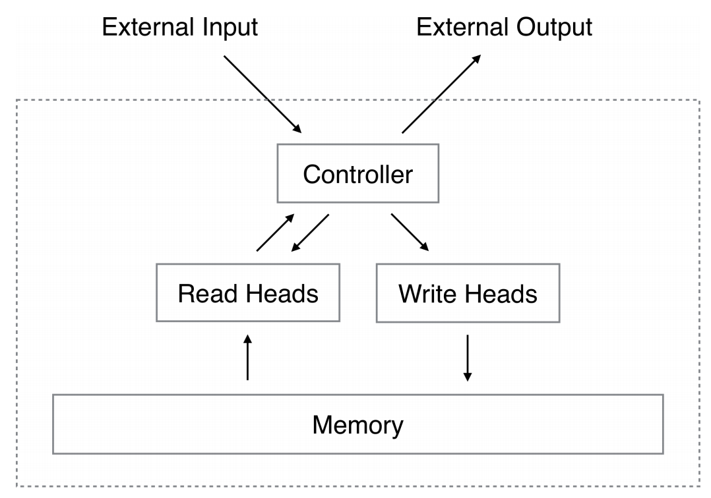
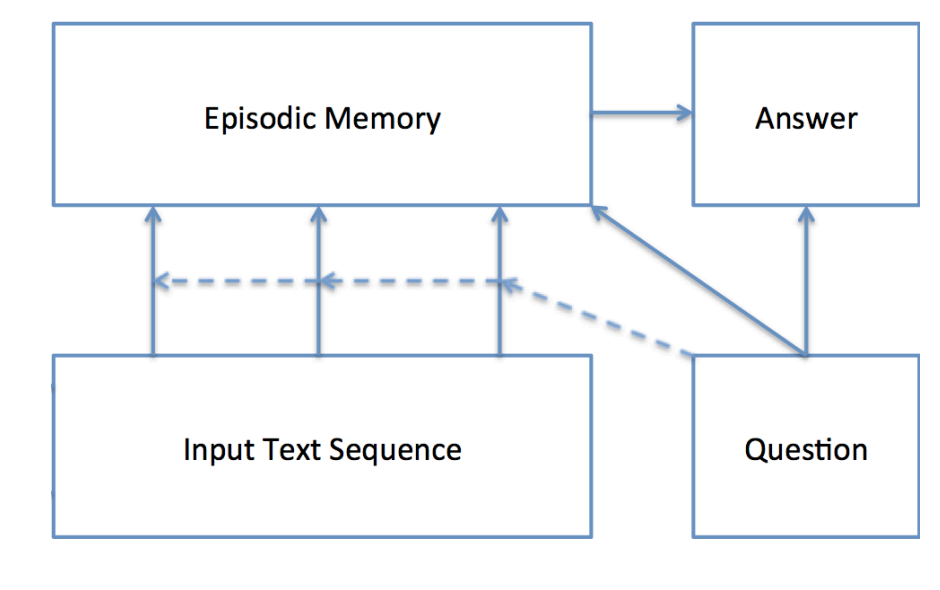
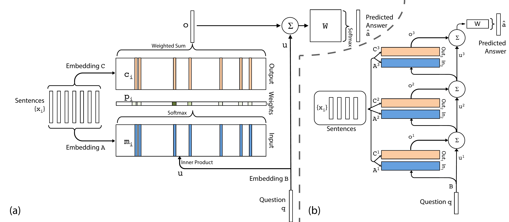
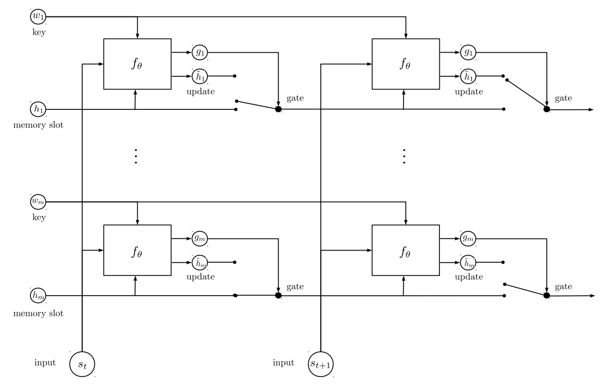

# Memory Network

A **Memory Network** provides a memory component that can be read from and written to with the inference capabilities of a neural network model.

A memory network consists of a memory $\textbf{m}$ (an array of objects indexed by $\textbf{m}_{i}$ and four potentially learned components:

- Input feature map $I$ - feature representation of the data input.
- Generalization $G$ - updates old memories given the new input.
- Output feature map $O$ - produces new feature map given $I$ and $G$.
- Response $R$ - converts output into the desired response. 

Image Source: [Adrian Colyer](https://blog.acolyer.org/2016/03/10/memory-networks/)

# Neural Turing Machine

A **Neural Turing Machine** is a working memory neural network model. It couples a neural network architecture with external memory resources. The whole architecture is differentiable end-to-end with gradient descent. The models can infer tasks such as copying, sorting and associative recall.

# Dynamic Memory Network

A **Dynamic Memory Network** is a neural network architecture which processes input sequences and questions, forms episodic memories, and generates relevant answers. Questions trigger an iterative attention process which allows the model to condition its attention on the inputs and the result of previous iterations. These results are then reasoned over in a hierarchical recurrent sequence model to generate answers. 

# End-To-End Memory Network

An **End-to-End Memory Network** is a neural network with a recurrent attention model over a possibly large external memory. The architecture is a form of Memory Network, but unlike the model in that work, it is trained end-to-end,
and hence requires significantly less supervision during training. It can also be seen as an extension of RNNsearch to the case where multiple computational steps (hops) are performed per output symbol.

# Recurrent Entity Network

The **Recurrent Entity Network** is equipped with a dynamic long-term memory which allows it to maintain and update a representation of the state of the world as it receives new data. For language understanding tasks, it can reason on-the-fly as it reads text, not just when it is required to answer a question or respond as is the case for a Memory Network. Like a Neural Turing Machine or Differentiable Neural Computer, it maintains a fixed size memory and can learn to perform location and content-based read and write operations.  However, unlike those models it has a simple parallel 
architecture in which several memory locations can be updated simultaneously. 

The model consists of a fixed number of dynamic memory cells, each containing a vector key $w_j$ and a vector value (or content) $h_j$. Each cell is associated with its own processor, a simple gated recurrent network that may update the cell value given an input. If each cell learns to represent a concept or entity in the world, one can imagine a gating mechanism that, based on the key and content of the memory cells, will only modify the cells that concern the entities mentioned in the input. There is no direct interaction between the memory cells, hence the system can be seen as multiple identical processors functioning in parallel, with distributed local memory. 

The sharing of these parameters reflects an invariance of these laws across object instances, similarly to how the weight tying scheme in a CNN reflects an invariance of image statistics across locations. Their hidden state is updated only when new information relevant to their concept is received, and remains otherwise unchanged. The keys used in the addressing/gating mechanism also correspond to concepts or entities, but are modified only during learning, not during inference.

