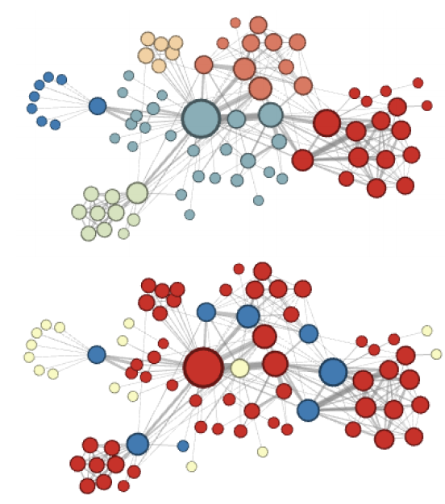
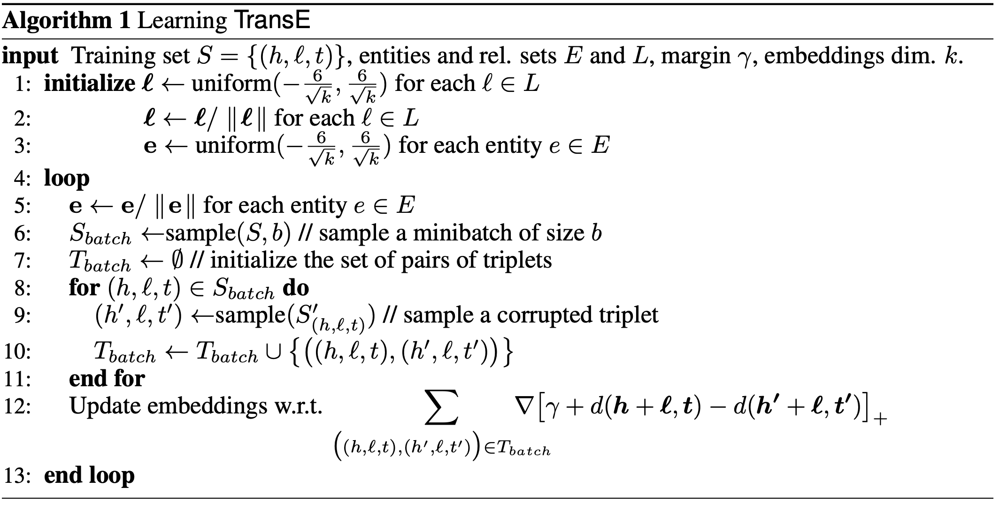
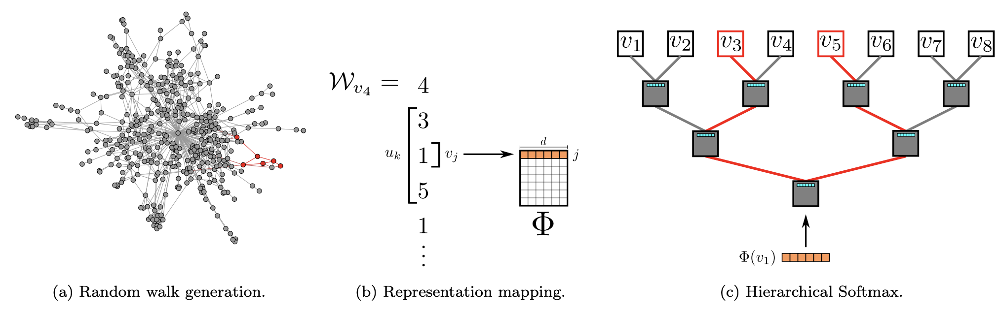

# [node2vec](https://paperswithcode.com/method/node2vec)

**node2vec** is a framework for learning graph embeddings for nodes in graphs. Node2vec maximizes a likelihood objective over mappings which preserve neighbourhood distances in higher dimensional spaces. From an algorithm design perspective, node2vec exploits the freedom to define neighbourhoods for nodes and provide an explanation for the effect of the choice of neighborhood on the learned representations. 

For each node, node2vec simulates biased random walks based on an efficient network-aware search strategy and the nodes appearing in the random walk define neighbourhoods. The search strategy accounts for the relative influence nodes exert in a network. It also generalizes prior work alluding to naive search strategies by providing flexibility in exploring neighborhoods.

source: [source](http://arxiv.org/abs/1607.00653v1)
# [TransE](https://paperswithcode.com/method/transe)

**TransE** is an energy-based model that produces knowledge base embeddings. It models relationships by interpreting them as translations operating on the low-dimensional embeddings of the entities. Relationships are represented as translations in the embedding space: if $\left(h, \mathcal{l}, t\right)$ holds, the embedding of the tail entity $t$ should be close to the embedding of the head entity $h$ plus some vector that depends on the relationship $\mathcal{l}$.

source: [source](http://papers.nips.cc/paper/5071-translating-embeddings-for-modeling-multi-relational-data)
# [DeepWalk](https://paperswithcode.com/method/deepwalk)

**DeepWalk** learns embeddings (social representations) of a graph's vertices, by modeling a stream of short random walks. Social representations are latent features of the vertices that capture neighborhood similarity and community membership. These latent representations encode social relations in a continuous vector space with a relatively small number of dimensions. It generalizes neural language models to process a special language composed of a set of randomly-generated walks. 

The goal is to learn a latent representation, not only a probability distribution of node co-occurrences, and so as to introduce a mapping function $\Phi \colon v \in V \mapsto \mathbb{R}^{|V|\times d}$.
This mapping $\Phi$ represents the latent social representation associated with each vertex $v$ in the graph. In practice, $\Phi$ is represented by a $|V| \times d$ matrix of free parameters.

source: [source](http://arxiv.org/abs/1403.6652v2)
# [GIN](https://paperswithcode.com/method/gin)

Per the authors, Graph Isomorphism Network (GIN) generalizes the WL test and hence achieves maximum discriminative power among GNNs.

source: [source](http://arxiv.org/abs/1810.00826v3)
