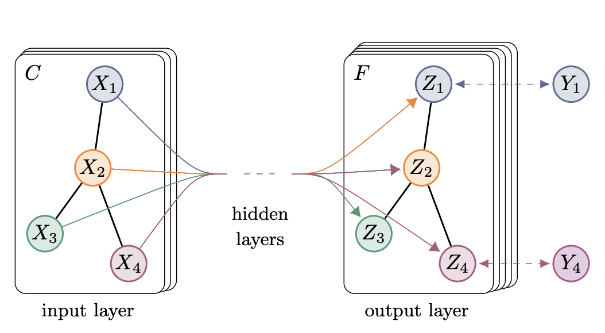
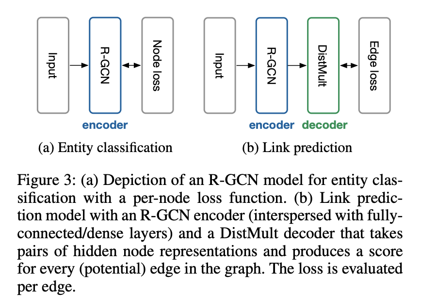

# [GCN](https://paperswithcode.com/method/gcn)

A **Graph Convolutional Network**, or **GCN**, is an approach for semi-supervised learning on graph-structured data. It is based on an efficient variant of [convolutional neural networks](https://paperswithcode.com/methods/category/convolutional-neural-networks) which operate directly on graphs. The choice of convolutional architecture is motivated via a localized first-order approximation of spectral graph convolutions. The model scales linearly in the number of graph edges and learns hidden layer representations that encode both local graph structure and features of nodes.

source: [source](http://arxiv.org/abs/1609.02907v4)
# [GAT](https://paperswithcode.com/method/gat)

A **Graph Attention Network (GAT)** is a neural network architecture that operates on graph-structured data, leveraging masked self-attentional layers to address the shortcomings of prior methods based on graph convolutions or their approximations. By stacking layers in which nodes are able to attend over their neighborhoods’ features, a GAT enables (implicitly) specifying different weights to different nodes in a neighborhood, without requiring any kind of costly matrix operation (such as inversion) or depending on knowing the graph structure upfront.

See [here](https://docs.dgl.ai/en/0.4.x/tutorials/models/1_gnn/9_gat.html) for an explanation by DGL.

source: [source](http://arxiv.org/abs/1710.10903v3)
# [RGCN](https://paperswithcode.com/method/rgcn)

An **RGCN**, or **Relational Graph Convolution Network**, is a an application of the [GCN framework](https://paperswithcode.com/method/gcn) to modeling relational data, specifically
to link prediction and entity classification tasks.

See [here](https://docs.dgl.ai/en/0.4.x/tutorials/models/1_gnn/4_rgcn.html) for an in-depth explanation of RGCNs by DGL.

source: [source](http://arxiv.org/abs/1703.06103v4)
