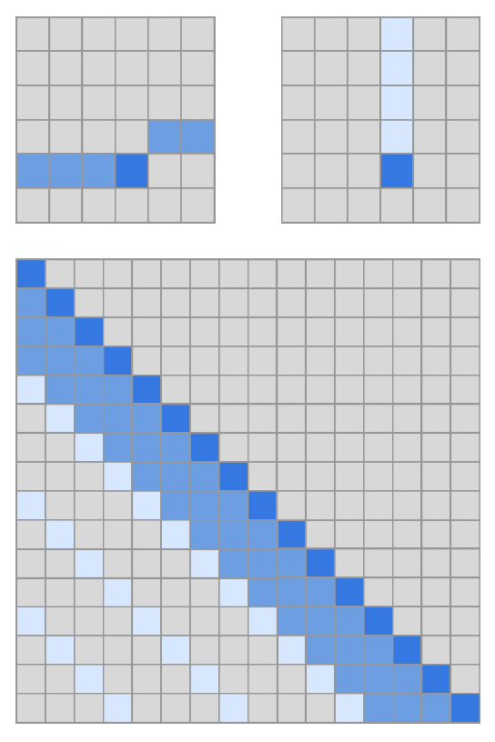
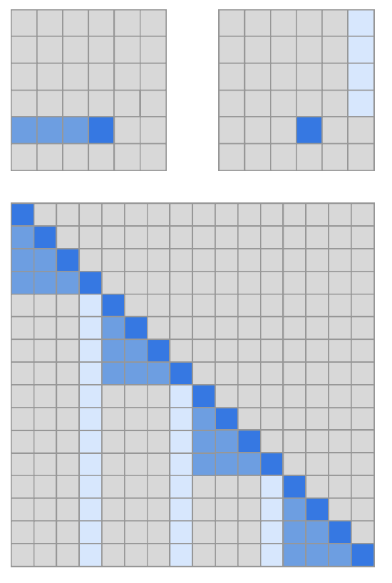
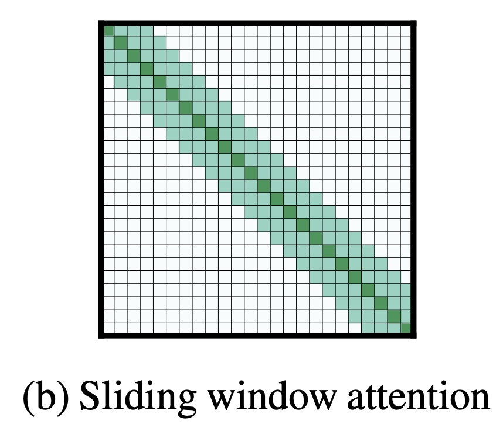
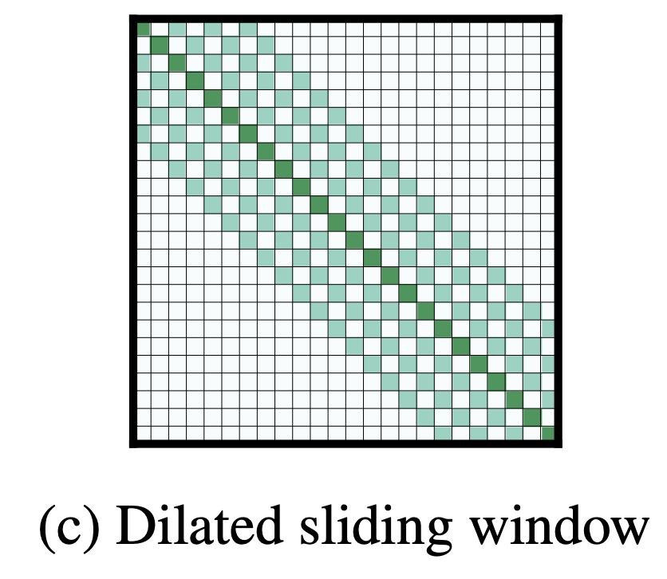
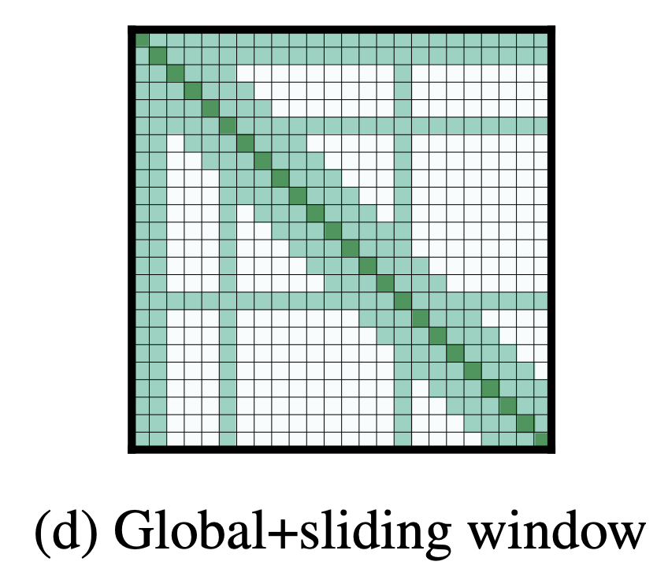
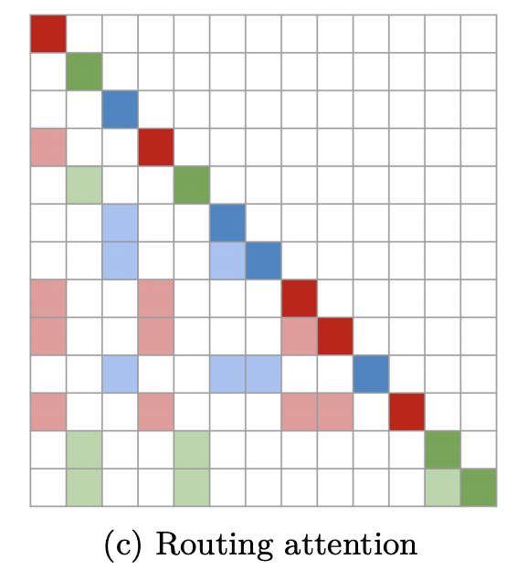

# [Strided Attention](https://paperswithcode.com/method/strided-attention)

**Strided Attention** is a factorized attention pattern that has one head attend to the previous
$l$ locations, and the other head attend to every $l$th location, where $l$ is the stride and chosen to be close to $\sqrt{n}$. It was proposed as part of the [Sparse Transformer](https://paperswithcode.com/method/sparse-transformer) architecture.

Formally, $A^{(1)}_{i} = ${$t, t + 1, ..., i$} for $t = \max\left(0, i − l\right)$, and $A^{(2)}_{i} = ${$j : (i − j) \mod l = 0$}. The $i$-th output vector of the attention head attends to all input vectors either from $A^{(1)}_{i}$ or $A^{(2)}_{i}$. This pattern can be visualized in the figure to the right.

This formulation is convenient if the data naturally has a structure that aligns with the stride, like images or some types of music. For data without a periodic structure, like text, however, we find that the network can fail to properly route information with the strided pattern, as spatial coordinates for an element do not necessarily correlate with the positions where the element may be most relevant in the future.

source: [source](http://arxiv.org/abs/1904.10509v1)
# [Fixed Factorized Attention](https://paperswithcode.com/method/fixed-factorized-attention)

**Fixed Factorized Attention** is a factorized attention pattern where specific cells summarize previous locations and propagate that information to all future cells. It was proposed as part of the [Sparse Transformer](https://paperswithcode.com/method/sparse-transformer) architecture.

Formally, $A^{(1)}_{i} = ${$j : \left(\lfloor{j/l\rfloor}=\lfloor{i/l\rfloor}\right)$}, where the brackets denote the floor operation, and $A^{(2)}_{i} = ${$j : j \mod l \in ${$t, t+1, \ldots, l$}}, where $t=l-c$ and $c$ is a hyperparameter. The $i$-th output vector of the attention head attends to all input vectors either from $A^{(1)}_{i}$ or $A^{(2)}_{i}$. This pattern can be visualized in the figure to the right.

If the stride is 128 and $c = 8$, then all future positions greater than 128 can attend to positions 120-128, all positions greater than 256 can attend to 248-256, and so forth. 

A fixed-attention pattern with $c = 1$ limits the expressivity of the network significantly, as many representations in the network are only used for one block whereas a small number of locations are used by all blocks. The authors found choosing $c \in ${$8, 16, 32$} for typical values of $l \in
{128, 256}$ performs well, although this increases the computational cost of this method by $c$ in comparison to the strided attention.

Additionally, the authors found that when using multiple heads, having them attend to distinct subblocks of length $c$ within the block of size $l$ was preferable to having them attend to the same subblock.

source: [source](http://arxiv.org/abs/1904.10509v1)
# [Sliding Window Attention](https://paperswithcode.com/method/sliding-window-attention)

**Sliding Window Attention** is an attention pattern for attention-based models. It was proposed as part of the [Longformer](https://paperswithcode.com/method/longformer) architecture. It is motivated by the fact that non-sparse attention in the original [Transformer](https://paperswithcode.com/method/transformer) formulation has a self-attention component with $O\left(n^{2}\right)$ time and memory complexity where $n$ is the input sequence length and thus, is not efficient to scale to long inputs. Given the importance of local context, this attention pattern employs a fixed-size window attention surrounding each token. Using multiple stacked layers of such windowed attention results in a large receptive field, where top layers have access to all input locations and have the capacity to build representations that incorporate information across the entire input. 

More formally, in this attention pattern, given a fixed window size $w$, each token attends to $\frac{1}{2}w$ tokens on each side. The computation complexity of this pattern is $O\left(n×w\right)$,
which scales linearly with input sequence length $n$. To make this attention pattern efficient, $w$ should be small compared with $n$. But a model with typical multiple stacked transformers will have a large receptive field. This is analogous to CNNs where stacking layers of small kernels leads to high level features that are built from a large portion of the input (receptive field)

In this case, with a transformer of $l$ layers, the receptive field size is $l × w$ (assuming
$w$ is fixed for all layers). Depending on the application, it might be helpful to use different values of $w$ for each layer to balance between efficiency and model representation capacity.

source: [source](https://arxiv.org/abs/2004.05150v1)
# [Dilated Sliding Window Attention](https://paperswithcode.com/method/dilated-sliding-window-attention)

**Dilated Sliding Window Attention** is an attention pattern for attention-based models. It was proposed as part of the [Longformer](https://paperswithcode.com/method/longformer) architecture. It is motivated by the fact that non-sparse attention in the original [Transformer](https://paperswithcode.com/method/transformer) formulation has a self-attention component with $O\left(n^{2}\right)$ time and memory complexity where $n$ is the input sequence length and thus, is not efficient to scale to long inputs. 

Compared to a Sliding Window Attention pattern, we can further increase the receptive field without increasing computation by making the sliding window "dilated". This is analogous to [dilated CNNs](https://paperswithcode.com/method/dilated-convolution) where the window has gaps of size dilation $d$. Assuming a fixed $d$ and $w$ for all layers, the receptive field is $l × d × w$, which can reach tens of thousands of tokens even for small values of $d$. In multi-headed attention, each attention head computes a different attention score.

source: [source](https://arxiv.org/abs/2004.05150v1)
# [Global and Sliding Window Attention](https://paperswithcode.com/method/global-and-sliding-window-attention)

**Global and Sliding Window Attention** is an attention pattern for attention-based models. It is motivated by the fact that non-sparse attention in the original [Transformer](https://paperswithcode.com/method/transformer) formulation has a self-attention component with $O\left(n^{2}\right)$ time and memory complexity where $n$ is the input sequence length and thus, is not efficient to scale to long inputs. 

Since windowed and dilated attention patterns are not flexible enough to learn task-specific representations, the authors of the [Longformer](https://paperswithcode.com/method/longformer) add “global attention” on few pre-selected input locations. This attention is operation symmetric: that is, a token with a global attention attends to all tokens across the sequence, and all tokens in the sequence attend to it. The Figure to the right shows an example of a sliding window attention with global attention at a few tokens at custom locations. For example for classification, global attention is used for the [CLS] token while in QA global attention is provided on all question tokens.

source: [source](https://arxiv.org/abs/2004.05150v1)
# [Routing Attention](https://paperswithcode.com/method/routed-attention)

**Routed Attention** is an attention pattern proposed as part of the [Routing Transformer](https://paperswithcode.com/method/routing-transformer) architecture.  Each attention module
considers a clustering of the space: the current timestep only attends to context belonging to the same cluster. In other word, the current time-step query is routed to a limited number of context through its cluster assignment. This can be contrasted with [strided](https://paperswithcode.com/method/strided-attention) attention patterns and those proposed with the [Sparse Transformer](https://paperswithcode.com/method/sparse-transformer).

In the image to the right, the rows represent the outputs while the columns represent the inputs. The different colors represent cluster memberships for the output token.

source: [source](https://arxiv.org/abs/2003.05997v1)
