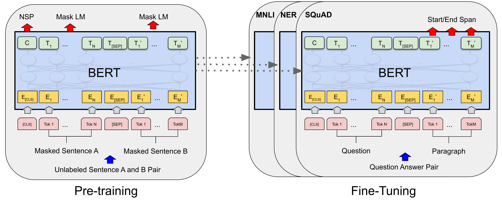

# [BERT](https://paperswithcode.com/method/bert)

**BERT**, or Bidirectional Encoder Representations from Transformers, improves upon standard [Transformers](http://paperswithcode.com/method/transformer) by removing the unidirectionality constraint by using a **masked language model** (MLM) pre-training objective. The masked language model randomly masks some of the tokens from the input, and the objective is to predict the original vocabulary id of the masked word based only on its context. Unlike left-to-right language model pre-training, the MLM objective enables the representation to fuse the left and the right context, which allows us to pre-train a deep bidirectional Transformer. In addition to the masked language model, BERT uses a **next sentence prediction** task that jointly pre-trains text-pair representations. 

There are two steps in BERT: **pre-training** and **fine-tuning**. During pre-training, the model is trained on unlabeled data over different pre-training tasks. For fine-tuning, the BERT model is first initialized with the pre-trained parameters, and all of the parameters are fine-tuned using labeled data from the downstream tasks. Each downstream task has separate fine-tuned models, even though they
are initialized with the same pre-trained parameters.

source: [source](https://arxiv.org/abs/1810.04805v2)
# [RoBERTa](https://paperswithcode.com/method/roberta)

**RoBERTa** is an extension of BERT with changes to the pretraining procedure. The modifications include: 

- training the model longer, with bigger batches, over more data
- removing the next sentence prediction objective
- training on longer sequences
- dynamically changing the masking pattern applied to the training data. The authors also collect a large new dataset ($\text{CC-News}$) of comparable size to other privately used datasets, to better control for training set size effects

source: [source](https://arxiv.org/abs/1907.11692v1)
# [ALBERT](https://paperswithcode.com/method/albert)

**ALBERT** is a Transformer architecture based on [BERT](https://paperswithcode.com/method/bert) but with much fewer parameters. It achieves this through two parameter reduction techniques. The first is a factorized embeddings parameterization. By decomposing the large vocabulary embedding matrix into two small matrices, the size of the hidden layers is separated from the size of vocabulary embedding. This makes it easier to grow the hidden size without significantly increasing the parameter size of the vocabulary embeddings. The second technique is cross-layer parameter sharing. This technique prevents the parameter from growing with the depth of the network. 

Additionally, ALBERT utilises a self-supervised loss for sentence-order prediction (SOP). SOP primary focuses on inter-sentence coherence and is designed to address the ineffectiveness of the next sentence prediction (NSP) loss proposed in the original BERT.

source: [source](https://arxiv.org/abs/1909.11942v6)
# [XLM](https://paperswithcode.com/method/xlm)

**XLM** is a Transformer based architecture that is pre-trained using one of three language modelling objectives:

1. Causal Language Modeling - models the probability of a word given the previous words in a sentence.
1. Masked Language Modeling - the masked language modeling objective of BERT.
1. Translation Language Modeling - a (new) translation language modeling objective for improving cross-lingual pre-training.

The authors find that both the CLM and MLM approaches provide strong cross-lingual features that can be used for pretraining models.

source: [source](http://arxiv.org/abs/1901.07291v1)
# [DistilBERT](https://paperswithcode.com/method/distillbert)

**DistilBERT**  is a small, fast, cheap and light Transformer model based on the [BERT](https://paperswithcode.com/method/bert) architecture. Knowledge distillation is performed during the pre-training phase to reduce the size of a BERT model by 40%. To leverage the inductive biases learned by larger models during pre-training, the authors introduce a triple loss combining language modeling, distillation and cosine-distance losses.

source: [source](https://arxiv.org/abs/1910.01108v4)
# [ELECTRA](https://paperswithcode.com/method/electra)

**ELECTRA** is a transformer with a new pre-training approach which trains two transformer models: the generator and the discriminator. The generator replaces tokens in the sequence - trained as a masked language model - and the discriminator (the ELECTRA contribution) attempts to identify which tokens are replaced by the generator in the sequence. This pre-training task is called replaced token detection, and is a replacement for masking the input.

source: [source](https://arxiv.org/abs/2003.10555v1)
# [Longformer](https://paperswithcode.com/method/longformer)

**Longformer** is a modified Transformer architecture. Traditional [Transformer-based models](https://paperswithcode.com/methods/category/transformers) are unable to process long sequences due to their self-attention operation, which scales quadratically with the sequence length. To address this, **Longformer** uses an attention pattern that scales linearly with sequence length, making it easy to process documents of thousands of tokens or longer. The attention mechanism is a drop-in replacement for the standard self-attention and combines a local windowed attention with a task motivated global attention.

The attention patterns utilised include: sliding window attention, dilated sliding window attention and global + sliding window. These can be viewed in the components section of this page.

source: [source](https://arxiv.org/abs/2004.05150v1)
