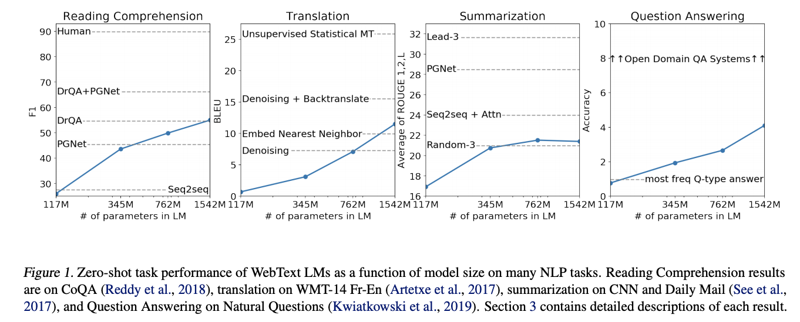
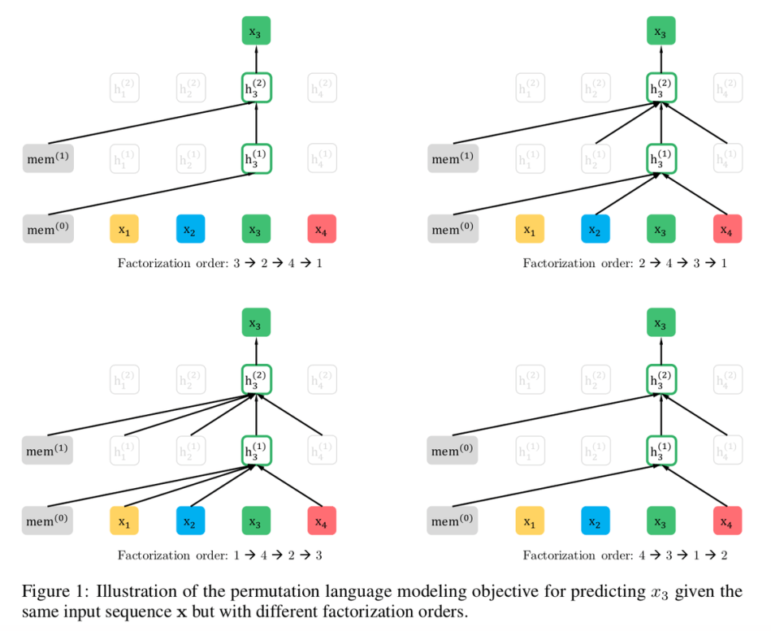
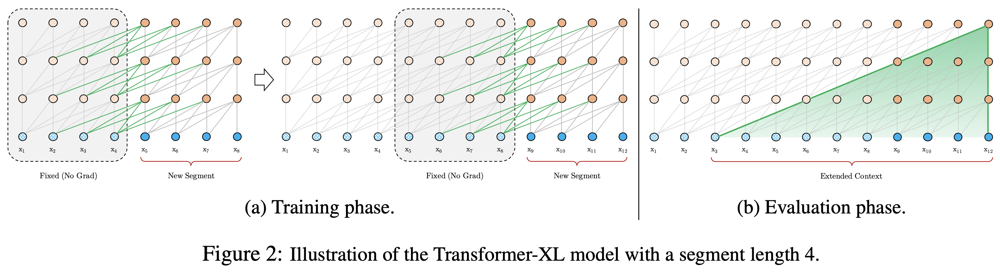
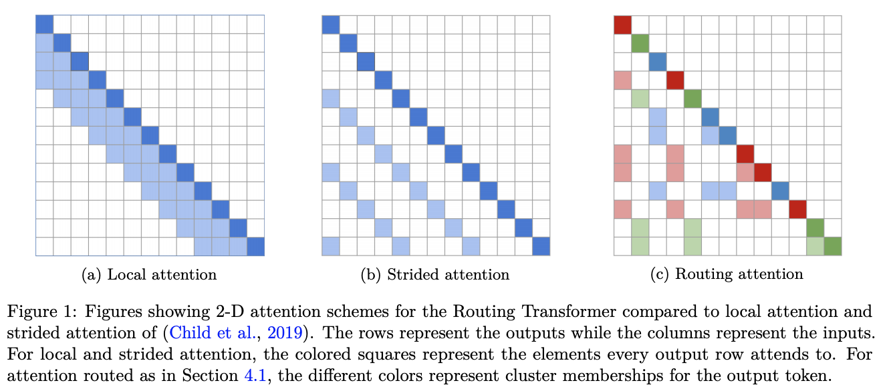

# [Transformer](https://paperswithcode.com/method/transformer)

A **Transformer** is a model architecture that eschews recurrence and instead relies entirely on an [attention mechanism](https://paperswithcode.com/methods/category/attention-mechanisms-1) to draw global dependencies between input and output. Before Transformers, the dominant sequence transduction models were based on complex recurrent or convolutional neural networks that include an encoder and a decoder. The Transformer also employs an encoder and decoder, but removing recurrence in favor of [attention mechanisms](https://paperswithcode.com/methods/category/attention-mechanisms-1) allows for significantly more parallelization than methods like [RNNs](https://paperswithcode.com/methods/category/recurrent-neural-networks) and [CNNs](https://paperswithcode.com/methods/category/convolutional-neural-networks).

source: [source](http://arxiv.org/abs/1706.03762v5)
# [GPT-2](https://paperswithcode.com/method/gpt-2)

**GPT-2** is a [Transformer](https://paperswithcode.com/methods/category/transformers) architecture that was notable for its size (1.5 billion parameters) on its release. The model is pretrained on a WebText dataset - text from 45 million website links. It largely follows the previous [GPT](https://paperswithcode.com/method/gpt) architecture with some modifications:

<li>

Layer normalization is moved to the input of each sub-block, similar to a
pre-activation residual network and an additional layer normalization was added after the final self-attention block. 

</li>
<li>

A modified initialization which accounts for the accumulation on the residual path with model depth
is used. Weights of residual layers are scaled at initialization by a factor of $1/\sqrt{N}$ where $N$ is the number of residual layers. 

</li>
<li>

The vocabulary is expanded to 50,257. The context size is expanded from 512 to 1024 tokens and
a larger batch size of 512 is used.

</li>

source: [source](https://d4mucfpksywv.cloudfront.net/better-language-models/language-models.pdf)
# [XLNet](https://paperswithcode.com/method/xlnet)

**XLNet** is an autoregressive Transformer that leverages the best of both autoregressive language modeling and autoencoding while attempting to avoid their limitations. Instead of using a fixed forward or backward factorization order as in conventional autoregressive models, XLNet maximizes the expected log likelihood of a sequence w.r.t. all possible permutations of the factorization order. Thanks to the permutation operation, the context for each position can consist of tokens from both left and right. In expectation, each position learns to utilize contextual information from all positions, i.e., capturing bidirectional context.

Additionally, inspired by the latest advancements in autogressive language modeling, XLNet integrates the segment recurrence mechanism and relative encoding scheme of [Transformer-XL](https://paperswithcode.com/method/transformer-xl) into pretraining, which empirically improves the performance especially for tasks involving a longer text sequence.

source: [source](https://arxiv.org/abs/1906.08237v2)
# [GPT](https://paperswithcode.com/method/gpt)

**GPT** is a Transformer-based architecture and training procedure for natural language processing tasks. Training follows a two-stage procedure. First, a language modeling objective is used on
the unlabeled data to learn the initial parameters of a neural network model. Subsequently, these parameters are adapted to a target task using the corresponding supervised objective.

source: [source](https://s3-us-west-2.amazonaws.com/openai-assets/research-covers/language-unsupervised/language_understanding_paper.pdf)
# [Transformer-XL](https://paperswithcode.com/method/transformer-xl)

**Transformer-XL** (meaning extra long) is a Transformer architecture that introduces the notion of recurrence to the deep self-attention network. Instead of computing the hidden states from scratch for each new segment, Transformer-XL reuses the hidden states obtained in previous segments. The reused hidden states serve as memory for the current segment, which builds up a recurrent connection between the segments. As a result, modeling very long-term dependency becomes possible because information can be propagated through the recurrent connections. As an additional contribution, the Transformer-XL uses a new relative positional encoding formulation that generalizes to attention lengths longer than the one observed during training.

source: [source](https://arxiv.org/abs/1901.02860v3)
# [Universal Transformer](https://paperswithcode.com/method/universal-transformer)

The **Universal Transformer** is a generalization of the [Transformer](https://paperswithcode.com/method/transformer) architecture. Universal Transformers combine the parallelizability and global receptive field of feed-forward sequence models like the Transformer with the recurrent inductive bias of [RNNs](https://paperswithcode.com/methods/category/recurrent-neural-networks). They also utilise a dynamic per-position halting mechanism.

source: [source](http://arxiv.org/abs/1807.03819v3)
# [Sparse Transformer](https://paperswithcode.com/method/sparse-transformer)

A **Sparse Transformer** is a [Transformer](https://paperswithcode.com/method/transformer) based architecture which utilises sparse factorizations of the attention matrix to reduce time/memory to $O(n \sqrt{n})$. Other changes to the Transformer architecture include: (a) a restructured residual block and weight initialization, (b) A set of sparse attention kernels which efficiently compute subsets of the attention matrix, (c) recomputation of attention weights during the backwards pass to reduce memory usage

source: [source](http://arxiv.org/abs/1904.10509v1)
# [Adaptive Span Transformer](https://paperswithcode.com/method/adaptive-span-transformer)

The **Adaptive Attention Span Transformer** is a Transformer that utilises an alternative to the self-attention layer called adaptive masking that allows the model to choose its own context size. This results in a network where each attention layer gathers information on their own context. This allows for scaling to input sequences of more than 8k tokens.

Their proposals are based on the observation that, with the dense attention of a traditional [Transformer](https://paperswithcode.com/method/transformer), each attention head shares the same attention span $S$ (attending over the full context). But many attention heads can specialize to more local context (others look at the longer sequence). This motivates the need for a variant of self-attention that allows the model to choose its own context size (adaptive masking - see components).

source: [source](https://arxiv.org/abs/1905.07799v2)
# [Sinkhorn Transformer](https://paperswithcode.com/method/sinkhorn-transformer)

The **Sinkhorn Transformer** is a type of transformer that uses [Sparse Sinkhorn Attention](https://paperswithcode.com/method/sparse-sinkhorn-attention) as a building block. This component is a plug-in replacement for dense fully-connected attention (as well as local attention, and sparse attention alternatives), and allows for reduced memory complexity as well as sparse attention.

source: [source](https://arxiv.org/abs/2002.11296v1)
# [Routing Transformer](https://paperswithcode.com/method/routing-transformer)

The **Routing Transformer** is a Transformer that endows self-attention with a sparse routing module based on online k-means. Each attention module considers a clustering of the space: the current timestep only attends to context belonging to the same cluster. In other word, the current time-step query is routed to a limited number of context through its cluster assignment.

source: [source](https://arxiv.org/abs/2003.05997v1)
# [Linformer](https://paperswithcode.com/method/linformer)

**Linformer** is a linear Transformer that utilises a linear self-attention mechanism to tackle the self-attention bottleneck with [Transformer models](https://paperswithcode.com/methods/category/transformers). The original scaled dot-product attention is decomposed into multiple smaller attentions through linear projections, such that the combination of these operations forms a low-rank factorization of the original attention.

source: [source](https://arxiv.org/abs/2006.04768v3)
