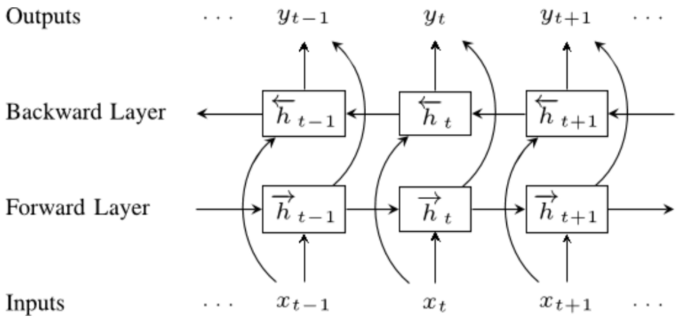
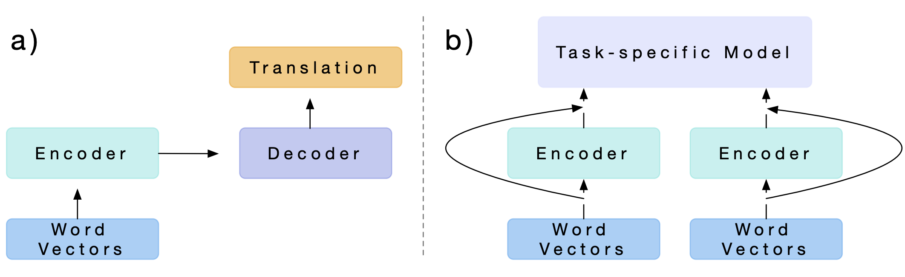
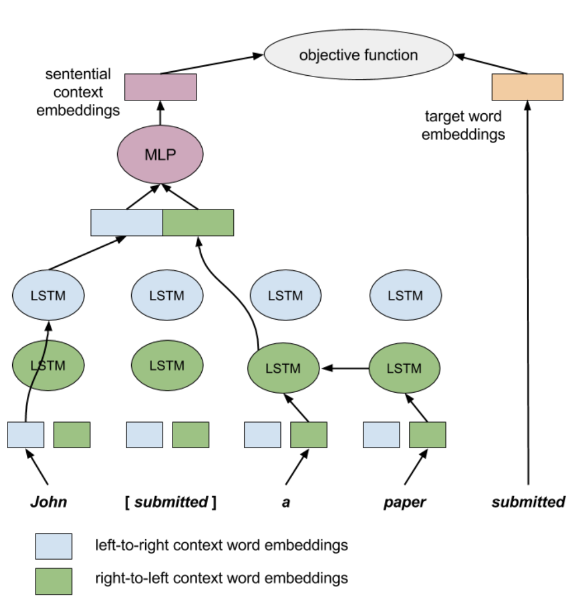

# [ELMo](https://paperswithcode.com/method/elmo)

**Embeddings from Language Models**, or **ELMo**, is a type of deep contextualized word representation that models both (1) complex characteristics of word use (e.g., syntax and semantics), and (2) how these uses vary across linguistic contexts (i.e., to model polysemy). Word vectors are learned functions of the internal states of a deep bidirectional language model (biLM), which is pre-trained on a large text corpus.

A biLM combines both a forward and backward LM.  ELMo jointly maximizes the log likelihood of the forward and backward directions. To add ELMo to a supervised model, we freeze the weights of the biLM and then concatenate the ELMo vector $\textbf{ELMO}^{task}_k$ with $\textbf{x}_k$ and pass the ELMO enhanced representation $[\textbf{x}_k; \textbf{ELMO}^{task}_k]$ into the task RNN. Here $\textbf{x}_k$ is a context-independent token representation for each token position. 

Image Source: [here](https://medium.com/@duyanhnguyen_38925/create-a-strong-text-classification-with-the-help-from-elmo-e90809ba29da)

source: [source](http://arxiv.org/abs/1802.05365v2)
# [CoVe](https://paperswithcode.com/method/cove)

**CoVe**, or **Contextualized Word Vectors**, uses a deep LSTM encoder from an attentional sequence-to-sequence model trained for machine translation to contextualize word vectors. $\text{CoVe}$ word embeddings are therefore a function of the entire input sequence. These word embeddings can then be used in downstream tasks by concatenating them with $\text{GloVe}$ embeddings:

$$ v = \left[\text{GloVe}\left(x\right), \text{CoVe}\left(x\right)\right]$$

and then feeding these in as features for the task-specific models.

source: [source](http://arxiv.org/abs/1708.00107v2)
# [context2vec](https://paperswithcode.com/method/context2vec)

**context2vec** is an unsupervised model for learning generic context embedding of wide sentential contexts, using a bidirectional LSTM. A large plain text corpora is trained on to learn a neural model that embeds entire sentential contexts and target words in the same low-dimensional space, which
is optimized to reflect inter-dependencies between targets and their entire sentential context as a whole. 

In contrast to word2vec that use context modeling mostly internally and considers the target word embeddings as their main output, the focus of context2vec is the context representation. context2vec achieves its objective by assigning similar embeddings to sentential contexts and their associated target words.

source: [source](https://www.aclweb.org/anthology/K16-1006/)
# [Cross-View Training](https://paperswithcode.com/method/cross-view-training)

**Cross View Training**, or **CVT**, is a semi-supervised algorithm for training distributed word representations that makes use of unlabelled and labelled examples. 

CVT adds $k$ auxiliary prediction modules to the model, a Bi-LSTM encoder, which are used when learning on unlabeled examples. A prediction module is usually a small neural network (e.g., a hidden layer followed by a softmax layer). Each one takes as input an intermediate representation $h^j(x_i)$ produced by the model (e.g., the outputs of one of the LSTMs in a Bi-LSTM model). It outputs a distribution over labels $p_{j}^{\theta}\left(y\mid{x_{i}}\right)$.

Each $h^j$ is chosen such that it only uses a part of the input $x_i$; the particular choice can depend on the task and model architecture. The auxiliary prediction modules are only used during training; the test-time prediction come from the primary prediction module that produces $p_\theta$.

source: [source](http://arxiv.org/abs/1809.08370v1)
