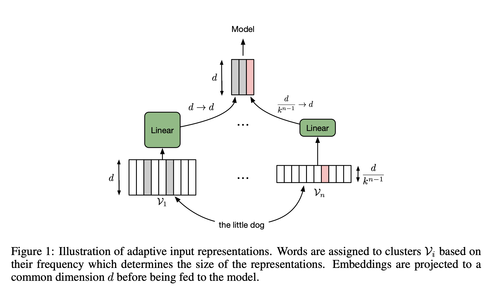

# [Adaptive Input Representations](https://paperswithcode.com/method/adaptive-input-representations)

**Adaptive Input Embeddings** extend the adaptive softmax to input word representations. The factorization assigns more capacity to frequent words and reduces the capacity for less frequent words with the benefit of reducing overfitting to rare words.

source: [source](http://arxiv.org/abs/1809.10853v3)
