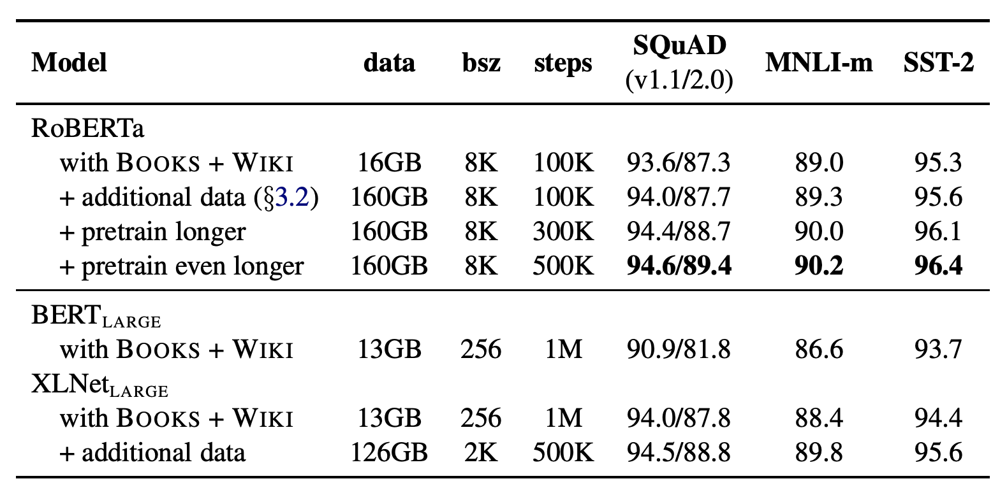
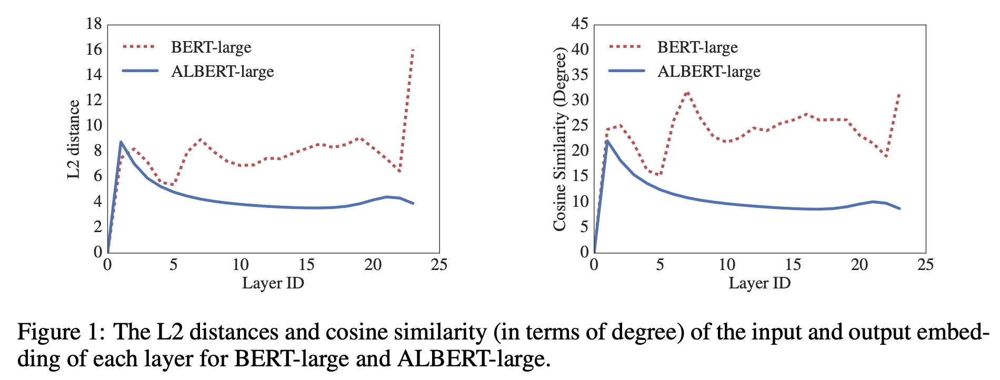
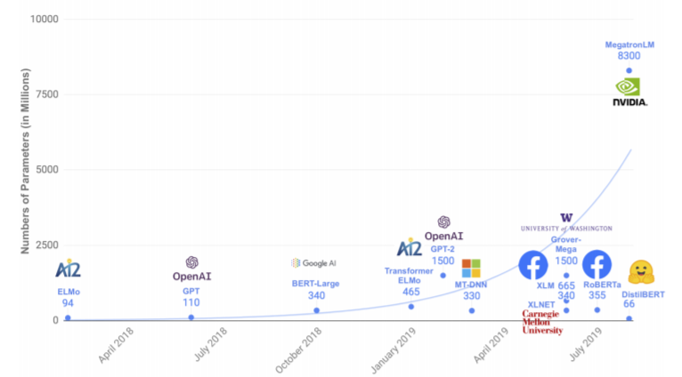
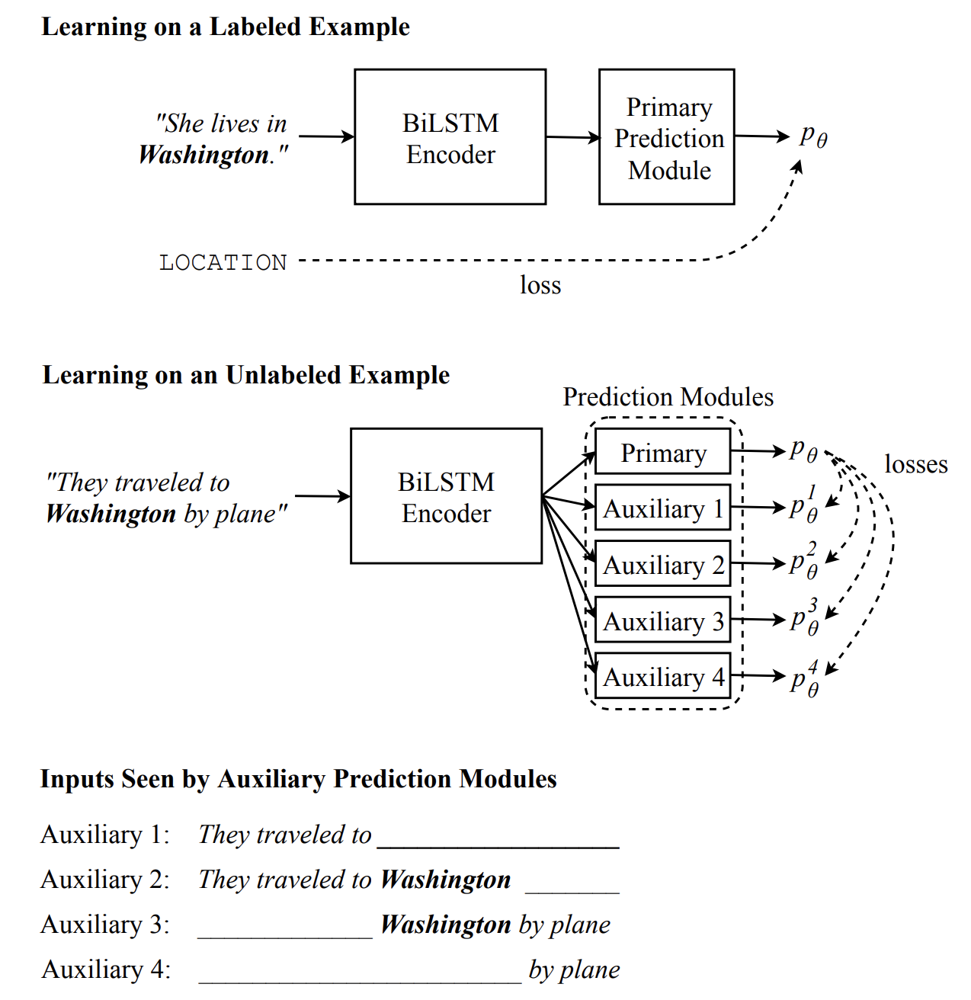
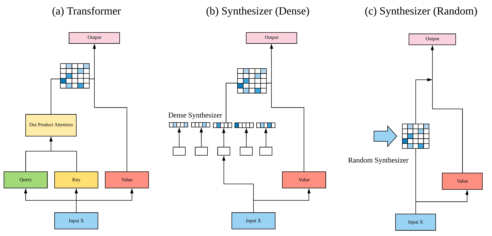

# [Transformer](https://paperswithcode.com/method/transformer)

A **Transformer** is a model architecture that eschews recurrence and instead relies entirely on an [attention mechanism](https://paperswithcode.com/methods/category/attention-mechanisms-1) to draw global dependencies between input and output. Before Transformers, the dominant sequence transduction models were based on complex recurrent or convolutional neural networks that include an encoder and a decoder. The Transformer also employs an encoder and decoder, but removing recurrence in favor of [attention mechanisms](https://paperswithcode.com/methods/category/attention-mechanisms-1) allows for significantly more parallelization than methods like [RNNs](https://paperswithcode.com/methods/category/recurrent-neural-networks) and [CNNs](https://paperswithcode.com/methods/category/convolutional-neural-networks).

source: [source](http://arxiv.org/abs/1706.03762v5)
# [BERT](https://paperswithcode.com/method/bert)

**BERT**, or Bidirectional Encoder Representations from Transformers, improves upon standard [Transformers](http://paperswithcode.com/method/transformer) by removing the unidirectionality constraint by using a **masked language model** (MLM) pre-training objective. The masked language model randomly masks some of the tokens from the input, and the objective is to predict the original vocabulary id of the masked word based only on its context. Unlike left-to-right language model pre-training, the MLM objective enables the representation to fuse the left and the right context, which allows us to pre-train a deep bidirectional Transformer. In addition to the masked language model, BERT uses a **next sentence prediction** task that jointly pre-trains text-pair representations. 

There are two steps in BERT: **pre-training** and **fine-tuning**. During pre-training, the model is trained on unlabeled data over different pre-training tasks. For fine-tuning, the BERT model is first initialized with the pre-trained parameters, and all of the parameters are fine-tuned using labeled data from the downstream tasks. Each downstream task has separate fine-tuned models, even though they
are initialized with the same pre-trained parameters.

source: [source](https://arxiv.org/abs/1810.04805v2)
# [ELMo](https://paperswithcode.com/method/elmo)

**Embeddings from Language Models**, or **ELMo**, is a type of deep contextualized word representation that models both (1) complex characteristics of word use (e.g., syntax and semantics), and (2) how these uses vary across linguistic contexts (i.e., to model polysemy). Word vectors are learned functions of the internal states of a deep bidirectional language model (biLM), which is pre-trained on a large text corpus.

A biLM combines both a forward and backward LM.  ELMo jointly maximizes the log likelihood of the forward and backward directions. To add ELMo to a supervised model, we freeze the weights of the biLM and then concatenate the ELMo vector $\textbf{ELMO}^{task}_k$ with $\textbf{x}_k$ and pass the ELMO enhanced representation $[\textbf{x}_k; \textbf{ELMO}^{task}_k]$ into the task RNN. Here $\textbf{x}_k$ is a context-independent token representation for each token position. 

Image Source: [here](https://medium.com/@duyanhnguyen_38925/create-a-strong-text-classification-with-the-help-from-elmo-e90809ba29da)

source: [source](http://arxiv.org/abs/1802.05365v2)
# [RoBERTa](https://paperswithcode.com/method/roberta)

**RoBERTa** is an extension of BERT with changes to the pretraining procedure. The modifications include: 

- training the model longer, with bigger batches, over more data
- removing the next sentence prediction objective
- training on longer sequences
- dynamically changing the masking pattern applied to the training data. The authors also collect a large new dataset ($\text{CC-News}$) of comparable size to other privately used datasets, to better control for training set size effects

source: [source](https://arxiv.org/abs/1907.11692v1)
# [GPT-2](https://paperswithcode.com/method/gpt-2)

**GPT-2** is a [Transformer](https://paperswithcode.com/methods/category/transformers) architecture that was notable for its size (1.5 billion parameters) on its release. The model is pretrained on a WebText dataset - text from 45 million website links. It largely follows the previous [GPT](https://paperswithcode.com/method/gpt) architecture with some modifications:

<li>

Layer normalization is moved to the input of each sub-block, similar to a
pre-activation residual network and an additional layer normalization was added after the final self-attention block. 

</li>
<li>

A modified initialization which accounts for the accumulation on the residual path with model depth
is used. Weights of residual layers are scaled at initialization by a factor of $1/\sqrt{N}$ where $N$ is the number of residual layers. 

</li>
<li>

The vocabulary is expanded to 50,257. The context size is expanded from 512 to 1024 tokens and
a larger batch size of 512 is used.

</li>

source: [source](https://d4mucfpksywv.cloudfront.net/better-language-models/language-models.pdf)
# [XLNet](https://paperswithcode.com/method/xlnet)

**XLNet** is an autoregressive Transformer that leverages the best of both autoregressive language modeling and autoencoding while attempting to avoid their limitations. Instead of using a fixed forward or backward factorization order as in conventional autoregressive models, XLNet maximizes the expected log likelihood of a sequence w.r.t. all possible permutations of the factorization order. Thanks to the permutation operation, the context for each position can consist of tokens from both left and right. In expectation, each position learns to utilize contextual information from all positions, i.e., capturing bidirectional context.

Additionally, inspired by the latest advancements in autogressive language modeling, XLNet integrates the segment recurrence mechanism and relative encoding scheme of [Transformer-XL](https://paperswithcode.com/method/transformer-xl) into pretraining, which empirically improves the performance especially for tasks involving a longer text sequence.

source: [source](https://arxiv.org/abs/1906.08237v2)
# [GPT](https://paperswithcode.com/method/gpt)

**GPT** is a Transformer-based architecture and training procedure for natural language processing tasks. Training follows a two-stage procedure. First, a language modeling objective is used on
the unlabeled data to learn the initial parameters of a neural network model. Subsequently, these parameters are adapted to a target task using the corresponding supervised objective.

source: [source](https://s3-us-west-2.amazonaws.com/openai-assets/research-covers/language-unsupervised/language_understanding_paper.pdf)
# [Transformer-XL](https://paperswithcode.com/method/transformer-xl)

**Transformer-XL** (meaning extra long) is a Transformer architecture that introduces the notion of recurrence to the deep self-attention network. Instead of computing the hidden states from scratch for each new segment, Transformer-XL reuses the hidden states obtained in previous segments. The reused hidden states serve as memory for the current segment, which builds up a recurrent connection between the segments. As a result, modeling very long-term dependency becomes possible because information can be propagated through the recurrent connections. As an additional contribution, the Transformer-XL uses a new relative positional encoding formulation that generalizes to attention lengths longer than the one observed during training.

source: [source](https://arxiv.org/abs/1901.02860v3)
# [ULMFiT](https://paperswithcode.com/method/ulmfit)

**Universal Language Model Fine-tuning**, or **ULMFiT**, is an architecture and transfer learning method that can be applied to NLP tasks. It involves a 3-layer [AWD-LSTM](https://paperswithcode.com/method/awd-lstm) architecture for its representations. The training consists of three steps: 1) general language model pre-training on a Wikipedia-based text, 2) fine-tuning the language model on a target task, and 3) fine-tuning the classifier on the target task.

As different layers capture different types of information, they are fine-tuned to different extents using discriminative fine-tuning. Training is performed using [Slanted triangular learning rates](https://paperswithcode.com/method/slanted-triangular-learning-rates) (STLR), a learning rate scheduling strategy that first linearly increases the learning rate and then linearly decays it.

Fine-tuning the target classifier is achieved in ULMFiT using gradual unfreezing. Rather than fine-tuning all layers at once, which risks catastrophic forgetting, ULMFiT gradually unfreezes the model starting from the last layer (i.e., closest to the output) as this contains the least general knowledge. First the last layer is unfrozen and all unfrozen layers are fine-tuned for one epoch. Then the next group of frozen layers is unfrozen and fine-tuned and repeat, until all layers are fine-tuned until convergence at the last iteration.

source: [source](http://arxiv.org/abs/1801.06146v5)
# [ALBERT](https://paperswithcode.com/method/albert)

**ALBERT** is a Transformer architecture based on [BERT](https://paperswithcode.com/method/bert) but with much fewer parameters. It achieves this through two parameter reduction techniques. The first is a factorized embeddings parameterization. By decomposing the large vocabulary embedding matrix into two small matrices, the size of the hidden layers is separated from the size of vocabulary embedding. This makes it easier to grow the hidden size without significantly increasing the parameter size of the vocabulary embeddings. The second technique is cross-layer parameter sharing. This technique prevents the parameter from growing with the depth of the network. 

Additionally, ALBERT utilises a self-supervised loss for sentence-order prediction (SOP). SOP primary focuses on inter-sentence coherence and is designed to address the ineffectiveness of the next sentence prediction (NSP) loss proposed in the original BERT.

source: [source](https://arxiv.org/abs/1909.11942v6)
# [XLM](https://paperswithcode.com/method/xlm)

**XLM** is a Transformer based architecture that is pre-trained using one of three language modelling objectives:

1. Causal Language Modeling - models the probability of a word given the previous words in a sentence.
1. Masked Language Modeling - the masked language modeling objective of BERT.
1. Translation Language Modeling - a (new) translation language modeling objective for improving cross-lingual pre-training.

The authors find that both the CLM and MLM approaches provide strong cross-lingual features that can be used for pretraining models.

source: [source](http://arxiv.org/abs/1901.07291v1)
# [DistilBERT](https://paperswithcode.com/method/distillbert)

**DistilBERT**  is a small, fast, cheap and light Transformer model based on the [BERT](https://paperswithcode.com/method/bert) architecture. Knowledge distillation is performed during the pre-training phase to reduce the size of a BERT model by 40%. To leverage the inductive biases learned by larger models during pre-training, the authors introduce a triple loss combining language modeling, distillation and cosine-distance losses.

source: [source](https://arxiv.org/abs/1910.01108v4)
# [Universal Transformer](https://paperswithcode.com/method/universal-transformer)

The **Universal Transformer** is a generalization of the [Transformer](https://paperswithcode.com/method/transformer) architecture. Universal Transformers combine the parallelizability and global receptive field of feed-forward sequence models like the Transformer with the recurrent inductive bias of [RNNs](https://paperswithcode.com/methods/category/recurrent-neural-networks). They also utilise a dynamic per-position halting mechanism.

source: [source](http://arxiv.org/abs/1807.03819v3)
# [T5](https://paperswithcode.com/method/t5)

**T5**, or **Text-to-Text Transfer Transformer**, is a Transformer based architecture that uses a text-to-text approach. Every task – including translation, question answering, and classification – is cast as feeding the model text as input and training it to generate some target text. This allows for the use of the same model, loss function, hyperparameters, etc. across our diverse set of tasks. The changes compared to [BERT](https://paperswithcode.com/method/bert) include:

- adding a **causal** decoder to the bidirectional architecture.
- replacing the fill-in-the-blank cloze task with a mix of alternative pre-training tasks.

source: [source](https://arxiv.org/abs/1910.10683v2)
# [BART](https://paperswithcode.com/method/bart)

**BART** is a denoising autoencoder for pretraining sequence-to-sequence models. It is trained by (1) corrupting text with an arbitrary noising function, and (2) learning a model to reconstruct the original text. It uses a standard Transformer-based neural machine translation architecture. It uses a standard seq2seq/NMT architecture with a bidirectional encoder (like [BERT](https://paperswithcode.com/method/bert)) and a left-to-right decoder (like [GPT](https://paperswithcode.com/method/gpt)). This means the encoder's attention mask is fully visible, like BERT, and the decoder's attention mask is causal, like [GPT2](https://paperswithcode.com/method/gpt-2).

source: [source](https://arxiv.org/abs/1910.13461v1)
# [Sparse Transformer](https://paperswithcode.com/method/sparse-transformer)

A **Sparse Transformer** is a [Transformer](https://paperswithcode.com/method/transformer) based architecture which utilises sparse factorizations of the attention matrix to reduce time/memory to $O(n \sqrt{n})$. Other changes to the Transformer architecture include: (a) a restructured residual block and weight initialization, (b) A set of sparse attention kernels which efficiently compute subsets of the attention matrix, (c) recomputation of attention weights during the backwards pass to reduce memory usage

source: [source](http://arxiv.org/abs/1904.10509v1)
# [ELECTRA](https://paperswithcode.com/method/electra)

**ELECTRA** is a transformer with a new pre-training approach which trains two transformer models: the generator and the discriminator. The generator replaces tokens in the sequence - trained as a masked language model - and the discriminator (the ELECTRA contribution) attempts to identify which tokens are replaced by the generator in the sequence. This pre-training task is called replaced token detection, and is a replacement for masking the input.

source: [source](https://arxiv.org/abs/2003.10555v1)
# [Cross-View Training](https://paperswithcode.com/method/cross-view-training)

**Cross View Training**, or **CVT**, is a semi-supervised algorithm for training distributed word representations that makes use of unlabelled and labelled examples. 

CVT adds $k$ auxiliary prediction modules to the model, a Bi-LSTM encoder, which are used when learning on unlabeled examples. A prediction module is usually a small neural network (e.g., a hidden layer followed by a softmax layer). Each one takes as input an intermediate representation $h^j(x_i)$ produced by the model (e.g., the outputs of one of the LSTMs in a Bi-LSTM model). It outputs a distribution over labels $p_{j}^{\theta}\left(y\mid{x_{i}}\right)$.

Each $h^j$ is chosen such that it only uses a part of the input $x_i$; the particular choice can depend on the task and model architecture. The auxiliary prediction modules are only used during training; the test-time prediction come from the primary prediction module that produces $p_\theta$.

source: [source](http://arxiv.org/abs/1809.08370v1)
# [Longformer](https://paperswithcode.com/method/longformer)

**Longformer** is a modified Transformer architecture. Traditional [Transformer-based models](https://paperswithcode.com/methods/category/transformers) are unable to process long sequences due to their self-attention operation, which scales quadratically with the sequence length. To address this, **Longformer** uses an attention pattern that scales linearly with sequence length, making it easy to process documents of thousands of tokens or longer. The attention mechanism is a drop-in replacement for the standard self-attention and combines a local windowed attention with a task motivated global attention.

The attention patterns utilised include: sliding window attention, dilated sliding window attention and global + sliding window. These can be viewed in the components section of this page.

source: [source](https://arxiv.org/abs/2004.05150v1)
# [Reformer](https://paperswithcode.com/method/reformer)

**Reformer** is a Transformer based architecture that seeks to make efficiency improvements. Dot-product attention is replaced by one that uses locality-sensitive hashing, changing its complexity
from O($L^2$) to O($L\log L$), where $L$ is the length of the sequence. Furthermore, Reformers use reversible residual layers instead of the standard residuals, which allows storing activations only once in the training process instead of $N$ times, where $N$ is the number of layers.

source: [source](https://arxiv.org/abs/2001.04451v2)
# [Neural Probabilistic Language Model](https://paperswithcode.com/method/neural-probabilistic-language-model)

A **Neural Probablistic Language Model** is an early language modelling architecture. It involves a feedforward architecture that takes in input vector representations (i.e. word embeddings) of the previous $n$ words, which are looked up in a table $C$.

The word embeddings are concatenated and fed into a hidden layer which then feeds into a softmax layer to estimate the probability of the word given the context.

# [Synthesizer](https://paperswithcode.com/method/synthesizer)

The  **Synthesizer** is a model that learns synthetic attention weights without token-token interactions. Unlike [Transformers](https://paperswithcode.com/method/transformer), the model eschews dot product self-attention but also content-based self-attention altogether. Synthesizer learns to synthesize the self-alignment matrix instead of manually computing pairwise dot products. It is transformation-based, only relies on simple feed-forward layers, and completely dispenses with dot products and explicit token-token interactions. 

This new module employed by the Synthesizer is called "Synthetic Attention": a new way of learning to attend without explicitly attending (i.e., without dot product attention or content-based attention). Instead, Synthesizer generate the alignment matrix independent of token-token dependencies.

source: [source](https://arxiv.org/abs/2005.00743v1)
# [Gated Convolution Network](https://paperswithcode.com/method/gated-convolution-network)

A **Gated Convolutional Network** is a type of language model that combines convolutional networks with a gating mechanism. Zero padding is used to ensure future context can not be seen. Gated convolutional layers can be stacked on top of other hierarchically. Model predictions are then obtained with an adaptive softmax layer.

source: [source](http://arxiv.org/abs/1612.08083v3)
# [Linformer](https://paperswithcode.com/method/linformer)

**Linformer** is a linear Transformer that utilises a linear self-attention mechanism to tackle the self-attention bottleneck with [Transformer models](https://paperswithcode.com/methods/category/transformers). The original scaled dot-product attention is decomposed into multiple smaller attentions through linear projections, such that the combination of these operations forms a low-rank factorization of the original attention.

source: [source](https://arxiv.org/abs/2006.04768v3)
# [Adaptive Span Transformer](https://paperswithcode.com/method/adaptive-span-transformer)

The **Adaptive Attention Span Transformer** is a Transformer that utilises an alternative to the self-attention layer called adaptive masking that allows the model to choose its own context size. This results in a network where each attention layer gathers information on their own context. This allows for scaling to input sequences of more than 8k tokens.

Their proposals are based on the observation that, with the dense attention of a traditional [Transformer](https://paperswithcode.com/method/transformer), each attention head shares the same attention span $S$ (attending over the full context). But many attention heads can specialize to more local context (others look at the longer sequence). This motivates the need for a variant of self-attention that allows the model to choose its own context size (adaptive masking - see components).

source: [source](https://arxiv.org/abs/1905.07799v2)
# [CTRL](https://paperswithcode.com/method/ctrl)

**CTRL** is conditional transformer language model, trained
to condition on control codes that govern style, content, and task-specific behavior. Control codes were derived from structure that naturally co-occurs with raw
text, preserving the advantages of unsupervised learning while providing more
explicit control over text generation. These codes also allow CTRL to predict
which parts of the training data are most likely given a sequence

source: [source](https://arxiv.org/abs/1909.05858v2)
# [GPT-3](https://paperswithcode.com/method/gpt-3)

**GPT-3** is an autoregressive [transformer](https://paperswithcode.com/methods/category/transformers)  model with 175 billion
parameters. It uses the same architecture/model as [GPT-2](https://paperswithcode.com/method/gpt-2), including the modified initialization, pre-normalization, and reversible tokenization, with the exception that GPT-3 uses alternating dense and locally banded sparse attention patterns in the layers of the transformer, similar to the [Sparse Transformer](https://paperswithcode.com/method/sparse-transformer).

source: [source](https://arxiv.org/abs/2005.14165v3)
# [BP-Transformer](https://paperswithcode.com/method/bp-transformer)

The **BP-Transformer (BPT)** is a type of Transformer that is motivated by the need to find a better balance between capability and computational complexity for self-attention. The architecture partitions the input sequence into different multi-scale spans via binary partitioning (BP). It incorporates an inductive bias of attending the context information from fine-grain to coarse-grain as the relative distance increases. The farther the context information is, the coarser its representation is.
BPT can be regard as graph neural network, whose nodes are the multi-scale spans. A token node can attend the smaller-scale span for the closer context and the larger-scale span for the longer distance context. The representations of nodes are updated with Graph Self-Attention.

source: [source](https://arxiv.org/abs/1911.04070v1)
# [Adaptively Sparse Transformer](https://paperswithcode.com/method/adaptively-sparse-transformer)

The **Adaptively Sparse Transformer** is a type of Transformer.

source: [source](https://arxiv.org/abs/1909.00015v2)
# [Compressive Transformer](https://paperswithcode.com/method/compressive-transformer)

The **Compressive Transformer** is an extension to the [Transformer](https://paperswithcode.com/method/transformer) which maps past hidden activations (memories) to a smaller set of compressed representations (compressed memories). The Compressive Transformer uses the same attention mechanism over its set of memories and compressed memories, learning to query both its short-term granular memory and longer-term coarse memory. It builds on the ideas of [Transformer-XL](https://paperswithcode.com/method/transformer-xl) which maintains a memory of past activations at each layer to preserve a longer history of context. The Transformer-XL discards past activations when they become sufficiently old (controlled by the size of the memory). The key principle of the Compressive Transformer is to compress these old memories, instead of discarding them, and store them in an additional compressed memory.

At each time step $t$, we discard the oldest compressed memories (FIFO) and then the oldest $n$ states from ordinary memory are compressed and shifted to the new slot in compressed memory. During training, the compressive memory component is optimized separately from the main language model (separate training loop).

source: [source](https://arxiv.org/abs/1911.05507v1)
# [SHA-RNN](https://paperswithcode.com/method/sha-rnn)

**SHA-RNN**, or **Single Headed Attention RNN**, is a recurrent neural network, and language model when combined with an embedding input and softmax classifier, based on a core [LSTM](https://paperswithcode.com/method/lstm) component and a single-headed attention module. Other design choices include a Boom feedforward layer and the use of layer normalization. The guiding principles of the author were to ensure simplicity in the architecture and to keep computational costs bounded (the model was originally trained with a single GPU).

source: [source](https://arxiv.org/abs/1911.11423v2)
# [Routing Transformer](https://paperswithcode.com/method/routing-transformer)

The **Routing Transformer** is a Transformer that endows self-attention with a sparse routing module based on online k-means. Each attention module considers a clustering of the space: the current timestep only attends to context belonging to the same cluster. In other word, the current time-step query is routed to a limited number of context through its cluster assignment.

source: [source](https://arxiv.org/abs/2003.05997v1)
# [Sinkhorn Transformer](https://paperswithcode.com/method/sinkhorn-transformer)

The **Sinkhorn Transformer** is a type of transformer that uses [Sparse Sinkhorn Attention](https://paperswithcode.com/method/sparse-sinkhorn-attention) as a building block. This component is a plug-in replacement for dense fully-connected attention (as well as local attention, and sparse attention alternatives), and allows for reduced memory complexity as well as sparse attention.

source: [source](https://arxiv.org/abs/2002.11296v1)
