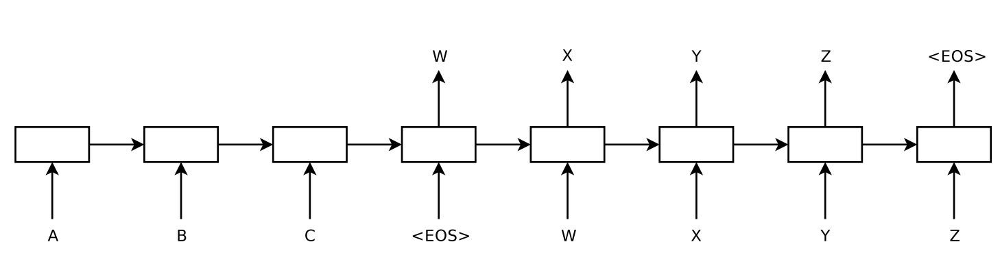

# [Seq2Seq](https://paperswithcode.com/method/seq2seq)

**Seq2Seq**, or **Sequence To Sequence**, is a model used in sequence prediction tasks, such as language modelling and machine translation. The idea is to use one LSTM, the **encoder**, to read the input sequence one timestep at a time, to obtain a large fixed dimensional vector representation (a context vector), and then to use another LSTM, the **decoder**, to extract the output sequence
from that vector. The second LSTM is essentially a recurrent neural network language model except that it is conditioned on the input sequence.

(Note that this page refers to the original seq2seq not general sequence-to-sequence models)

source: [source](http://arxiv.org/abs/1409.3215v3)
