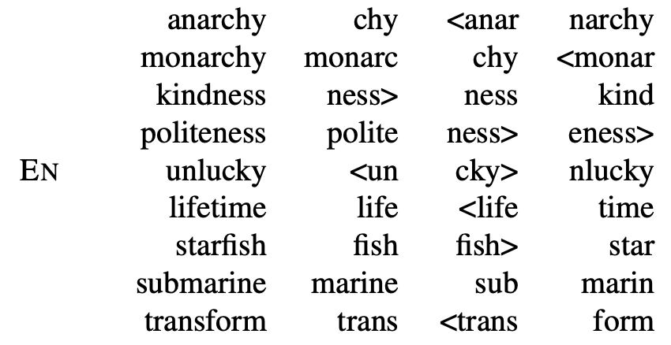
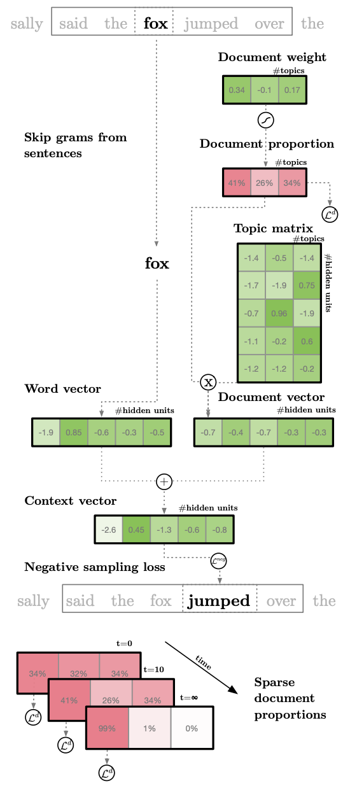
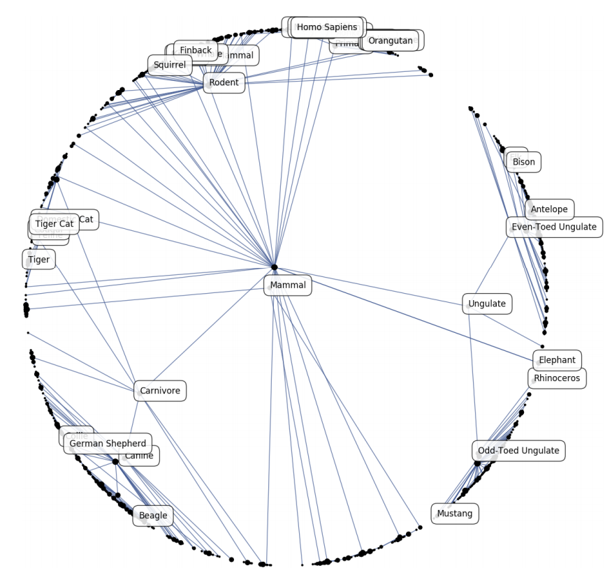

# [GloVe](https://paperswithcode.com/method/glove)

**GloVe Embeddings** are a type of word embedding that encode the co-occurrence probability ratio between two words as vector differences. GloVe uses a weighted least squares objective $J$ that minimizes the difference between the dot product of the vectors of two words and the logarithm of their number of co-occurrences:

$$ J=\sum_{i, j=1}^{V}f\left(𝑋_{i j}\right)(w^{T}_{i}\tilde{w}_{j} + b_{i} + \tilde{b}_{j} - \log{𝑋}_{ij})^{2} $$

where $w_{i}$ and $b_{i}$ are the word vector and bias respectively of word $i$, $\tilde{w}$, $j$ and $b_{j}$ are the context word vector and bias respectively of word $k$, $X_{ij}$ is the number of times word $i$ occurs in the context of word $j$, and $f$ is a weighting function that assigns lower weights to rare and frequent co-occurrences.

source: [source](https://www.aclweb.org/anthology/D14-1162/)
# [fastText](https://paperswithcode.com/method/fasttext)

**fastText** embeddings exploit subword information to construct word embeddings. Representations are learnt of character $n$-grams, and words represented as the sum of the $n$-gram vectors. This extends the word2vec type models with subword information. This helps the embeddings understand suffixes and prefixes. Once a word is represented using character $n$-grams, a skipgram model is trained to learn the embeddings.

source: [source](http://arxiv.org/abs/1607.04606v2)
# [Skip-gram Word2Vec](https://paperswithcode.com/method/skip-gram-word2vec)

**Skip-gram Word2Vec** is an architecture for computing word embeddings. Instead of using surrounding words to predict the center word, as with CBow Word2Vec, Skip-gram Word2Vec uses the central word to predict the surrounding words.

The skip-gram objective function sums the log probabilities of the surrounding $n$ words to the left and right of the target word $w_{t}$ to produce the following objective:

$$J_\theta = \frac{1}{T}\sum^{T}_{t=1}\sum_{-n\leq{j}\leq{n}, \neq{0}}\log{p}\left(w_{j+1}\mid{w_{t}}\right)$$

source: [source](http://arxiv.org/abs/1301.3781v3)
# [CBoW Word2Vec](https://paperswithcode.com/method/cbow-word2vec)

**Continuous Bag-of-Words Word2Vec** is an architecture for creating word embeddings that uses $n$ future words as well as $n$ past words to create a word embedding. The objective function for CBOW is:

$$ J_\theta = \frac{1}{T}\sum^{T}_{t=1}\log{p}\left(w_{t}\mid{w}_{t-n},\ldots,w_{t-1}, w_{t+1},\ldots,w_{t+n}\right) $$

In the CBOW model, the distributed representations of context are used to predict the word in the middle of the window. This contrasts with Skip-gram Word2Vec where the distributed representation of the input word is used to predict the context.

source: [source](http://arxiv.org/abs/1301.3781v3)
# [lda2vec](https://paperswithcode.com/method/lda2vec)

**lda2vec** builds representations over both words and documents by mixing word2vec’s skipgram architecture with Dirichlet-optimized sparse topic mixtures. 

The Skipgram Negative-Sampling (SGNS) objective of word2vec is modified to utilize document-wide feature vectors while simultaneously learning continuous document weights loading onto topic vectors. The total loss term $L$ is the sum of the Skipgram Negative Sampling Loss (SGNS) $L^{neg}_{ij}$ with the addition of a Dirichlet-likelihood term over document weights, $L_{d}$. The loss is conducted using a context vector, $\overrightarrow{c_{j}}$ , pivot word vector $\overrightarrow{w_{j}}$, target word vector $\overrightarrow{w_{i}}$, and negatively-sampled word vector $\overrightarrow{w_{l}}$:

$$ L = L^{d} + \Sigma_{ij}L^{neg}_{ij} $$

$$L^{neg}_{ij} = \log\sigma\left(c_{j}\cdot\overrightarrow{w_{i}}\right) + \sum^{n}_{l=0}\sigma\left(-\overrightarrow{c_{j}}\cdot\overrightarrow{w_{l}}\right)$$

source: [source](http://arxiv.org/abs/1605.02019v1)
# [Poincaré Embeddings](https://paperswithcode.com/method/poincare-embeddings)

**Poincaré Embeddings** learn hierarchical representations of symbolic data by embedding them into hyperbolic space -- or more precisely into an $n$-dimensional Poincaré ball. Due to the underlying hyperbolic geometry, this allows for learning of parsimonious representations of symbolic data by simultaneously capturing hierarchy and similarity. Embeddings are learnt based on
Riemannian optimization.

source: [source](http://arxiv.org/abs/1705.08039v2)
