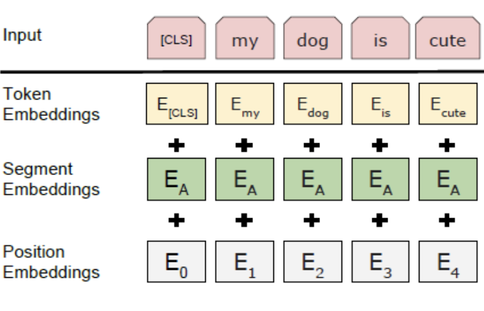

# [BPE](https://paperswithcode.com/method/bpe)

**Byte Pair Encoding**, or **BPE**, is a subword segmentation algorithm that encodes rare and unknown words as sequences of subword units. The intuition is that various word classes are translatable via smaller units than words, for instance names (via character copying or transliteration), compounds (via compositional translation), and cognates and loanwords (via phonological and morphological transformations).

[Lei Mao](https://leimao.github.io/blog/Byte-Pair-Encoding/) has a detailed blog post that explains how this works.

source: [source](http://arxiv.org/abs/1508.07909v5)
# [WordPiece](https://paperswithcode.com/method/wordpiece)

**WordPiece** is a subword segmentation algorithm used in natural language processing.  The vocabulary is initialized with individual characters in the language, then the most frequent combinations of symbols in the vocabulary are iteratively added to the vocabulary. The process is:

1. Initialize the word unit inventory with all the characters in the text.
1. Build a language model on the training data using the inventory from 1.
1. Generate a new word unit by combining two units out of the current word inventory to increment the word unit inventory by one. Choose the new word unit out of all the possible ones that increases the likelihood on the training data the most when added to the model.
1. Goto 2 until a predefined limit of word units is reached or the likelihood increase falls below a certain threshold.

Text: [Source](https://stackoverflow.com/questions/55382596/how-is-wordpiece-tokenization-helpful-to-effectively-deal-with-rare-words-proble/55416944#55416944)

Image: WordPiece as used in BERT

source: [source](http://arxiv.org/abs/1609.08144v2)
# [Unigram Segmentation](https://paperswithcode.com/method/unigram-segmentation)

**Unigram Segmentation** is a subword segmentation algorithm based on a unigram language model. It provides multiple segmentations with probabilities. The language model allows for emulating the noise generated during the segmentation of actual data.

The unigram language model makes an assumption that each subword occurs independently, and consequently, the probability of a subword sequence $\mathbf{x} = (x_1,\ldots,x_M)$ is
formulated as the product of the subword occurrence probabilities
$p(x_i)$:

$$
  P(\mathbf{x}) = \prod_{i=1}^{M} p(x_i), \\
  \forall i\,\, x_i \in \mathcal{V},\,\,\,
  \sum_{x \in \mathcal{V}} p(x) = 1, \nonumber
$$

where $\mathcal{V}$ is a pre-determined vocabulary.  The most probable
segmentation $\mathbf{x}^*$ for the input sentence $X$ is then given by:

$$
  \mathbf{x}^{*} = \text{argmax}_{\mathbf{x} \in \mathcal{S}(X)} P(\mathbf{x}),
$$

where $\mathcal{S}(X)$ is a set of segmentation candidates built from
the input sentence $X$.  $\mathbf{x}^*$ is obtained with the Viterbi
algorithm.

source: [source](http://arxiv.org/abs/1804.10959v1)
