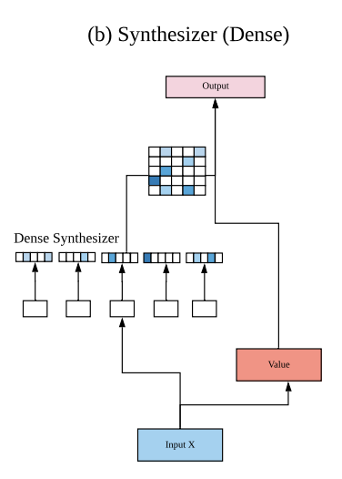
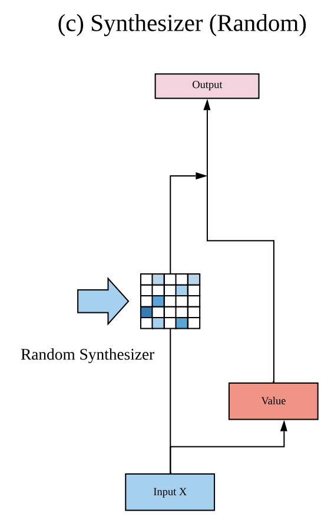

# [Dense Synthesized Attention](https://paperswithcode.com/method/dense-synthesized-attention)

**Dense Synthesized Attention**, introduced with the [Synthesizer](https://paperswithcode.com/method/synthesizer) architecture, is a type of synthetic attention mechanism that replaces the notion of query-key-values in the self-attention module and directly synthesizes the alignment matrix instead. Dense attention is conditioned on each input token. The method accepts an input $X \in \mathbb{R}^{l\text{ x }d}$ and produces an output of $Y \in \mathbb{R}^{l\text{ x }d}$. Here $l$ refers to the sequence length and $d$ refers to the dimensionality of the model. We first adopt $F\left(.\right)$, a parameterized function, for projecting input $X_{i}$ from $d$ dimensions to $l$ dimensions.

$$B_{i} = F\left(X_{i}\right)$$

where $F\left(.\right)$ is a parameterized function that maps $\mathbb{R}^{d}$ to $\mathbb{R}^{l}$ and $i$ is the $i$-th token of $X$. Intuitively, this can be interpreted as learning a token-wise projection to the sequence length $l$. Essentially, with this model, each token predicts weights for each token in the input sequence. In practice, a simple two layered feed-forward layer with ReLU activations for $F\left(.\right)$ is adopted:

$$ F\left(X\right) = W\left(\sigma_{R}\left(W(X) + b\right)\right) + b$$

where $\sigma_{R}$ is the ReLU activation function. Hence, $B$ is now of $\mathbb{R}^{l\text{ x }d}$. Given $B$, we now compute:

$$ Y = \text{Softmax}\left(B\right)G\left(X\right) $$

where $G\left(.\right)$ is another parameterized function of $X$ that is analogous to $V$ (value) in the standard Transformer model. This approach eliminates the dot product altogether by replacing $QK^{T}$ in standard Transformers with the synthesizing function $F\left(.\right)$.

source: [source](https://arxiv.org/abs/2005.00743v1)
# [Random Synthesized Attention](https://paperswithcode.com/method/random-synthesized-attention)

Dense Synthesized Attention, introduced with the [Synthesizer](https://paperswithcode.com/method/synthesizer) architecture, learns synthetic attention by conditioning on each input of $X$ and projecting to $l$ dimensions. Hence, the Dense Synthesizer conditions on each token independently, as opposed to pairwise token interactions in the vanilla Transformer model. In contrast, **Random Synthesized Attention** is where the attention weights are not conditioned on any input tokens. Instead, the attention weights are initialized to random values. These values can then either be trainable or kept fixed. Let $R$ be a randomly initialized matrix. Random Synthesized Attention is defined as:

$$Y = \text{Softmax}\left(R\right)G\left(X\right) $$

where $R \in \mathbb{R}^{l \text{ x } l}$. Notably, each head adds 2 parameters to the overall network. The basic idea of the Random Synthesizer is to not rely on pairwise token interactions or any information from individual token but rather to learn a task-specific alignment that works well globally across many samples. This is a direct generalization of the recently proposed fixed self-attention patterns of Raganato et al (2020).

source: [source](https://arxiv.org/abs/2005.00743v1)
# [Factorized Random Synthesized Attention](https://paperswithcode.com/method/factorized-random-synthesized-attention)

**Factorized Random Synthesized Attention**, introduced with the [Synthesizer](https://paperswithcode.com/method/synthesizer) architecture, is similar to factorized dense synthesized attention but for random synthesizers. We factorize $R$ into low rank matrices $R_{1}, R_{2} \in \mathbb{R}^{l\text{ x}k}$:

$$ Y = \text{Softmax}\left(R_{1}R_{2}^{T}\right)G\left(X\right) . $$

Therefore for each head, this reduces the parameter costs from $l^{2}$ to $2\left(lk\right)$ where
$k &lt;&lt; l$ and hence helps prevent overfitting. In practice, we use a small value of $k = 8$.

source: [source](https://arxiv.org/abs/2005.00743v1)
# [Factorized Dense Synthesized Attention](https://paperswithcode.com/method/factorized-dense-synthesized-attention)

**Factorized Dense Synthesized Attention** is a synthesized attention mechanism, similar to dense synthesized attention, but we factorize the outputs to reduce parameters and prevent overfitting. It was proposed as part of the [Synthesizer](https://paperswithcode.com/method/synthesizer) architecture. The factorized variant of the dense synthesizer can be expressed as follows:

$$A, B = F_{A}\left(X_{i}\right), F_{B}\left(X_{i}\right)$$

where $F_{A}\left(.\right)$ projects input $X_{i}$ into $a$ dimensions, $F_B\left(.\right)$ projects $X_{i}$ to $b$ dimensions, and $a \text{ x } b = l$. The output of the factorized module is now written as:

$$ Y = \text{Softmax}\left(C\right)G\left(X\right) $$

where $C = H_{A}\left(A\right) * H_{B}\left(B\right)$, where $H_{A}$, $H_{B}$ are tiling functions and $C \in \mathbb{R}^{l \text{ x } l}$. The tiling function simply duplicates the vector $k$ times, i.e., $\mathbb{R}^{l} \rightarrow \mathbb{R}^{lk}$. In this case, $H_{A}\left(\right)$ is a projection of $\mathbb{R}^{a} \rightarrow \mathbb{R}^{ab}$ and $H_{B}\left(\right)$ is a projection of $\mathbb{R}^{b} \rightarrow \mathbb{R}^{ba}$. To avoid having similar values within the same block, we compose the outputs of $H_{A}$ and $H_{B}$.

source: [source](https://arxiv.org/abs/2005.00743v1)
