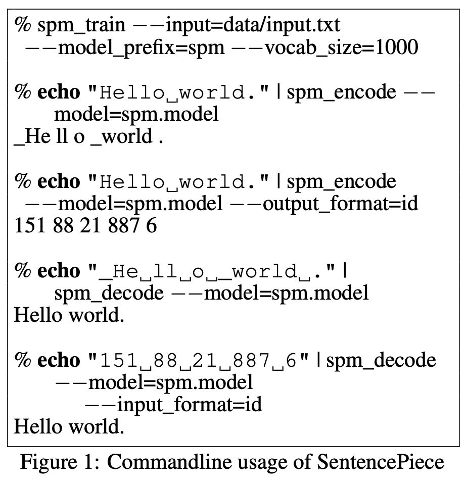

# [WordPiece](https://paperswithcode.com/method/wordpiece)

**WordPiece** is a subword segmentation algorithm used in natural language processing.  The vocabulary is initialized with individual characters in the language, then the most frequent combinations of symbols in the vocabulary are iteratively added to the vocabulary. The process is:

1. Initialize the word unit inventory with all the characters in the text.
1. Build a language model on the training data using the inventory from 1.
1. Generate a new word unit by combining two units out of the current word inventory to increment the word unit inventory by one. Choose the new word unit out of all the possible ones that increases the likelihood on the training data the most when added to the model.
1. Goto 2 until a predefined limit of word units is reached or the likelihood increase falls below a certain threshold.

Text: [Source](https://stackoverflow.com/questions/55382596/how-is-wordpiece-tokenization-helpful-to-effectively-deal-with-rare-words-proble/55416944#55416944)

Image: WordPiece as used in BERT

source: [source](http://arxiv.org/abs/1609.08144v2)
# [SentencePiece](https://paperswithcode.com/method/sentencepiece)

**SentencePiece** is a subword tokenizer and detokenizer for natural language processing. It performs subword segmentation, supporting the byte-pair-encoding (BPE) algorithm and unigram language model, and then converts this text into an id sequence guarantee perfect reproducibility of the normalization and subword segmentation.

source: [source](http://arxiv.org/abs/1808.06226v1)
