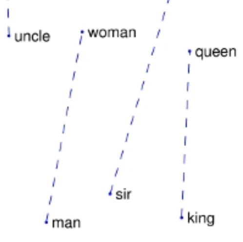
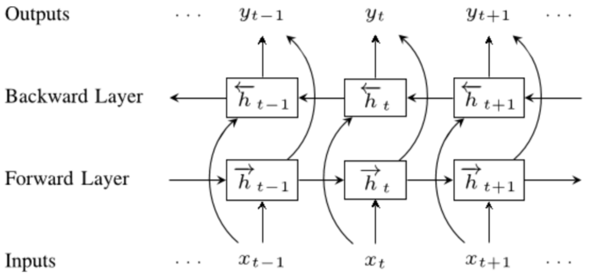
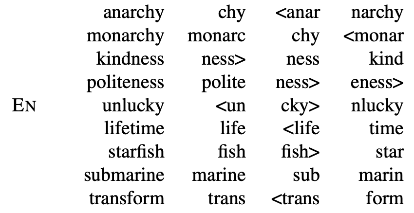
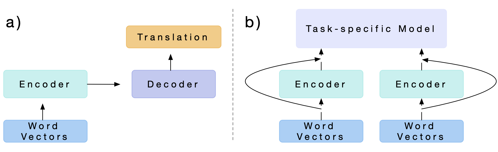
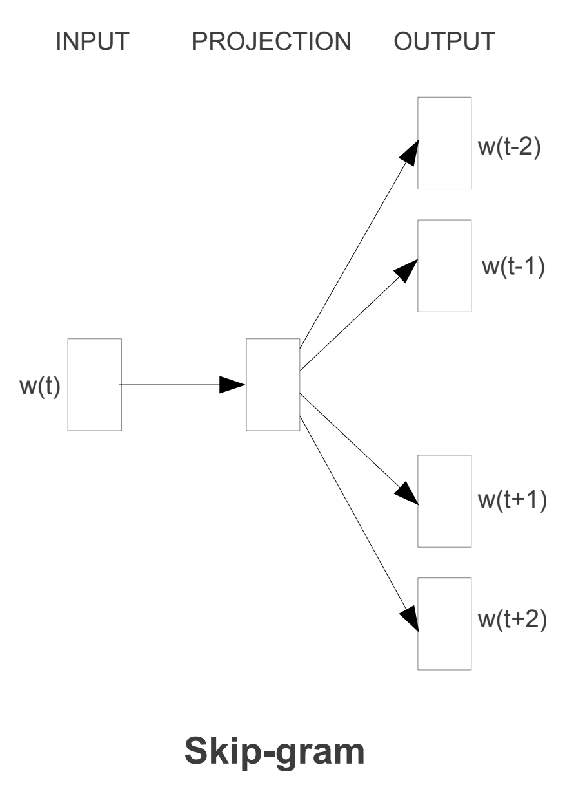
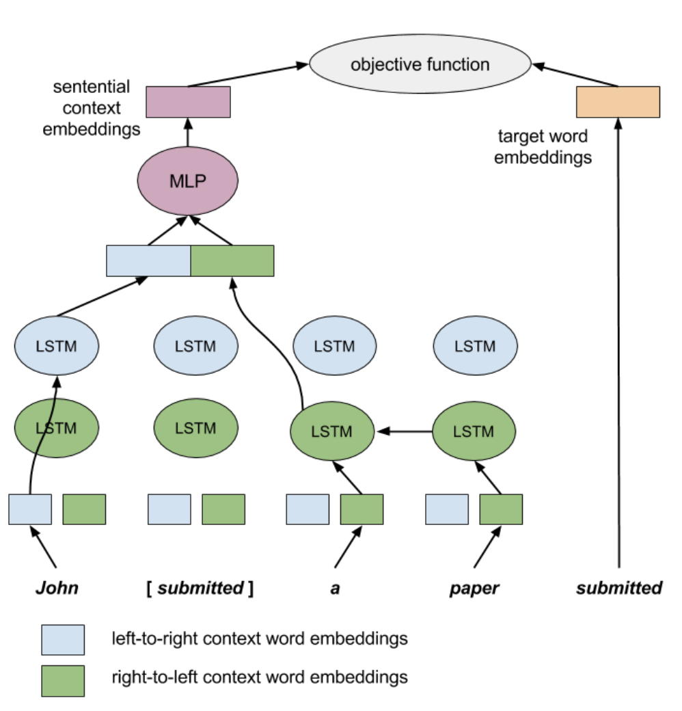
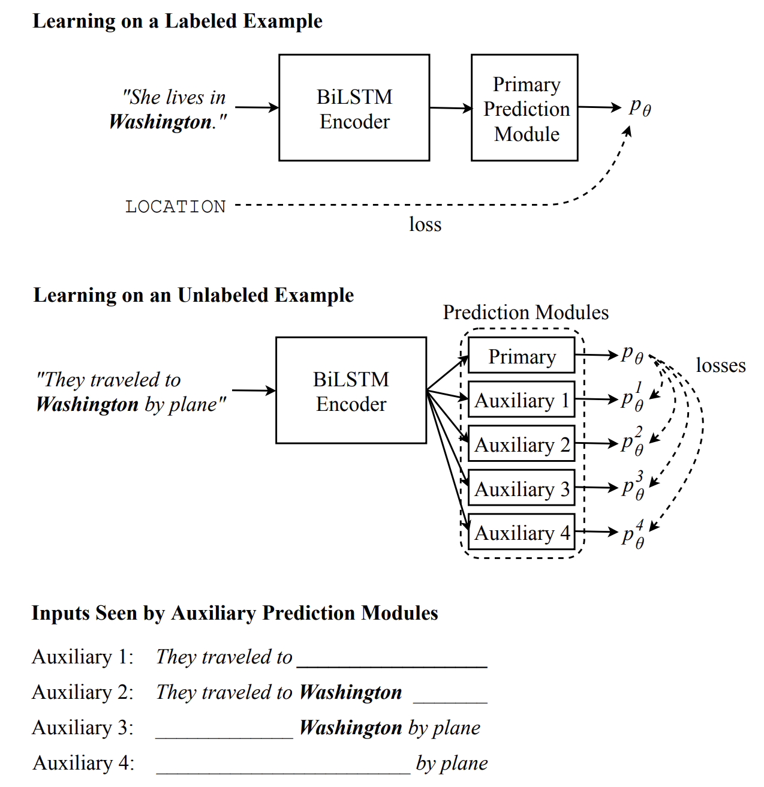
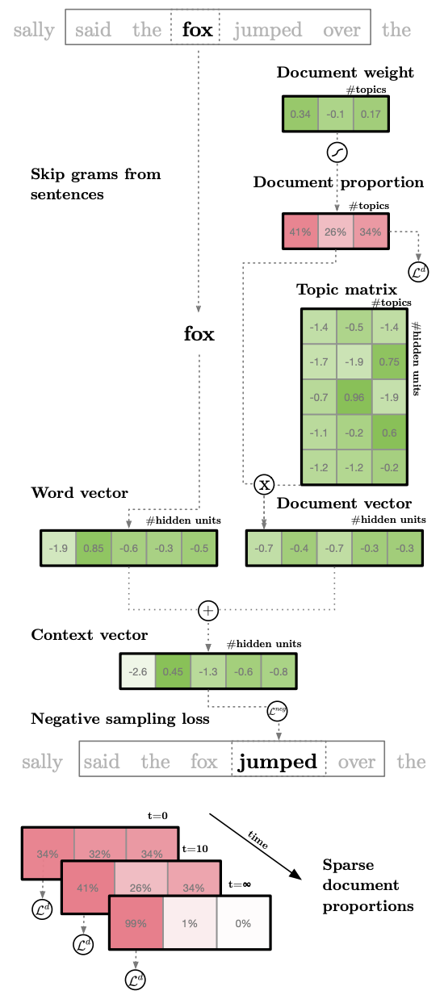
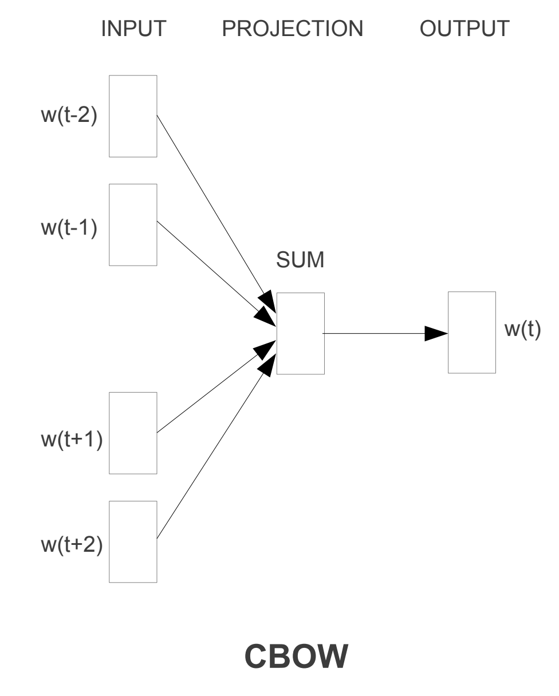

# [GloVe](https://paperswithcode.com/method/glove)

**GloVe Embeddings** are a type of word embedding that encode the co-occurrence probability ratio between two words as vector differences. GloVe uses a weighted least squares objective $J$ that minimizes the difference between the dot product of the vectors of two words and the logarithm of their number of co-occurrences:

$$ J=\sum_{i, j=1}^{V}f\left(𝑋_{i j}\right)(w^{T}_{i}\tilde{w}_{j} + b_{i} + \tilde{b}_{j} - \log{𝑋}_{ij})^{2} $$

where $w_{i}$ and $b_{i}$ are the word vector and bias respectively of word $i$, $\tilde{w}$, $j$ and $b_{j}$ are the context word vector and bias respectively of word $k$, $X_{ij}$ is the number of times word $i$ occurs in the context of word $j$, and $f$ is a weighting function that assigns lower weights to rare and frequent co-occurrences.

source: [source](https://www.aclweb.org/anthology/D14-1162/)
# [ELMo](https://paperswithcode.com/method/elmo)

**Embeddings from Language Models**, or **ELMo**, is a type of deep contextualized word representation that models both (1) complex characteristics of word use (e.g., syntax and semantics), and (2) how these uses vary across linguistic contexts (i.e., to model polysemy). Word vectors are learned functions of the internal states of a deep bidirectional language model (biLM), which is pre-trained on a large text corpus.

A biLM combines both a forward and backward LM.  ELMo jointly maximizes the log likelihood of the forward and backward directions. To add ELMo to a supervised model, we freeze the weights of the biLM and then concatenate the ELMo vector $\textbf{ELMO}^{task}_k$ with $\textbf{x}_k$ and pass the ELMO enhanced representation $[\textbf{x}_k; \textbf{ELMO}^{task}_k]$ into the task RNN. Here $\textbf{x}_k$ is a context-independent token representation for each token position. 

Image Source: [here](https://medium.com/@duyanhnguyen_38925/create-a-strong-text-classification-with-the-help-from-elmo-e90809ba29da)

source: [source](http://arxiv.org/abs/1802.05365v2)
# [fastText](https://paperswithcode.com/method/fasttext)

**fastText** embeddings exploit subword information to construct word embeddings. Representations are learnt of character $n$-grams, and words represented as the sum of the $n$-gram vectors. This extends the word2vec type models with subword information. This helps the embeddings understand suffixes and prefixes. Once a word is represented using character $n$-grams, a skipgram model is trained to learn the embeddings.

source: [source](http://arxiv.org/abs/1607.04606v2)
# [CoVe](https://paperswithcode.com/method/cove)

**CoVe**, or **Contextualized Word Vectors**, uses a deep LSTM encoder from an attentional sequence-to-sequence model trained for machine translation to contextualize word vectors. $\text{CoVe}$ word embeddings are therefore a function of the entire input sequence. These word embeddings can then be used in downstream tasks by concatenating them with $\text{GloVe}$ embeddings:

$$ v = \left[\text{GloVe}\left(x\right), \text{CoVe}\left(x\right)\right]$$

and then feeding these in as features for the task-specific models.

source: [source](http://arxiv.org/abs/1708.00107v2)
# [Skip-gram Word2Vec](https://paperswithcode.com/method/skip-gram-word2vec)

**Skip-gram Word2Vec** is an architecture for computing word embeddings. Instead of using surrounding words to predict the center word, as with CBow Word2Vec, Skip-gram Word2Vec uses the central word to predict the surrounding words.

The skip-gram objective function sums the log probabilities of the surrounding $n$ words to the left and right of the target word $w_{t}$ to produce the following objective:

$$J_\theta = \frac{1}{T}\sum^{T}_{t=1}\sum_{-n\leq{j}\leq{n}, \neq{0}}\log{p}\left(w_{j+1}\mid{w_{t}}\right)$$

source: [source](http://arxiv.org/abs/1301.3781v3)
# [context2vec](https://paperswithcode.com/method/context2vec)

**context2vec** is an unsupervised model for learning generic context embedding of wide sentential contexts, using a bidirectional LSTM. A large plain text corpora is trained on to learn a neural model that embeds entire sentential contexts and target words in the same low-dimensional space, which
is optimized to reflect inter-dependencies between targets and their entire sentential context as a whole. 

In contrast to word2vec that use context modeling mostly internally and considers the target word embeddings as their main output, the focus of context2vec is the context representation. context2vec achieves its objective by assigning similar embeddings to sentential contexts and their associated target words.

source: [source](https://www.aclweb.org/anthology/K16-1006/)
# [Cross-View Training](https://paperswithcode.com/method/cross-view-training)

**Cross View Training**, or **CVT**, is a semi-supervised algorithm for training distributed word representations that makes use of unlabelled and labelled examples. 

CVT adds $k$ auxiliary prediction modules to the model, a Bi-LSTM encoder, which are used when learning on unlabeled examples. A prediction module is usually a small neural network (e.g., a hidden layer followed by a softmax layer). Each one takes as input an intermediate representation $h^j(x_i)$ produced by the model (e.g., the outputs of one of the LSTMs in a Bi-LSTM model). It outputs a distribution over labels $p_{j}^{\theta}\left(y\mid{x_{i}}\right)$.

Each $h^j$ is chosen such that it only uses a part of the input $x_i$; the particular choice can depend on the task and model architecture. The auxiliary prediction modules are only used during training; the test-time prediction come from the primary prediction module that produces $p_\theta$.

source: [source](http://arxiv.org/abs/1809.08370v1)
# [lda2vec](https://paperswithcode.com/method/lda2vec)

**lda2vec** builds representations over both words and documents by mixing word2vec’s skipgram architecture with Dirichlet-optimized sparse topic mixtures. 

The Skipgram Negative-Sampling (SGNS) objective of word2vec is modified to utilize document-wide feature vectors while simultaneously learning continuous document weights loading onto topic vectors. The total loss term $L$ is the sum of the Skipgram Negative Sampling Loss (SGNS) $L^{neg}_{ij}$ with the addition of a Dirichlet-likelihood term over document weights, $L_{d}$. The loss is conducted using a context vector, $\overrightarrow{c_{j}}$ , pivot word vector $\overrightarrow{w_{j}}$, target word vector $\overrightarrow{w_{i}}$, and negatively-sampled word vector $\overrightarrow{w_{l}}$:

$$ L = L^{d} + \Sigma_{ij}L^{neg}_{ij} $$

$$L^{neg}_{ij} = \log\sigma\left(c_{j}\cdot\overrightarrow{w_{i}}\right) + \sum^{n}_{l=0}\sigma\left(-\overrightarrow{c_{j}}\cdot\overrightarrow{w_{l}}\right)$$

source: [source](http://arxiv.org/abs/1605.02019v1)
# [Poincaré Embeddings](https://paperswithcode.com/method/poincare-embeddings)

**Poincaré Embeddings** learn hierarchical representations of symbolic data by embedding them into hyperbolic space -- or more precisely into an $n$-dimensional Poincaré ball. Due to the underlying hyperbolic geometry, this allows for learning of parsimonious representations of symbolic data by simultaneously capturing hierarchy and similarity. Embeddings are learnt based on
Riemannian optimization.

source: [source](http://arxiv.org/abs/1705.08039v2)
# [CBoW Word2Vec](https://paperswithcode.com/method/cbow-word2vec)

**Continuous Bag-of-Words Word2Vec** is an architecture for creating word embeddings that uses $n$ future words as well as $n$ past words to create a word embedding. The objective function for CBOW is:

$$ J_\theta = \frac{1}{T}\sum^{T}_{t=1}\log{p}\left(w_{t}\mid{w}_{t-n},\ldots,w_{t-1}, w_{t+1},\ldots,w_{t+n}\right) $$

In the CBOW model, the distributed representations of context are used to predict the word in the middle of the window. This contrasts with Skip-gram Word2Vec where the distributed representation of the input word is used to predict the context.

source: [source](http://arxiv.org/abs/1301.3781v3)
