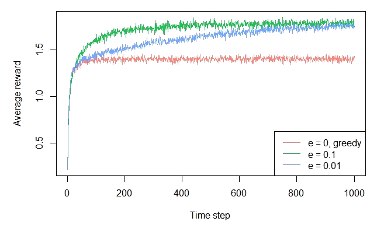

# [Epsilon Greedy Exploration](https://paperswithcode.com/method/epsilon-greedy-exploration)

**$\epsilon$-Greedy Exploration** is an exploration strategy in reinforcement learning that takes an exploratory action with probability $\epsilon$ and a greedy action with probability $1-\epsilon$. It tackles the exploration-exploitation tradeoff with reinforcement learning algorithms: the desire to explore the state space with the desire to seek an optimal policy. Despite its simplicity, it is still commonly used as an behaviour policy $\pi$ in several state-of-the-art reinforcement learning models.

Image Credit: [Robin van Embden](https://cran.r-project.org/web/packages/contextual/vignettes/sutton_barto.html)

