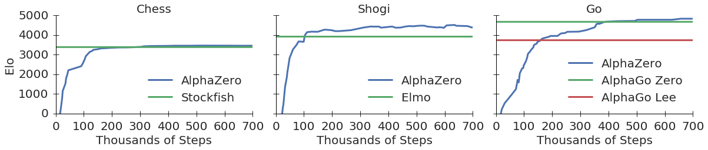
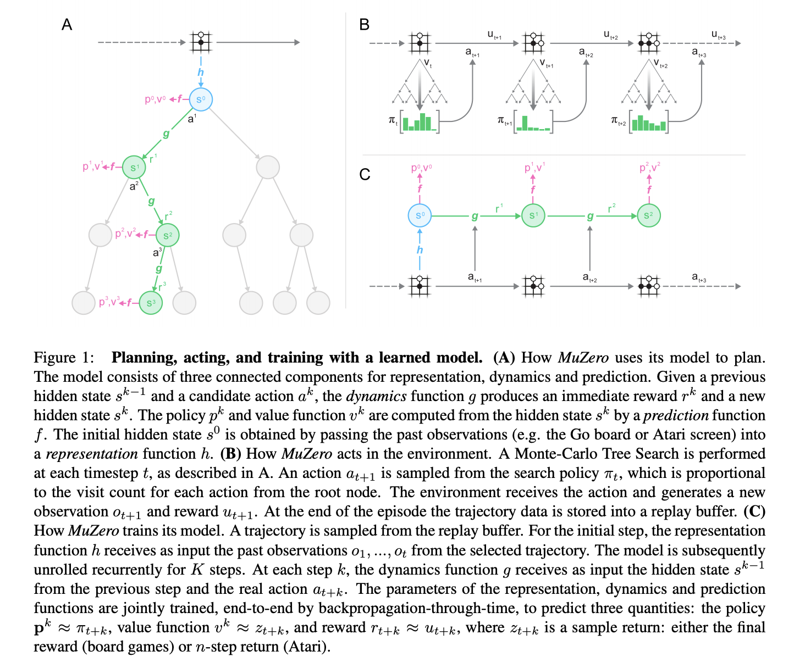
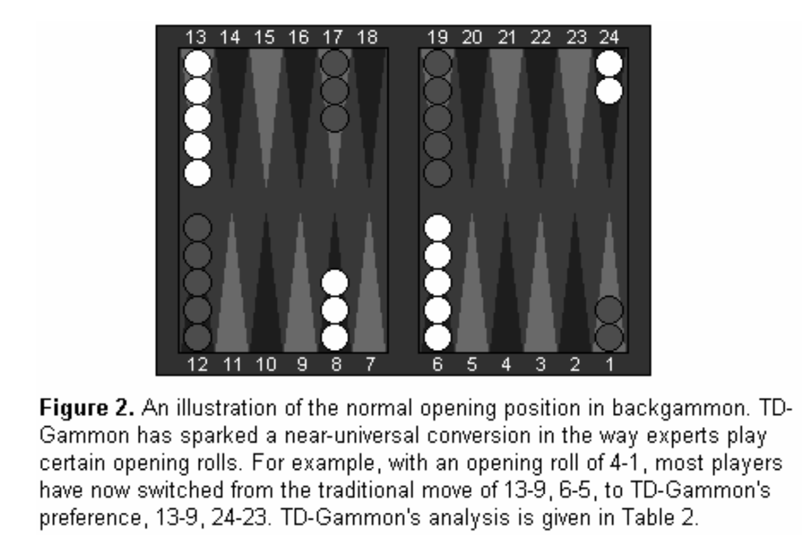

# [AlphaZero](https://paperswithcode.com/method/alphazero)

**AlphaZero** is a reinforcement learning agent for playing board games such as Go, chess, and shogi. 

source: [source](http://arxiv.org/abs/1712.01815v1)
# [MuZero](https://paperswithcode.com/method/muzero)

**MuZero** is a model-based reinforcement learning algorithm. It builds upon [AlphaZero](https://paperswithcode.com/method/alphazero)'s search and search-based policy iteration algorithms, but incorporates a learned model into the training procedure. 

The main idea of the algorithm is to predict those aspects of the future that are directly relevant for planning. The model receives the observation (e.g. an image of the Go board or the Atari screen) as an
input and transforms it into a hidden state. The hidden state is then updated iteratively by a recurrent process that receives the previous hidden state and a hypothetical next action. At every one of these steps the model predicts the policy (e.g. the move to play), value function (e.g. the predicted winner), and immediate reward (e.g. the points scored by playing a move). The model is trained end-to-end, with the sole objective of accurately estimating these three important quantities, so as to match the improved estimates of policy and value generated by search as well as the observed reward. There is no direct constraint or requirement for the hidden state to capture all information necessary to reconstruct the original observation, drastically reducing the amount of information the model has to maintain and predict; nor is there any requirement for the hidden state to match the unknown, true state of the environment; nor any other constraints on the semantics of state. Instead, the hidden states are free to represent state in whatever way is relevant to predicting current and future values and policies. Intuitively, the agent can invent, internally, the rules or dynamics that lead to most accurate planning.

source: [source](https://arxiv.org/abs/1911.08265v2)
# [TD-Gammon](https://paperswithcode.com/method/td-gammon)

**TD-Gammon** is a game-learning architecture for playing backgammon. It involves the use of a $TD\left(\lambda\right)$ learning algorithm and a feedforward neural network.

Credit: <a href="https://cling.csd.uwo.ca/cs346a/extra/tdgammon.pdf">Temporal Difference Learning and
TD-Gammon</a>

