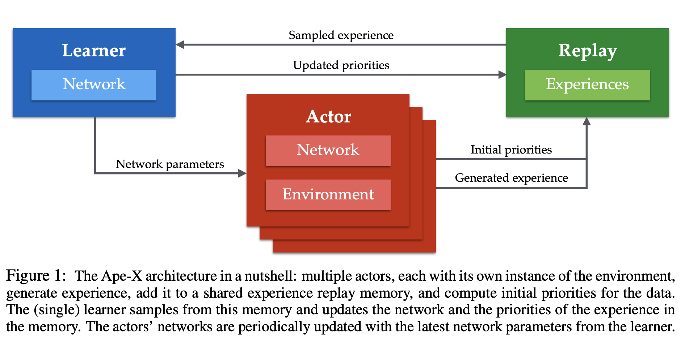
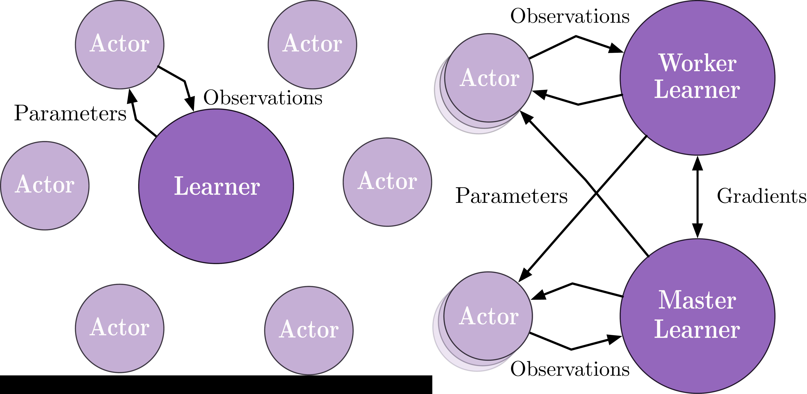

# [Ape-X](https://paperswithcode.com/method/ape-x)

**Ape-X** is a distributed architecture for deep reinforcement learning. The algorithm decouples acting from learning: the actors interact with their own instances of the environment by selecting actions according to a shared neural network, and accumulate the resulting experience in a shared experience replay memory; the learner replays samples of experience and updates the neural network. The architecture relies on prioritized experience replay to focus only on the most significant data generated by the actors.

In contrast to Gorila, Ape-X uses a shared, centralized replay memory, and instead of sampling
uniformly, it prioritizes, to sample the most useful data more often. All communications are batched with the centralized replay, increasing the efficiency and throughput at the cost of some latency. 
And by learning off-policy, Ape-X has the ability to combine data from many distributed actors, by giving the different actors different exploration policies, broadening the diversity of the experience they jointly encounter.

source: [source](http://arxiv.org/abs/1803.00933v1)
# [IMPALA](https://paperswithcode.com/method/impala)

**IMPALA**, or the **Importance Weighted Actor Learner Architecture**, is an off-policy actor-critic framework that decouples acting from learning and learns from experience trajectories using V-trace. Unlike the popular [A3C](https://paperswithcode.com/method/a3c)-based agents, in which workers communicate gradients with respect to the parameters of the policy to a central parameter server, IMPALA actors communicate trajectories of experience (sequences of states, actions, and rewards) to a centralized learner. Since the learner in IMPALA has access to full trajectories of experience we use a GPU to perform updates on mini-batches of trajectories while aggressively parallelising all time independent operations. 

This type of decoupled architecture can achieve very high throughput. However, because the policy used to generate a trajectory can lag behind the policy on the learner by several updates at the time of gradient calculation, learning becomes off-policy. The V-trace off-policy actor-critic algorithm is used to correct for this harmful discrepancy.

source: [source](http://arxiv.org/abs/1802.01561v3)
