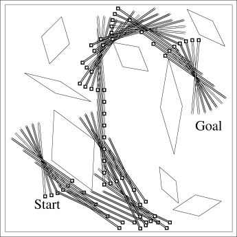

# [Prioritized Sweeping](https://paperswithcode.com/method/prioritized-sweeping)

**Prioritized Sweeping** is a reinforcement learning technique for model-based algorithms that prioritizes updates according to a measure of urgency, and performs these updates first. A queue is maintained of every state-action pair whose estimated value would change nontrivially if updated, prioritized by the size of the change. When the top pair in the queue is updated, the effect on each of its predecessor pairs is computed. If the effect is greater than some threshold, then the pair is inserted in the queue with the new priority.

Source: Sutton and Barto, Reinforcement Learning, 2nd Edition

