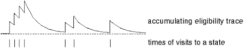
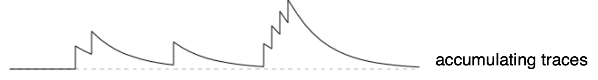

# [Eligibility Trace](https://paperswithcode.com/method/eligibility-trace)

An **Eligibility Trace** is a memory vector $\textbf{z}_{t} \in \mathbb{R}^{d}$ that parallels the long-term weight vector $\textbf{w}_{t} \in \mathbb{R}^{d}$. The idea is that when a component of $\textbf{w}_{t}$ participates in producing an estimated value, the corresponding component of $\textbf{z}_{t}$ is bumped up and then begins to fade away. Learning will then occur in that component of $\textbf{w}_{t}$ if a nonzero TD error occurs before the trade falls back to zero. The trace-decay parameter $\lambda \in \left[0, 1\right]$ determines the rate at which the trace falls.

Intuitively, they tackle the credit assignment problem by capturing both a frequency heuristic - states that are visited more often deserve more credit - and a recency heuristic - states that are visited more recently deserve more credit.

$$E_{0}\left(s\right) = 0 $$
$$E_{t}\left(s\right) = \gamma\lambda{E}_{t-1}\left(s\right) + \textbf{1}\left(S_{t} = s\right) $$

Source: Sutton and Barto, Reinforcement Learning, 2nd Edition

# [Accumulating Eligibility Trace](https://paperswithcode.com/method/accumulating-eligibility-trace)

An **Accumulating Eligibility Trace** is a type of eligibility trace where the trace increments in an accumulative way. For the memory vector $\textbf{e}_{t} \in \mathbb{R}^{b} \geq \textbf{0}$:

$$\mathbf{e_{0}} = \textbf{0}$$

$$\textbf{e}_{t} = \nabla{\hat{v}}\left(S_{t}, \mathbf{\theta}_{t}\right) + \gamma\lambda\textbf{e}_{t}$$

# [Dutch Eligibility Trace](https://paperswithcode.com/method/dutch-eligibility-trace)

A **Dutch Eligibility Trace** is a type of eligibility trace where the trace increments grow less quickly than the accumulative eligibility trace (helping avoid large variance updates). For the memory vector $\textbf{e}_{t} \in \mathbb{R}^{b} \geq \textbf{0}$:

$$\mathbf{e_{0}} = \textbf{0}$$

$$\textbf{e}_{t} = \gamma\lambda\textbf{e}_{t-1} + \left(1-\alpha\gamma\lambda\textbf{e}_{t-1}^{T}\phi_{t}\right)\phi_{t}$$

# [Replacing Eligibility Trace](https://paperswithcode.com/method/replacing-eligibility-trace)

In a **Replacing Eligibility Trace**, each time the state is revisited, the trace is reset to $1$ regardless of the presence of a prior trace.. For the memory vector $\textbf{e}_{t} \in \mathbb{R}^{b} \geq \textbf{0}$:

$$\mathbf{e_{0}} = \textbf{0}$$

$$\textbf{e}_{t} = \gamma\lambda{e}_{t-1}\left(s\right) \text{ if } s \neq s_{t}$$

$$\textbf{e}_{t} = 1 \text{ if } s = s_{t}$$

They can be seen as crude approximation to dutch traces, which have largely superseded them as they perform better than replacing traces and have a clearer theoretical basis. Accumulating traces remain of interest for nonlinear function approximations where dutch traces are not available.

Source: Sutton and Barto, Reinforcement Learning, 2nd Edition

